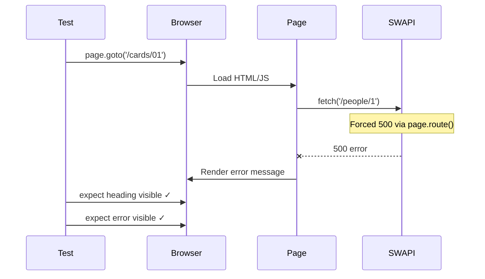

# Card 01: First Browser Test

## What This Pattern Solves

Before you can mock APIs, you need to understand basic browser automation: opening a page, waiting for elements, and making assertions. This card shows the fundamentals WITHOUT mocking - you'll see what happens when the real API is called (or fails).

## How It Works

1. We simulate the external API being unavailable with `page.route()` returning a 500
2. Playwright opens the browser and navigates to `/cards/01` (the person demo page)
3. The page tries to fetch the person and gets the failing response
4. We assert on the page structure and error state, not on successful data

This demonstrates **why mocking is valuable**: tests that depend on external APIs are slow and flaky. When SWAPI fails (which happens frequently), the page shows an error message - which is what we test here. Here we force that failure so the outcome is deterministic.

## Code Example

```typescript
import { test, expect } from '@playwright/test';

test.describe('01-first-browser-test: Open browser and assert on page', () => {
  // @smoke: a fast, always-run sanity check. Selective run: `--grep @smoke`.
  test('shows an error when the external API fails', { tag: '@smoke' }, async ({ page }) => {
    // Simulate the real SWAPI being unavailable. Without mocking, a flaky
    // external dependency makes this the outcome you cannot control.
    await page.route('**/swapi.dev/api/people/**', (route) =>
      route.fulfill({ status: 500 }),
    );

    await page.goto('/cards/01');

    await expect(page.getByRole('heading', { name: 'Person' })).toBeVisible();
    await expect(page.getByTestId('error')).toBeVisible();
  });
});
```

A single `page.route()` forces the failure - the rest is just navigation and assertions.

## Run This Example

```bash
pnpm test src/01-first-browser-test
```

**Note**: This test expects SWAPI to fail (which it often does). If SWAPI is working, the test may fail - demonstrating exactly why we need mocking! Card 02 fixes this with deterministic mocking.

## Prerequisites

None - **start here**. This is your first Playwright test.

## Key Concepts

- **page.goto()**: Navigates to a URL (relative URLs use baseURL from config)
- **expect().toBeVisible()**: Waits for element to appear (auto-waits up to timeout)
- **getByRole()**: Playwright's recommended selector (accessibility-friendly)
- **getByTestId()**: Selector for elements with `data-testid` attribute

## When to Use This Pattern

- ✓ Smoke tests against real staging/production environments
- ✓ Learning Playwright basics before diving into mocking
- ✓ Verifying page structure loads correctly
- ✗ CI tests (too slow and flaky without mocking)
- ✗ Testing data variations (need mocking for deterministic data)
- ✗ Testing edge cases (can't control external API responses)

## Common Mistakes

- **Using `waitForTimeout()`** instead of `expect().toBeVisible()` - always prefer web-first assertions
- **Testing data content** when API is unmocked - leads to flaky assertions when data changes
- **Not understanding the value of mocking** - this test shows why external dependencies are problematic
- **Expecting this test to always pass** - that's the point! It shows the need for mocking.

## Flow Diagram



## Related Patterns

- **Next**: Card 02 (Mock Your First API) - Make this test deterministic with mocking
- **Contrast**: Card 05 (Proxy to Real API) - When you want real data with patches
