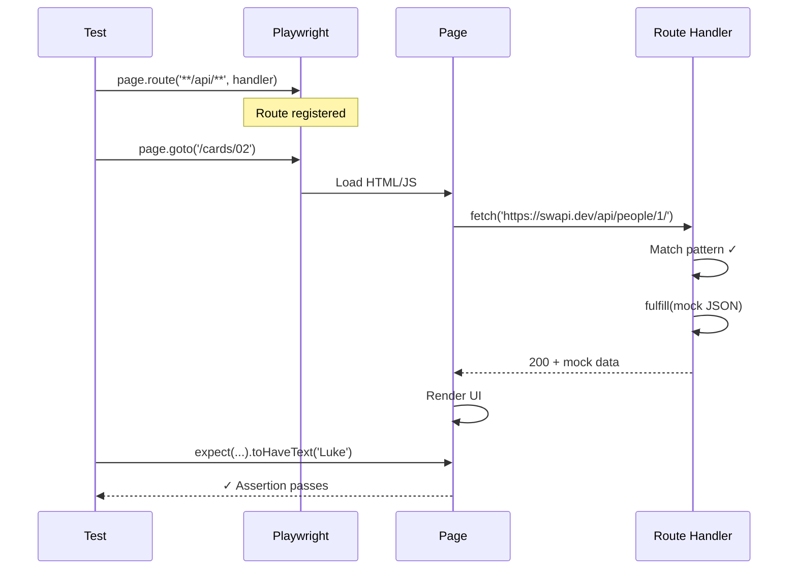

# Card 02: Mock Your First API

## What This Pattern Solves

When testing a page that fetches from an external API (like SWAPI), you need deterministic, fast tests that don't depend on network availability. Without mocking, your tests are slow, flaky, and fail when the API is down (see Card 01).

## How It Works

1. Register a route handler BEFORE navigating to the page
2. Use `page.route()` to intercept requests matching a pattern
3. Use `route.fulfill()` to return mock JSON data
4. The page receives your mock response instead of hitting the real API
5. Assert on the UI rendering your deterministic data

This is the **fundamental pattern** for all API mocking in Playwright - every other card builds on this.

## Code Example

```typescript
import { test, expect } from '@playwright/test';
import type { SwapiPerson } from '../swapi/schema';

test.describe('02-mock-first-api: Playwright + page.route', () => {
  test('GET people/1 returns mocked person in UI', async ({ page }) => {
    const luke = {
      name: 'Luke Skywalker',
      height: '172',
    } satisfies Partial<SwapiPerson>;

    // 1. Register route BEFORE navigation
    await page.route('**/swapi.dev/api/people/1/**', (route) =>
      route.fulfill({ json: luke }),
    );

    // 2. Navigate - fetch is intercepted
    await page.goto('/cards/02');

    // 3. Assert on deterministic data
    await expect(page.getByTestId('person-name')).toHaveText('Luke Skywalker');
    await expect(page.getByTestId('person-height')).toHaveText('172');
  });
});
```

## Run This Example

```bash
pnpm test src/02-mock-first-api
```

## Prerequisites

- **Card 01**: Understanding basic browser navigation and assertions
- Concepts: HTTP requests, JSON responses, API mocking

## Key Concepts

- **page.route(pattern, handler)**: Registers a request interceptor. Pattern can be glob (`**/*.jpg`) or regex.
- **route.fulfill(options)**: Returns a mock response without hitting the network. The `json` option serializes an object and sets `content-type` automatically; you can also pass `status`, `contentType`, `body`, `headers`.
- **Order matters**: Routes must be registered BEFORE `page.goto()` or the requests you want to intercept.
- **Pattern matching**: Use `**` for glob patterns, e.g., `**/api/people/1/**` matches any URL containing that path.

## When to Use This Pattern

- ✓ Making tests fast and deterministic
- ✓ Testing UI behavior with specific API responses
- ✓ Avoiding external API dependencies in CI
- ✓ Controlling test data exactly
- ✗ When you need to test the real API integration (use staging environment)
- ✗ When the API contract is unknown (use Card 05 proxy pattern first to capture real responses)

## Common Mistakes

1. **Registering route AFTER navigation**:
   ```typescript
   // ❌ WRONG - too late, request already sent
   await page.goto('/');
   await page.route('**/api/**', handler);

   // ✓ CORRECT - route registered first
   await page.route('**/api/**', handler);
   await page.goto('/cards/02');
   ```

2. **Pattern doesn't match the actual request**:
   - Use browser DevTools Network tab to see exact URLs
   - Test your pattern: `'**/people/1/**'` matches `https://swapi.dev/api/people/1/`
   - Be specific enough to avoid matching unintended requests

3. **Hand-stringifying when `json` does it for you**:
   ```typescript
   // ❌ Verbose - body must be a string, and you must set contentType
   route.fulfill({
     contentType: 'application/json',
     body: JSON.stringify({ name: 'Luke' }),
   })

   // ✓ CORRECT - the json option serializes and sets content-type
   route.fulfill({ json: { name: 'Luke' } })
   ```

4. **Using `body` without `contentType`**:
   - If you pass a raw `body` string, set `contentType: 'application/json'` for JSON
   - Prefer the `json` option, which handles both for you

## Flow Diagram



## Related Patterns

- **Previous**: Card 01 (First Browser Test) - See why mocking is necessary
- **Next**: Card 03 (Full Mock Payload) - More complete mock data structures
- **Advanced**: Card 05 (Proxy to Real API) - Hybrid approach when you need real data with patches
- **Compare**: Card 06 (Record & Replay) - Alternative to writing mocks manually
