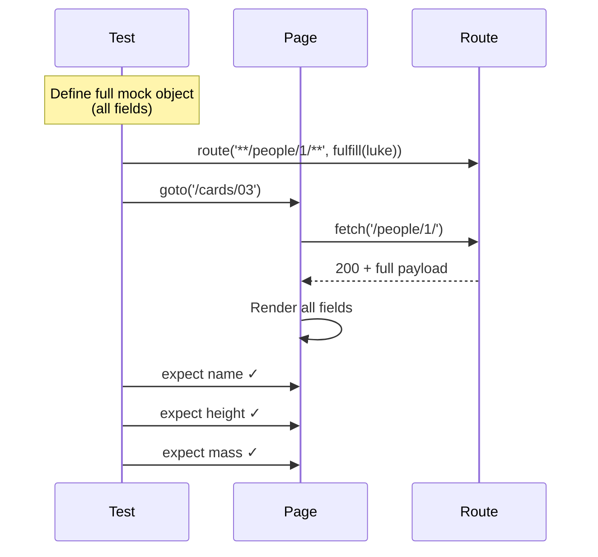

# Card 03: Full Mock Payload

## What This Pattern Solves

When your UI displays many fields from an API response, you need a complete mock payload that represents the full data structure. Minimal mocks (just `name` and `height`) work for simple cases, but real applications display more fields and you need to test them all.

## How It Works

1. Define a complete mock object that matches the API's structure
2. Include all fields the UI might display, even if you don't assert on all of them
3. Use this full payload in your `route.fulfill()` call
4. Assert on multiple fields to verify the UI renders correctly

This approach gives you **full control** and makes tests **deterministic** - no surprises from upstream API changes.

## Code Example

```typescript
import { test, expect } from '@playwright/test';
import type { SwapiPerson } from '../swapi/schema';

const luke = {
  name: 'Luke Skywalker',
  height: '172',
  mass: '77',
  url: 'https://swapi.dev/api/people/1/',
  films: [
    'https://swapi.dev/api/films/1/',
    'https://swapi.dev/api/films/2/',
  ],
} satisfies SwapiPerson;

test.describe('03-full-mock-payload: Full inline payload', () => {
  test('page displays full person from inline mock', async ({ page }) => {
    await page.route('**/swapi.dev/api/people/1/**', (route) =>
      route.fulfill({ json: luke }),
    );

    await page.goto('/cards/03');

    await expect(page.getByTestId('person-name')).toHaveText('Luke Skywalker');
    await expect(page.getByTestId('person-height')).toHaveText('172');
    await expect(page.getByTestId('person-mass')).toHaveText('77');
  });
});
```

The `satisfies SwapiPerson` annotation makes the inline payload match the API contract, so a missing or misspelled field fails at compile time.

## Run This Example

```bash
pnpm test src/03-full-mock-payload
```

## Prerequisites

- **Card 02**: Understanding basic `page.route()` and `route.fulfill()`
- Concepts: JSON data structures, API contracts

## Key Concepts

- **Complete data structure**: Include ALL fields from the real API, not just what you're testing
- **Contract testing**: Your mock represents the API contract - if the API changes, your mock should too
- **Inline fixtures**: Mock data defined directly in the test file for visibility
- **Deterministic assertions**: You control every field, so you can assert on any of them

## When to Use This Pattern

- ✓ When UI displays 3+ fields from a response
- ✓ When you want to test the UI handles the full data structure correctly
- ✓ For contract tests that verify your app works with the API's shape
- ✓ When you want tests to be completely offline and deterministic
- ✗ When the API response is huge (100+ fields) - use Card 06 (Record Fixtures) instead
- ✗ When you want real data with small patches - use Card 05 (Proxy) instead
- ✗ When you only test 1-2 fields - minimal mock from Card 02 is fine

## Common Mistakes

1. **Incomplete payloads breaking the UI**:
   ```typescript
   // ❌ WRONG - missing fields the UI expects
   const incomplete = { name: 'Luke' };
   // UI tries to access height, gets undefined, crashes

   // ✓ CORRECT - include all fields
   const complete = { name: 'Luke', height: '172', mass: '77', /* ... */ };
   ```

2. **Not updating mocks when API changes**:
   - If API adds required fields, update your mocks
   - Use Card 08 (Zod validation) to catch schema mismatches

3. **Hardcoding IDs that don't match the test**:
   - Ensure `url` and `id` fields match what you're testing
   - If testing person 1, the URL should be `.../people/1/`

4. **Copy-pasting old mock data**:
   - Mock data should represent current API contract
   - Regularly verify mocks match real API responses

## Flow Diagram



## Related Patterns

- **Previous**: Card 02 (Mock Your First API) - Minimal mock basics
- **Next**: Card 04 (Mock Only What You Need) - Strict mode to catch unhandled requests
- **Alternative**: Card 06 (Record Fixtures) - Capture real responses instead of writing by hand
- **Complementary**: Card 08 (Zod Validation) - Validate mock data matches expected schema
- **Compare**: Card 07 (Patch Fixtures) - When you want real data but override specific fields
