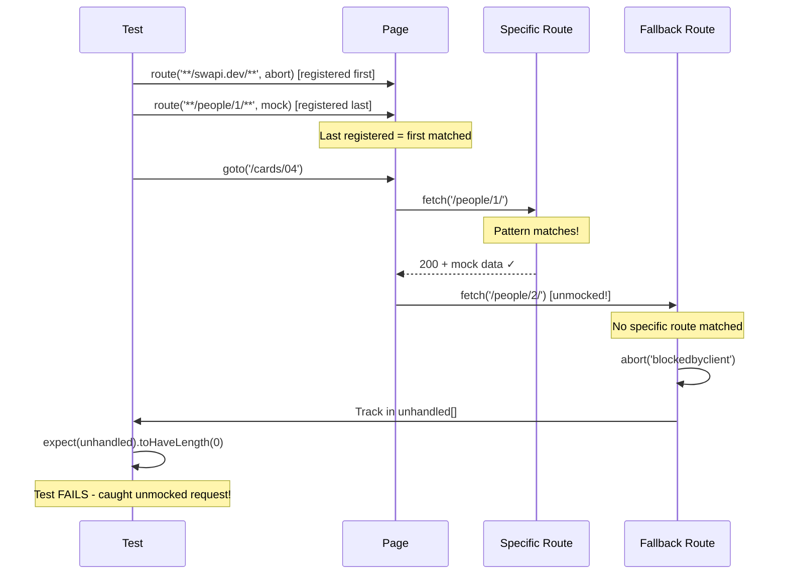

# Card 04: Mock Only What You Need

## What This Pattern Solves

When you mock APIs, it's easy to accidentally let unmocked requests slip through to the real network. This causes flaky tests, unexpected external calls in CI, and hard-to-debug failures. You need a way to ensure **only** the endpoints you explicitly mock are called—everything else should fail fast.

## How It Works

1. Register a **fallback route** with a broad pattern (e.g., `**/swapi.dev/**`) that aborts or fails
2. Register **specific routes** for the endpoints you want to mock
3. Playwright's route order (last registered = first matched) means specific routes run first
4. Any unhandled request hits the fallback and fails the test
5. Optionally track unhandled requests in an array to assert zero at the end

This is **strict mode** for API mocking—nothing gets through unless you explicitly allow it.

## Code Example

```typescript
import { test, expect } from '@playwright/test';
import type { SwapiPerson } from '../swapi/schema';

test.describe('04-mock-only-what-you-need: Strict mock scope', () => {
  test('only people/1 is mocked; other SWAPI requests are aborted', async ({ page }) => {
    const luke = {
      name: 'Luke Skywalker',
      height: '172',
    } satisfies Partial<SwapiPerson>;

    const unhandled: string[] = [];

    // 1. Fallback catches everything (registered FIRST)
    await page.route('**/swapi.dev/**', async (route) => {
      unhandled.push(route.request().url());
      await route.abort('blockedbyclient');
    });

    // 2. Specific mock (registered LAST, runs FIRST due to Playwright order)
    await page.route('**/swapi.dev/api/people/1/**', (route) =>
      route.fulfill({ json: luke }),
    );

    await page.goto('/cards/04');

    // 3. Assert no unhandled requests
    await expect(page.getByTestId('person-name')).toHaveText('Luke Skywalker');
    expect(unhandled).toHaveLength(0);
  });
});
```

The real spec also covers `context.route` (mock applies to every page in the context), `route.fallback()` (delegate to the next matching handler), and the `times` option (handle only the first N requests).

## Run This Example

```bash
pnpm test src/04-mock-only-what-you-need
```

## Prerequisites

- **Card 02**: Understanding basic `page.route()` mocking
- **Card 03**: Knowing how to write full mock payloads
- Concepts: Route order, request aborting, strict testing

## Key Concepts

- **Route order**: Last registered route runs first. Register fallback first, then specific mocks.
- **route.abort()**: Cancels a request without network call. Common reasons: `'blockedbyclient'`, `'failed'`, `'accessdenied'`.
- **Fallback pattern**: Broad glob like `**/api/**` or `**/*` catches unhandled requests.
- **Unhandled tracking**: Array to collect URLs that hit the fallback for debugging.
- **Strict mode**: Tests fail if ANY unmocked request is attempted.

## When to Use This Pattern

- ✓ **Default for CI** - Ensures tests never accidentally hit real APIs
- ✓ When debugging why tests are slow (catches real network calls)
- ✓ When you want confidence that mocks are complete
- ✓ In test suites with many endpoints to mock
- ✗ When initially exploring an API (use Card 05 proxy mode first)
- ✗ During rapid prototyping (too strict, slows development)

## Common Mistakes

1. **Wrong route order** (specific route registered first):
   ```typescript
   // ❌ WRONG - specific route won't run (fallback runs first)
   await page.route('**/people/1/**', mockHandler);
   await page.route('**/swapi.dev/**', abortHandler);

   // ✓ CORRECT - fallback first, specific last
   await page.route('**/swapi.dev/**', abortHandler);
   await page.route('**/people/1/**', mockHandler);
   ```

2. **Forgetting about other requests**:
   - Pages often load CSS, fonts, images, analytics
   - Either mock them too, or use a more specific fallback pattern like `**/api/**`

3. **Aborting with wrong error type**:
   - Use `'blockedbyclient'` for intentional blocks
   - Page may show network error if you use `'failed'`

4. **Not checking unhandled array**:
   ```typescript
   // ❌ WRONG - forgot to assert
   const unhandled: string[] = [];
   await page.route('**/*', (route) => unhandled.push(route.request().url()));
   // Test passes even with unhandled requests!

   // ✓ CORRECT - always assert
   expect(unhandled).toHaveLength(0);
   ```

## Flow Diagram



## Related Patterns

- **Previous**: Card 03 (Full Mock Payload) - Writing complete mocks
- **Next**: Card 05 (Proxy to Real API) - Opposite approach (allow real requests, patch results)
- **Advanced**: Card 16 (Debug Unhandled Requests) - Debugging workflow when fallback catches requests
- **Complementary**: Card 15 (Done Signals) - Waiting for network to be idle
- **Compare**: Card 02 (Basic Mocking) - No strictness, requests can leak to network
