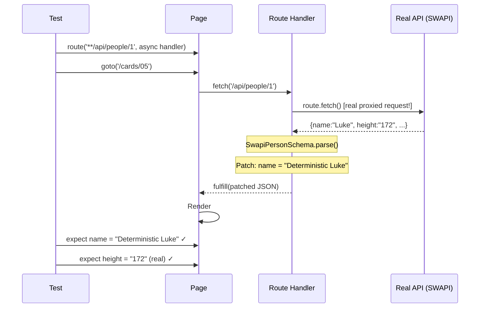

# Card 05: Proxy to Real API (Hybrid Mocking)

## What This Pattern Solves

Sometimes you want **real data** from an API (to test against actual structure and content) but need **deterministic assertions** (specific field values). Full mocking (Card 03) gives control but loses real data shape. This pattern gives you both: real API responses with selective patches.

## How It Works

1. Route handler intercepts the request
2. Use `route.fetch()` to make the real request (here a locally-proxied endpoint, so it returns real data without depending on a remote API)
3. Parse and validate the response JSON with `SwapiPersonSchema.parse()` so the patched object is typed
4. Patch specific fields you need to control (e.g., `name`)
5. Fulfill with the patched response via the `json` option
6. Page receives real data with your overrides

This is **hybrid mocking**: real data + deterministic patches.

## Code Example

```typescript
import { test, expect } from '@playwright/test';
import { SwapiPersonSchema } from '../swapi/schema';

test.describe('05-proxy-to-real-api: Real response, then patch', () => {
  // @integration: touches a real (locally-proxied) response, not a pure mock.
  // Selective run: `--grep @integration`.
  test('fetches the real response, patches one field, asserts deterministically', { tag: '@integration' }, async ({
    page,
  }) => {
    await page.route('**/api/people/1', async (route) => {
      // route.fetch() performs the real request. The card page proxies a local
      // endpoint, so this returns real data without depending on a remote API.
      const response = await route.fetch();

      // The proxied JSON is untrusted; parse it so the patched object is typed.
      const person = SwapiPersonSchema.parse(await response.json());

      // Only the name is forced. Height (172) stays as the endpoint returned it.
      await route.fulfill({ json: { ...person, name: 'Deterministic Luke' } });
    });

    await page.goto('/cards/05');

    await expect(page.getByTestId('person-name')).toHaveText('Deterministic Luke');
    await expect(page.getByTestId('person-height')).toHaveText('172');
  });
});
```

## Run This Example

```bash
pnpm test src/05-proxy-to-real-api
```

**Note**: The card page proxies a local endpoint, so this runs without a remote SWAPI connection. Tagged `@integration` because it exercises a real (proxied) response rather than a pure mock.

## Prerequisites

- **Card 02**: Understanding basic `page.route()` and `route.fulfill()`
- **Card 03**: Knowing when to use full vs minimal mocks
- Concepts: Async route handlers, JSON parsing, API proxying

## Key Concepts

- **route.fetch()**: Makes the actual HTTP request and returns a Response object
- **Hybrid approach**: Real data structure + controlled test values
- **Async handler**: Must use `async` to await `route.fetch()`
- **Response methods**: `response.status()`, `response.json()`, `response.headers()`
- **Selective patching**: Only override fields you need deterministic (leave rest real)

## When to Use This Pattern

- ✓ When initially exploring an unknown API (see real structure)
- ✓ When you want real data but need predictable assertions on 1-2 fields
- ✓ For integration tests against staging API with controlled test data
- ✓ When real response size/shape matters but content doesn't
- ✗ In CI without network access (use Card 06 fixtures instead)
- ✗ When API is slow or rate-limited (tests will be slow)
- ✗ When you need full offline tests (use Card 03 or 06)

## Common Mistakes

1. **Not using async/await**:
   ```typescript
   // ❌ WRONG - route.fetch() returns a Promise
   await page.route('**/*', (route) => {
     const response = route.fetch(); // Missing await!
     const json = response.json(); // Crashes
   });

   // ✓ CORRECT - async handler, await fetch
   await page.route('**/*', async (route) => {
     const response = await route.fetch();
     const json = await response.json();
   });
   ```

2. **Forgetting to preserve status/headers**:
   ```typescript
   // ❌ WRONG - loses status code
   await route.fulfill({ body: JSON.stringify(json) });

   // ✓ CORRECT - preserve status
   await route.fulfill({
     status: response.status(),
     contentType: 'application/json',
     body: JSON.stringify(json),
   });
   ```

3. **Patching too much** (defeats the purpose):
   - Only patch 1-2 fields for deterministic assertions
   - If you're patching everything, just use Card 03 (full mock)

4. **Not handling API failures**:
   - Real API can fail, be slow, or rate-limit
   - Consider timeouts and error handling

## Flow Diagram



## Related Patterns

- **Previous**: Card 04 (Mock Only What You Need) - Opposite: strict mocking, no network
- **Next**: Card 06 (Record & Replay Fixtures) - Evolution: proxy once, then replay forever
- **Complementary**: Card 07 (Patch Fixtures) - Similar patching, but on recorded data
- **Compare**: Card 03 (Full Mock) - No network, full control
- **Workflow**: Use this pattern first to explore API → Record with Card 06 → Patch with Card 07
