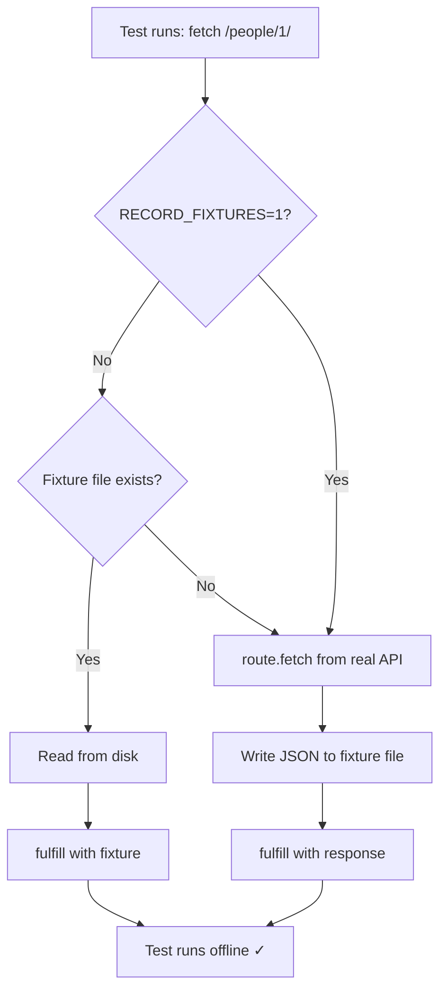

# Card 06: Record and Replay Fixtures

## What This Pattern Solves

Writing full mock payloads by hand (Card 03) is tedious and error-prone. Proxying to real APIs (Card 05) requires network access. The best of both worlds: **record real API responses once**, save them to files, then **replay from disk forever**—no network, no manual mocking.

## How It Works

1. A `beforeEach` registers one route for `**/swapi.dev/api/people/**` and extracts the person `id` from the URL
2. **Replay mode** (default): if a fixture file exists, read it from disk and fulfill with its contents
3. **Record mode** (`RECORD_FIXTURES=1`, or when no fixture exists yet): call the real API via `route.fetch()`, save the response to the fixture file, then fulfill with it
4. After initial recording, all tests run offline using fixture files
5. Update fixtures by running record mode again when the API changes

This is the **industry-standard pattern** for API mocking—used by VCR (Ruby), Polly.js, MSW, etc.

## Code Example

```typescript
import path from 'node:path';
import fs from 'node:fs';
import { test, expect } from '@playwright/test';

const FIXTURES_DIR = path.join(process.cwd(), 'test', 'fixtures');

function fixturePath(id: string) {
  return path.join(FIXTURES_DIR, `swapi.people.${id}.json`);
}

function isRecordMode() {
  return process.env.RECORD_FIXTURES === '1';
}

test.describe('06-record-and-replay-fixtures: Replay from fixtures', () => {
  test.beforeEach(async ({ page }) => {
    await page.route('**/swapi.dev/api/people/**', async (route) => {
      const url = route.request().url();
      const match = url.match(/\/people\/(\d+)/);
      const id = match ? match[1] : '1';
      const file = fixturePath(id);

      if (!isRecordMode() && fs.existsSync(file)) {
        const json = JSON.parse(fs.readFileSync(file, 'utf8'));
        return route.fulfill({
          status: 200,
          contentType: 'application/json',
          body: JSON.stringify(json),
        });
      }

      const response = await route.fetch();
      const body = await response.text();
      const json = body ? JSON.parse(body) : {};
      fs.mkdirSync(FIXTURES_DIR, { recursive: true });
      fs.writeFileSync(file, JSON.stringify(json, null, 2), 'utf8');
      await route.fulfill({
        status: response.status(),
        headers: response.headers(),
        body,
      });
    });
  });

  test('GET people/1 returns fixture when not in record mode', async ({ page }) => {
    await page.goto('/cards/06');

    await expect(page.getByTestId('person-name')).toBeVisible();
    await expect(page.getByTestId('person-name')).toContainText('Luke');
  });
});
```

## Run This Example

```bash
# First time: record fixtures from real API
RECORD_FIXTURES=1 pnpm test src/06-record-and-replay-fixtures
# Or use the script
pnpm test:record

# All subsequent runs: use fixtures (no network)
pnpm test src/06-record-and-replay-fixtures
```

## Prerequisites

- **Card 05**: Understanding `route.fetch()` for proxying
- **Card 03**: Knowing the value of deterministic data
- Concepts: File I/O, environment variables, fixture management

## Key Concepts

- **Fixture files**: JSON files in `test/fixtures/` containing captured responses
- **Record mode**: Environment variable (`RECORD_FIXTURES=1`) triggers API calls
- **Replay mode**: Default behavior, reads from disk
- **One-time setup**: Record fixtures once, commit to git, team shares them
- **Fixture updates**: Re-run record mode when API contract changes

## When to Use This Pattern

- ✓ **Default for most teams** - Best balance of convenience and control
- ✓ When API responses are large/complex (100+ fields)
- ✓ For air-gapped CI environments
- ✓ When multiple tests need the same API response
- ✓ To test against production-like data without hitting production
- ✗ When API responses are tiny (2-3 fields) - Card 03 is simpler
- ✗ When you need to patch many fields - use Card 07 instead

## Common Mistakes

1. **Forgetting to commit fixtures to git**:
   ```bash
   # ❌ WRONG - fixtures not in version control
   echo "test/fixtures/" >> .gitignore

   # ✓ CORRECT - fixtures are part of the test suite
   git add test/fixtures/*.json
   git commit -m "Add API fixtures"
   ```

2. **Not documenting how to record**:
   - Add `pnpm test:record` script to package.json
   - Document in README when to re-record

3. **Stale fixtures** (API changed but fixtures didn't):
   - Set up a weekly/monthly job to re-record and check for diffs
   - Or validate fixtures with Card 08 (Zod schemas)

4. **Recording in CI**:
   ```typescript
   // ❌ WRONG - CI tries to record but has no network access
   const RECORD_MODE = !fs.existsSync(fixturePath);

   // ✓ CORRECT - explicit env var control
   const RECORD_MODE = process.env.RECORD_FIXTURES === '1';
   ```

5. **Not handling record failures**:
   - Real API can be down during recording
   - Add error handling and retry logic

## Flow Diagram



## Related Patterns

- **Previous**: Card 05 (Proxy to Real API) - Live proxying without saving
- **Next**: Card 07 (Patch Fixtures) - Load fixture + override specific fields
- **Complementary**: Card 08 (Zod Validation) - Validate fixtures match expected schema
- **Alternative**: Card 09 (Faker Builders) - Generate synthetic data instead of recording
- **Workflow**: Card 05 (explore) → Card 06 (record) → Card 07 (patch for edge cases)
