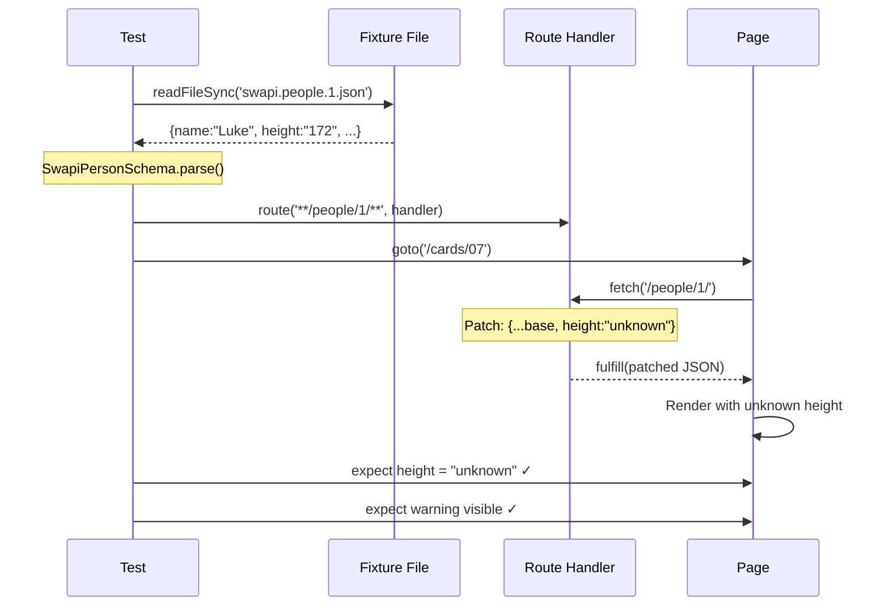

# Card 07: Patch Fixtures for Edge Cases

## What This Pattern Solves

You've recorded fixtures (Card 06) and most tests work great. But you need to test edge cases: what if `height` is `"unknown"`? What if `films` is empty? Creating separate fixture files for every variation is wasteful. Instead, **load one fixture and patch specific fields** for each test scenario.

## How It Works

1. Read the base fixture file from disk
2. Parse and validate it with `SwapiPersonSchema.parse()` so a stale fixture fails loudly
3. Use the spread operator to override 1-2 fields
4. Fulfill with the patched object (the `json` option serializes it for you)
5. Test asserts on the edge case behavior

This keeps **one source of truth** (the base fixture) and creates variations only where needed.

## Code Example

```typescript
import path from 'node:path';
import fs from 'node:fs';
import { test, expect } from '@playwright/test';
import { SwapiPersonSchema, type SwapiPerson } from '../swapi/schema';

const FIXTURE_FILE = path.join(process.cwd(), 'test', 'fixtures', 'swapi.people.1.json');

test.describe('07-patch-fixtures: Override one field from a fixture', () => {
  test('patches height to "unknown" and shows the fallback warning', async ({ page }) => {
    // One base fixture, validated on load so a stale fixture fails loudly.
    const base: SwapiPerson = SwapiPersonSchema.parse(
      JSON.parse(fs.readFileSync(FIXTURE_FILE, 'utf8')),
    );

    await page.route('**/swapi.dev/api/people/1/**', (route) =>
      route.fulfill({ json: { ...base, height: 'unknown' } }),
    );

    await page.goto('/cards/07');

    await expect(page.getByTestId('person-name')).toContainText('Luke');
    await expect(page.getByTestId('person-height')).toHaveText('unknown');
    await expect(page.getByTestId('height-warning')).toBeVisible();
  });
});
```

## Run This Example

```bash
pnpm test src/07-patch-fixtures
```

## Prerequisites

- **Card 06**: Understanding fixture recording/replay
- **Card 03**: Knowing full mock payloads
- Concepts: Spread operator, JSON parsing, edge case testing

## Key Concepts

- **Base fixture**: The "happy path" recorded response
- **Spread operator**: `{...base, field: newValue}` creates a shallow copy with override
- **Edge case variations**: Empty arrays, null values, "unknown" strings, extreme numbers
- **One source of truth**: Maintain one fixture, patch for variations
- **Deterministic edge cases**: Test error handling without relying on API to return errors

## When to Use This Pattern

- ✓ Testing edge cases (null, empty, unknown values)
- ✓ When you have 1 base fixture + 5 variations (better than 6 fixture files)
- ✓ Testing UI error states without mocking error responses
- ✓ Validating fallback/default behavior
- ✗ When every test needs different data (use Card 09 builders instead)
- ✗ When the base fixture is tiny (just write inline mocks per test)

## Common Mistakes

1. **Deep object patching** (spread is shallow):
   ```typescript
   // ❌ WRONG - doesn't patch nested objects
   const person = { ...base, metadata: { source: 'test' } };
   // base.metadata is completely replaced!

   // ✓ CORRECT - patch nested properly
   const person = {
     ...base,
     metadata: { ...base.metadata, source: 'test' },
   };
   ```

2. **Patching too many fields** (defeats the purpose):
   - If overriding 5+ fields, create a new fixture or use Card 09 (builders)
   - Patch should be 1-3 fields for clarity

3. **Not documenting why**:
   ```typescript
   // ❌ WRONG - unclear why height is 'unknown'
   const person = { ...base, height: 'unknown' };

   // ✓ CORRECT - comment explains edge case
   // Test UI fallback when API returns 'unknown' for missing data
   const person = { ...base, height: 'unknown' };
   ```

4. **Forgetting to re-stringify**:
   ```typescript
   // ❌ WRONG - body must be string
   route.fulfill({ body: patchedPerson });

   // ✓ CORRECT
   route.fulfill({ body: JSON.stringify(patchedPerson) });
   ```

## Flow Diagram



## Related Patterns

- **Previous**: Card 06 (Record Fixtures) - Creates the base fixtures you patch
- **Next**: Card 08 (Zod Validation) - Validate patched fixtures match schema
- **Complementary**: Card 05 (Proxy to Real API) - Similar patching, but on live data
- **Alternative**: Card 09 (Faker Builders) - Generate variations instead of patching
- **Compare**: Card 03 (Full Mock) - Write each variation by hand
