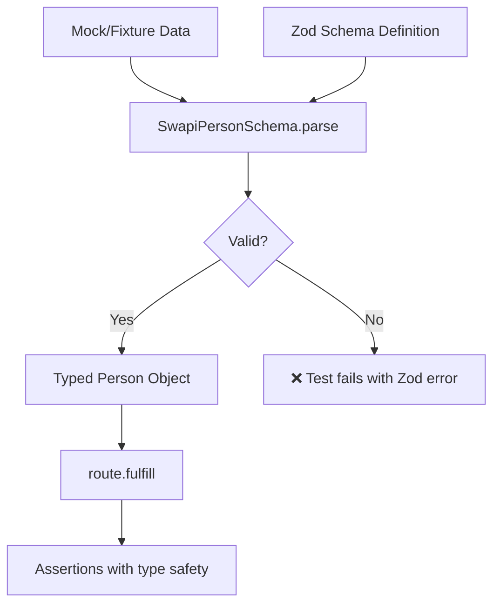

# Card 08: Validate with Zod Schemas

## What This Pattern Solves

TypeScript types help at compile time, but don't validate runtime data. When API contracts change, fixtures drift, or mocks have typos, you need **runtime validation** that fails tests immediately with clear error messages. Zod provides schemas that both validate and type your data.

## How It Works

1. Define a Zod schema describing the expected API response structure
2. Derive TypeScript types from the schema using `z.infer<>`
3. In tests, parse mock/fixture data with `schema.parse()`
4. If data doesn't match schema, Zod throws with detailed error
5. Successful parse gives you fully-typed data for assertions

This catches **contract drift** before assertions even run.

## Code Example

```typescript
import { test, expect } from '@playwright/test';
import { SwapiPersonSchema } from '../swapi/schema';
import type { SwapiPerson } from '../swapi/schema';

// Schema (shared across tests) — src/swapi/schema.ts
// export const SwapiPersonSchema = z.object({
//   name: z.string(),
//   height: z.string(),
//   mass: z.string(),
//   url: z.string().url(),
//   films: z.array(z.string().url()),
// });
// export type SwapiPerson = z.infer<typeof SwapiPersonSchema>;

const knownGoodPerson: SwapiPerson = {
  name: 'Luke Skywalker',
  height: '172',
  mass: '77',
  url: 'https://swapi.dev/api/people/1/',
  films: [],
};

test.describe('08-validate-with-zod: Validate response with Zod', () => {
  test('schema gates the boundary; only parsed data reaches the page', async ({ page }) => {
    // Parse at the boundary — only validated data is fulfilled.
    await page.route('**/swapi.dev/api/people/1/**', (route) =>
      route.fulfill({ json: SwapiPersonSchema.parse(knownGoodPerson) }),
    );

    await page.goto('/cards/08');

    await expect(page.getByTestId('person-name')).toHaveText('Luke Skywalker');
  });
});
```

## Run This Example

```bash
pnpm test src/08-validate-with-zod
```

## Prerequisites

- **Card 03**: Understanding full mock payloads
- **Card 06**: Understanding fixtures
- Concepts: Runtime validation, schema definition, type inference

## Key Concepts

- **Zod schema**: Runtime validator (`z.object()`, `z.string()`, `z.array()`, etc.)
- **Type inference**: `z.infer<typeof Schema>` generates TypeScript types
- **Parse vs safeParse**: `parse()` throws on error, `safeParse()` returns success/error object
- **Schema composition**: Reuse schemas across tests
- **Contract validation**: Ensures mocks/fixtures match expected API shape

## When to Use This Pattern

- ✓ **Highly recommended for all projects** - Catches contract changes early
- ✓ Validating recorded fixtures (Card 06) haven't drifted from API
- ✓ Ensuring hand-written mocks (Card 03) are complete
- ✓ Generating TypeScript types from API contracts
- ✓ Testing against production-like data with confidence
- ✗ When API contract is undefined/changing rapidly (too much maintenance)
- ✗ For tiny mocks with 2-3 fields (overhead not worth it)

## Common Mistakes

1. **Not handling parse errors**:
   ```typescript
   // ❌ WRONG - parse throws, test crashes with cryptic error
   const person = SwapiPersonSchema.parse(maybeInvalidData);

   // ✓ CORRECT - catch and provide context
   try {
     const person = SwapiPersonSchema.parse(mockData);
   } catch (error) {
     throw new Error(`Mock data invalid: ${error}`);
   }

   // ✓ BETTER - use safeParse for custom handling
   const result = SwapiPersonSchema.safeParse(mockData);
   if (!result.success) {
     console.error('Validation failed:', result.error.format());
   }
   ```

2. **Validating in wrong place**:
   ```typescript
   // ❌ WRONG - validating after page loaded (too late)
   await page.goto('/');
   const person = SwapiPersonSchema.parse(mockData);

   // ✓ CORRECT - validate before fulfill
   const person = SwapiPersonSchema.parse(mockData);
   await page.route('**/*', (route) =>
     route.fulfill({ body: JSON.stringify(person) })
   );
   ```

3. **Schema too strict** (brittle tests):
   - Only validate fields you actually use
   - Use `.passthrough()` to allow extra fields
   - Consider `.partial()` for optional fields

4. **Not reusing schemas**:
   ```typescript
   // ❌ WRONG - schema defined per test
   test('...', () => {
     const schema = z.object({ name: z.string() });
   });

   // ✓ CORRECT - shared schema file
   // src/schemas/swapi.ts
   export const SwapiPersonSchema = z.object({...});
   ```

## Flow Diagram



## Related Patterns

- **Previous**: Card 07 (Patch Fixtures) - Validate patched data matches schema
- **Next**: Card 09 (Faker Builders) - Combine schemas with generated data
- **Complementary**: Card 06 (Record Fixtures) - Validate recorded responses
- **Complementary**: Card 03 (Full Mock) - Ensure hand-written mocks are valid
- **Compare**: TypeScript types - Compile-time only, no runtime validation
