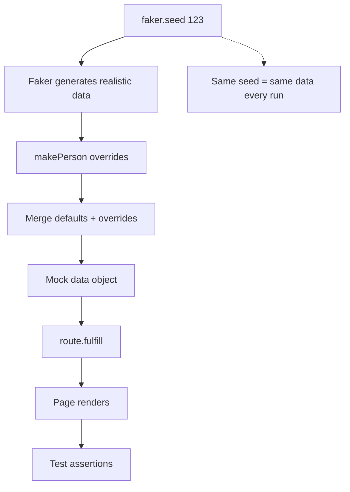

# Card 09: Generate Data with Faker Builders

## What This Pattern Solves

Fixtures (Card 06-07) work well but require maintenance when APIs change. Hand-written mocks (Card 03) are tedious. For many tests, you just need "a person" with realistic data—names, numbers, URLs that look real but don't require recording. **Faker** generates synthetic data, and **builders** make it deterministic and customizable.

## How It Works

1. Create a builder function (e.g., `makePerson()`) that uses Faker to generate realistic defaults
2. Seed Faker (`faker.seed(123)`) for deterministic results across test runs
3. Allow overrides for specific test cases: `makePerson({ name: 'Test User' })`
4. Use in route handlers to return synthetic, deterministic mock data
5. Tests are reproducible—same seed = same data every time

This combines the **realism** of recorded data with the **flexibility** of hand-written mocks.

## Code Example

```typescript
import { faker } from '@faker-js/faker';
import { test, expect } from '@playwright/test';
import { makePerson } from '../swapi/builders';

// Builder in shared file — src/swapi/builders.ts
// export function makePerson(overrides: Partial<SwapiPerson> = {}): SwapiPerson {
//   return {
//     name: faker.person.fullName(),
//     height: String(faker.number.int({ min: 120, max: 220 })),
//     mass: String(faker.number.int({ min: 40, max: 150 })),
//     url: faker.internet.url(),
//     films: [],
//     ...overrides, // Override specific fields
//   };
// }

test.describe('09-generate-data-faker: Deterministic synthetic data', () => {
  test.beforeEach(() => {
    faker.seed(123);
  });

  test('seeded builder produces the same person every run', async ({ page }) => {
    const person = makePerson({ name: 'Test' });

    await page.route('**/swapi.dev/api/people/1/**', (route) =>
      route.fulfill({ json: person }),
    );

    await page.goto('/cards/09');

    // Overridden field.
    await expect(page.getByTestId('person-name')).toHaveText('Test');
    // Faker-generated fields are deterministic for seed 123.
    await expect(page.getByTestId('person-height')).toHaveText('219');
    await expect(page.getByTestId('person-mass')).toHaveText('116');
  });
});
```

## Run This Example

```bash
pnpm test src/09-generate-data-faker
```

## Prerequisites

- **Card 03**: Understanding full mock payloads
- **Card 07**: Knowing why variations are valuable
- Concepts: Builder pattern, deterministic randomness, Faker.js

## Key Concepts

- **Faker**: Library for generating realistic fake data (names, emails, numbers, URLs)
- **Seeding**: `faker.seed(N)` makes Faker deterministic—same seed = same output
- **Builder pattern**: Function that creates objects with sensible defaults + overrides
- **Deterministic tests**: Seeding ensures tests pass/fail consistently
- **Realistic data**: Generated data looks like production data (good for visual testing)

## When to Use This Pattern

- ✓ **Recommended for most projects** - Best of both worlds (realistic + flexible)
- ✓ When you need many variations of "a person" across tests
- ✓ When API responses have 10+ fields (tedious to write by hand)
- ✓ For visual regression tests (need realistic-looking data)
- ✓ When you want tests independent of fixture files
- ✗ When testing against exact production data (use Card 06 fixtures)
- ✗ For tiny objects with 2-3 fields (just write inline)

## Common Mistakes

1. **Forgetting to seed** (non-deterministic tests):
   ```typescript
   // ❌ WRONG - different data every run, flaky tests
   const person = makePerson();

   // ✓ CORRECT - seed for deterministic data
   faker.seed(123);
   const person = makePerson();
   ```

2. **Seeding in wrong place**:
   ```typescript
   // ❌ WRONG - seed inside builder (called multiple times)
   function makePerson() {
     faker.seed(123); // Seeds every call!
     return { name: faker.person.fullName() };
   }

   // ✓ CORRECT - seed once per test/file
   beforeEach(() => faker.seed(123));
   function makePerson() {
     return { name: faker.person.fullName() };
   }
   ```

3. **Not allowing overrides**:
   ```typescript
   // ❌ WRONG - can't customize for specific tests
   function makePerson() {
     return { name: faker.person.fullName(), height: '172' };
   }

   // ✓ CORRECT - accept overrides
   function makePerson(overrides?: Partial<Person>) {
     return {
       name: faker.person.fullName(),
       height: '172',
       ...overrides,
     };
   }
   ```

4. **Overusing Faker** (inappropriate randomness):
   - Don't use Faker for IDs that tests assert on
   - Don't use for enums/constants (use actual valid values)
   - Keep URLs, numbers, names faker-generated

## Flow Diagram



## Related Patterns

- **Previous**: Card 08 (Zod Validation) - Combine with schemas to validate generated data
- **Next**: Card 10 (Per-Test Overrides) - Use builders with default + override pattern
- **Alternative**: Card 06 (Record Fixtures) - Record real data instead of generating
- **Alternative**: Card 03 (Full Mock) - Write by hand instead of generating
- **Complementary**: Card 07 (Patch Fixtures) - Similar override pattern
