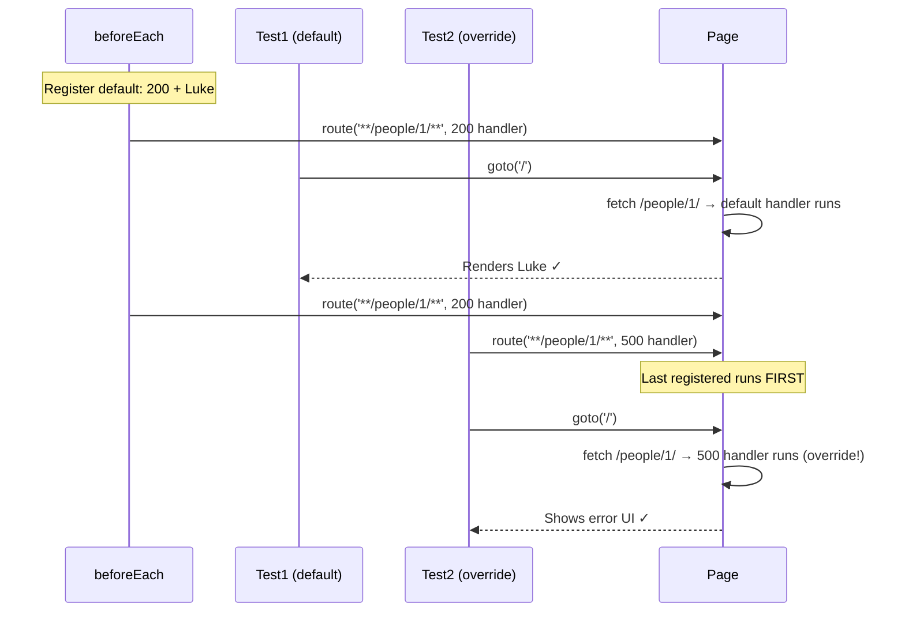

# Card 10: Per-Test Overrides (Error Scenarios)

## What This Pattern Solves

Most tests need the same "happy path" mock (200 + valid data). But you also need to test error scenarios: 500 errors, 404s, timeouts, malformed responses. Duplicating the happy-path setup in every test is wasteful. Instead, set up a **default handler** once, then **override** it in specific tests that need different behavior.

## How It Works

1. Register a default route handler in `beforeEach` (200 + happy path data)
2. Most tests just navigate—they get the default mock automatically
3. Error tests register a second route handler BEFORE navigating (same URL pattern)
4. Playwright's "last registered runs first" means the override takes precedence
5. Test asserts on error UI behavior
6. Each test gets a fresh page/context, so overrides don't leak

This is the **DRY** approach to scenario testing: one default, many overrides.

## Code Example

```typescript
import { test, expect } from '@playwright/test';
import type { SwapiPerson } from '../swapi/schema';

const luke: SwapiPerson = {
  name: 'Luke Skywalker',
  height: '172',
  mass: '77',
  url: 'https://swapi.dev/api/people/1/',
  films: [],
};

test.describe('10-per-test-overrides: Scenario-based route override', () => {
  // Default: happy path for all tests
  test.beforeEach(async ({ page }) => {
    await page.route('**/swapi.dev/api/people/1/**', (route) =>
      route.fulfill({ json: luke }),
    );
  });

  test('GET people/1 returns 200 and person by default', async ({ page }) => {
    await page.goto('/cards/10');
    await expect(page.getByTestId('person-name')).toHaveText('Luke Skywalker');
  });

  test('handles SWAPI 500 when overridden', async ({ page }) => {
    // Override: register BEFORE goto
    await page.route('**/swapi.dev/api/people/1/**', (route) =>
      route.fulfill({ status: 500, body: '' }),
    );

    await page.goto('/cards/10');

    await expect(page.getByTestId('error')).toBeVisible();
    await expect(page.getByTestId('error')).toContainText('500');
  });

  test('handles SWAPI 404 when overridden', async ({ page }) => {
    await page.route('**/swapi.dev/api/people/1/**', (route) =>
      route.fulfill({ status: 404, body: 'Not Found' }),
    );

    await page.goto('/cards/10');

    await expect(page.getByTestId('error')).toBeVisible();
    await expect(page.getByTestId('error')).toContainText('404');
  });

  test('handles network timeout via route.abort', async ({ page }) => {
    await page.route('**/swapi.dev/api/people/1/**', (route) =>
      route.abort('timedout'),
    );

    await page.goto('/cards/10');

    await expect(page.getByTestId('error')).toBeVisible();
  });
});
```

## Run This Example

```bash
pnpm test src/10-per-test-overrides
```

## Prerequisites

- **Card 02**: Understanding `page.route()` and route order
- **Card 04**: Knowing route order (last registered runs first)
- Concepts: DRY principle, error handling testing, route precedence

## Key Concepts

- **Default handler**: Common setup in `beforeEach` for happy path
- **Override pattern**: Register another handler in specific tests (runs first)
- **Route precedence**: Last registered route handler runs first in Playwright
- **Scenario testing**: Test various API responses (success, errors, edge cases)
- **Fresh context**: Each test gets isolated page, no cross-test pollution

## When to Use This Pattern

- ✓ **Recommended for all test suites** - DRY approach to scenario testing
- ✓ Testing error handling (4xx, 5xx responses)
- ✓ Testing timeout scenarios
- ✓ Testing malformed/incomplete data
- ✓ When you have 10+ tests with 1 default + 3 error cases
- ✗ When every test needs different mocks (no default makes sense)
- ✗ For single-test files (overhead not worth it)

## Common Mistakes

1. **Overriding AFTER navigation** (too late):
   ```typescript
   // ❌ WRONG - page already loaded with default mock
   await page.goto('/');
   await page.route('**/*', errorHandler);

   // ✓ CORRECT - override before navigation
   await page.route('**/*', errorHandler);
   await page.goto('/');
   ```

2. **Not understanding route order**:
   ```typescript
   // Routes run in reverse order of registration
   await page.route('**/*', defaultHandler);  // Runs SECOND
   await page.route('**/*', errorHandler);    // Runs FIRST (overrides)
   ```

3. **Forgetting default can still match**:
   - If override pattern is narrower, default might still run
   - Make override pattern match or be broader than default

4. **Sharing mutable state** (if using shared context):
   ```typescript
   // ❌ WRONG - shared context, routes leak between tests
   const context = await browser.newContext();

   // ✓ CORRECT - each test gets fresh page from fixture
   test('...', async ({ page }) => {
     // page is fresh per test
   });
   ```

## Flow Diagram



## Related Patterns

- **Previous**: Card 09 (Faker Builders) - Combine with builders for varied mock data
- **Next**: Card 11 (Login Flow) - Apply override pattern to auth scenarios
- **Foundation**: Card 02 (Basic Mocking) - Understanding route handlers
- **Foundation**: Card 04 (Mock Only What You Need) - Understanding route order
- **Complementary**: Card 07 (Patch Fixtures) - Similar override pattern for fixture data
