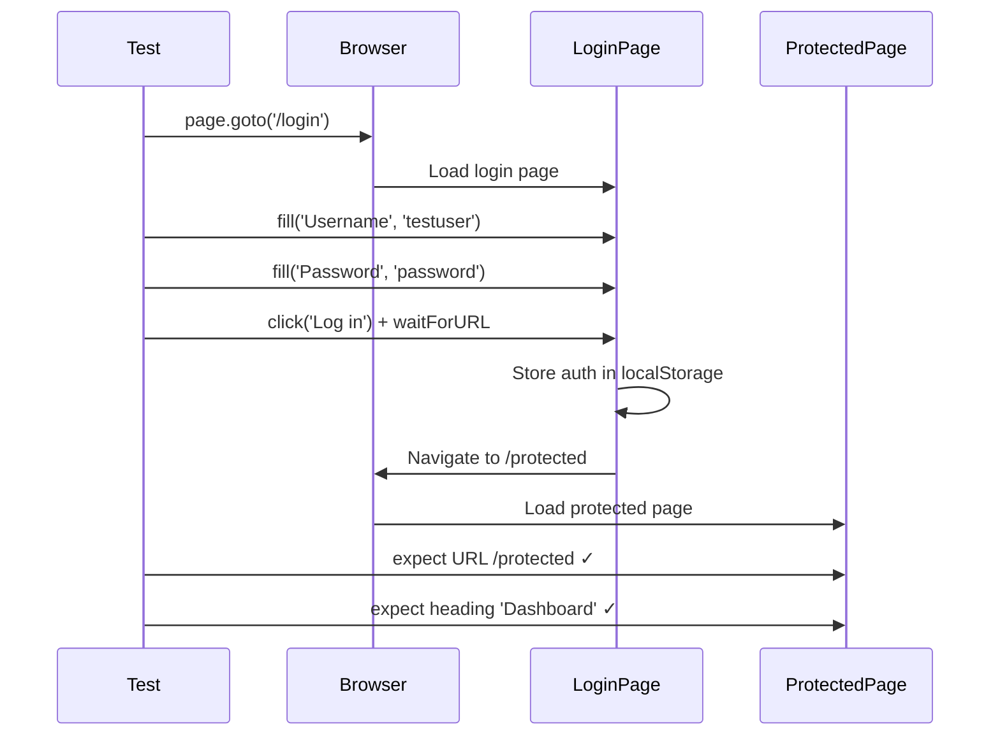

# Card 11: Login Flow (Forms & Navigation)

## What This Pattern Solves

Most real applications have forms, navigation, and multi-page flows. This card teaches you how to interact with form elements, submit them, and assert on navigation - going beyond the read-only tests from earlier cards.

## How It Works

1. Navigate to the login page
2. Use `getByLabel()` to find form inputs (accessibility-friendly)
3. Use `fill()` to enter text
4. Use `Promise.all()` to wait for navigation while clicking submit
5. Assert on the new URL and page content

This demonstrates **user interaction patterns** - clicking, typing, and navigating - that you'll use in most real-world tests.

## Code Example

```typescript
test('fills login form and navigates to protected page', async ({ page }) => {
  await page.goto('/login');

  // Fill form using accessible labels
  await page.getByLabel('Username').fill('testuser');
  await page.getByLabel('Password').fill('password');

  // Submit and wait for navigation
  await Promise.all([
    page.waitForURL(/protected/),
    page.getByRole('button', { name: 'Log in' }).click(),
  ]);

  // Assert we're on protected page
  await expect(page).toHaveURL(/protected/);
  await expect(page.getByRole('heading', { name: 'Dashboard' })).toBeVisible();
});
```

## Run This Example

```bash
pnpm test src/11-login-flow
```

## Prerequisites

- **Card 01-02**: Understanding page.goto() and basic assertions
- Concepts: Form interactions, URL assertions, multi-page flows

## Key Concepts

- **getByLabel()**: Finds inputs by their `<label>` text (accessibility-friendly, robust to markup changes)
- **fill()**: Types text into an input field (clears first, then types)
- **Promise.all([waitForURL, click])**: Prevents race conditions when clicks trigger navigation
- **expect(page).toHaveURL()**: Asserts current URL matches a pattern
- **page.evaluate()**: Runs JavaScript in the browser context to access localStorage, etc.

## When to Use This Pattern

- ✓ Testing login flows, forms, and multi-step processes
- ✓ Verifying navigation after user actions
- ✓ Checking client-side state (localStorage, cookies)
- ✓ Any test that goes beyond read-only assertions
- ✗ When you can skip the UI and set storage state directly (see Card 19)

## Common Mistakes

- **Clicking without waiting for navigation**: Always use `Promise.all([waitForURL, click])` when clicks trigger navigation
  ```typescript
  // ❌ WRONG - race condition
  await page.getByRole('button').click();
  await expect(page).toHaveURL(/protected/);

  // ✓ CORRECT - wait for navigation to start
  await Promise.all([
    page.waitForURL(/protected/),
    page.getByRole('button').click(),
  ]);
  ```

- **Using CSS selectors instead of accessibility queries**: Prefer `getByLabel()`, `getByRole()` over `locator('#username')`
- **Not checking navigation happened**: Always assert on final URL or page content
- **Hardcoding wait times**: Use `waitForURL()` instead of `waitForTimeout()`

## Flow Diagram



## Related Patterns

- **Previous**: Card 02 (Mock Your First API) - Basic page assertions
- **Next**: Card 12 (Locators, Actions, Flows) - Refactoring this inline code into reusable layers
- **Advanced**: Card 19 (Auth Storage State) - Skip login UI by loading storage state directly
