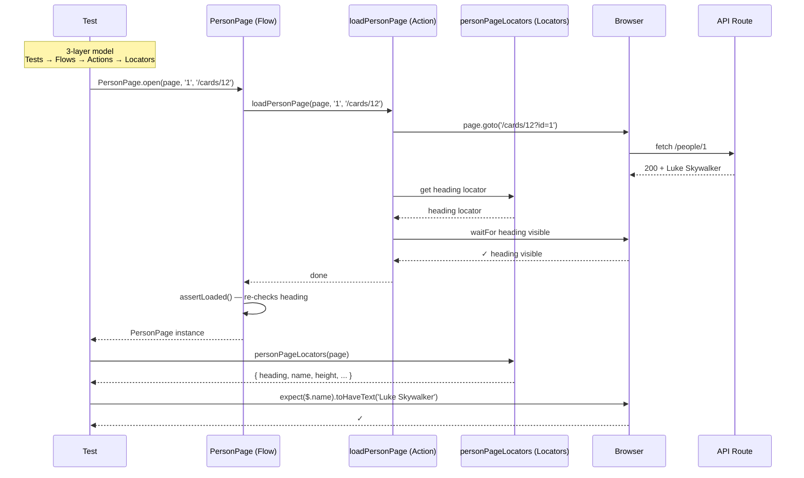

# Card 12: Locators → Actions → Flows (3-Layer Model)

## What This Pattern Solves

As your test suite grows beyond a few simple tests, inline selectors and raw `page.goto()` calls spread across dozens of files. A button's test ID changes and you're hunting through 15 files. Someone adds a `waitForTimeout(3000)` because the page "feels slow" — now your suite takes 3 minutes longer. The 3-layer model gives you a scalable architecture: **Locators** centralize every selector, **Actions** encapsulate every interaction with a built-in done signal, and **Flows** compose actions into business-meaningful steps that return the next page object.

This is the default structure for any non-trivial Playwright suite — it keeps tests describing _what_ the user does, not _how_ the DOM is structured.

## How It Works

1. **Locators layer** (`personPageLocators`): A plain function that takes `page` and returns an object of Playwright locators. No clicks, no assertions, no awaits — just locator definitions.
2. **Actions layer** (`loadPersonPage`): One interaction plus a "done signal" — navigate to a URL AND wait for the heading to become visible. Actions can import locators and compose multiple steps into a single atomic operation.
3. **Flows layer** (`PersonPage`): A lightweight class that composes actions into business-level steps. Exposes `assertLoaded()` for readiness checks and a static `open()` that loads the page and returns the next page object — the **return-next-page** pattern.
4. Tests import from the layer they need: use flows for full-page scenarios, use actions directly when you need finer control, and use locators for ad-hoc assertions.

## Code Example

```typescript
// ── e2e-patterns/person/locators.ts ───────────────────────
import type { Page } from '@playwright/test';

export function personPageLocators(page: Page) {
  return {
    heading: page.getByRole('heading', { name: 'Person' }),
    name: page.getByTestId('person-name'),
    height: page.getByTestId('person-height'),
    mass: page.getByTestId('person-mass'),
    // Semantic-first: the element has role="alert".
    error: page.getByRole('alert'),
    loading: page.getByText('Loading…'),
    // Semantic-first: <button>Edit</button> with an accessible name.
    editButton: page.getByRole('button', { name: 'Edit' }),
  };
}

// ── e2e-patterns/person/actions.ts ────────────────────────
import type { Page } from '@playwright/test';
import { personPageLocators } from './locators';

export async function loadPersonPage(
  page: Page,
  id: string,
  baseUrl: string = '/',
): Promise<void> {
  const url = baseUrl.includes('?')
    ? `${baseUrl}&id=${id}`
    : `${baseUrl}?id=${id}`;
  await page.goto(url);
  const $ = personPageLocators(page);
  await $.heading.waitFor({ state: 'visible', timeout: 10000 });
}

// ── e2e-patterns/person/PersonPage.ts ─────────────────────
import type { Page } from '@playwright/test';
import { expect } from '@playwright/test';
import { loadPersonPage } from './actions';
import { personPageLocators } from './locators';

export class PersonPage {
  constructor(readonly page: Page) {}

  async assertLoaded(): Promise<void> {
    const $ = personPageLocators(this.page);
    await expect($.heading).toBeVisible();
  }

  static async open(
    page: Page,
    personId: string,
    baseUrl: string = '/',
  ): Promise<PersonPage> {
    await loadPersonPage(page, personId, baseUrl);
    const personPage = new PersonPage(page);
    await personPage.assertLoaded();
    return personPage;
  }
}

// ── Test ──────────────────────────────────────────────────
import { test, expect } from '@playwright/test';
import { PersonPage } from '../e2e-patterns/person/PersonPage';
import { personPageLocators } from '../e2e-patterns/person/locators';
import { loadPersonPage } from '../e2e-patterns/person/actions';

// Test using flows
test('flow returns PersonPage and assertLoaded passes', async ({ page }) => {
  const personPage = await PersonPage.open(page, '1', '/cards/12');
  await personPage.assertLoaded();
  const $ = personPageLocators(page);
  await expect($.name).toHaveText('Luke Skywalker');
});

// Test using actions + locators directly
test('actions and locators used without flows', async ({ page }) => {
  await loadPersonPage(page, '1', '/cards/12');
  const $ = personPageLocators(page);
  await expect($.heading).toBeVisible();
  await expect($.name).toHaveText('Luke Skywalker');
});
```

## Run This Example

```bash
pnpm test src/12-locators-actions-flows
```

## Prerequisites

- **Card 11**: Understanding form interactions and navigation patterns
- Concepts: TypeScript modules, class-based page objects, separation of concerns

## Key Concepts

- **Locators only**: Locator functions never call `.click()`, `.fill()`, or `expect()`. They are pure definitions — one source of truth for every selector on a page.
- **Actions with done signals**: Every action function encapsulates an interaction AND a confirming signal (e.g., `goto` + `waitFor heading visible`). No caller needs to guess when the action is "done."
- **Return-next-page**: `PersonPage.open()` returns a `PersonPage` instance. The test can immediately call `assertLoaded()` or chain into the next flow without re-navigating.
- **Composable imports**: Tests can import only what they need — locators for edge-case assertions, actions for fine-grained control, flows for full business scenarios.
- **No giant page objects**: The `PersonPage` class stays small (a constructor, `assertLoaded()`, and a static `open()`). It doesn't grow to 200 lines because locators and actions live in their own modules.

## When to Use This Pattern

- ✓ Default structure for any screen or component with 3+ tests
- ✓ When multiple tests navigate to the same page (DRY up `goto` + `waitFor`)
- ✓ When selectors change frequently (one place to update)
- ✓ When you want tests to read like a user story, not a DOM script
- ✓ When you need the same page in multiple test files (import the flow)
- ✗ For a single, one-off test (overhead not worth it)
- ✗ For trivial pages with 1–2 elements (inline locators are fine)
- ✗ When you're still prototyping the test (start inline, extract later)

## Common Mistakes

1. **Putting awaits in the locators function**:
   ```typescript
   // ✗ WRONG — locators with actions
   export function personPageLocators(page: Page) {
     return {
       heading: page.getByRole('heading', { name: 'Person' }),
       editButton: async () => await page.getByTestId('edit-person').click(),
     };
   }

   // ✓ CORRECT — locators return locators only
   export function personPageLocators(page: Page) {
     return {
       heading: page.getByRole('heading', { name: 'Person' }),
       editButton: page.getByRole('button', { name: 'Edit' }),
     };
   }
   ```

2. **Dumping everything into one giant page class**:
   ```typescript
   // ✗ WRONG — 200-line class with locators, actions, and assertions
   class PersonPage {
     heading = this.page.getByRole('heading', { name: 'Person' });
     async clickEdit() { /* ... */ }
     async fillName(name: string) { /* ... */ }
     async assertLoaded() { /* ... */ }
     async assertErrorVisible() { /* ... */ }
     // ... 30 more methods
   }

   // ✓ CORRECT — split into locators, actions, and a thin flow class
   ```

3. **Skipping 'done signals' in actions**:
   ```typescript
   // ✗ WRONG — action without completion signal
   export async function loadPersonPage(page: Page, id: string) {
     await page.goto(`/?id=${id}`);
     // caller must remember to waitFor heading — flaky!
   }

   // ✓ CORRECT — action includes its own done signal
   export async function loadPersonPage(page: Page, id: string) {
     await page.goto(`/?id=${id}`);
     await page.getByRole('heading', { name: 'Person' })
       .waitFor({ state: 'visible', timeout: 10000 });
   }
   ```

4. **Not re-exporting or re-using across layers**:
   - Actions should import locators — don't duplicate selectors
   - Flows should import actions — don't re-implement navigation
   - This creates a dependency chain: tests → flows → actions → locators

5. **Making flows too smart**: Flows should compose actions, not contain business logic. If you're conditionally branching in a flow, you probably need a separate flow or a parameterized action.

## Flow Diagram



## Related Patterns

- **Previous**: Card 11 (Login Flow) — The inline form code that this pattern refactors into layers
- **Next**: Card 13 (Scoped Queries) — How to query inside containers within these layers
- **Foundation**: Card 14 (Region Objects) — Component-scoped helpers that plug into the actions layer
- **Advanced**: Card 21 (App Driver Fixture) — Wraps all flows into a single test fixture
- **Complementary**: Card 15 (Done Signals) — Deep dive on the "done signal" concept used in actions
