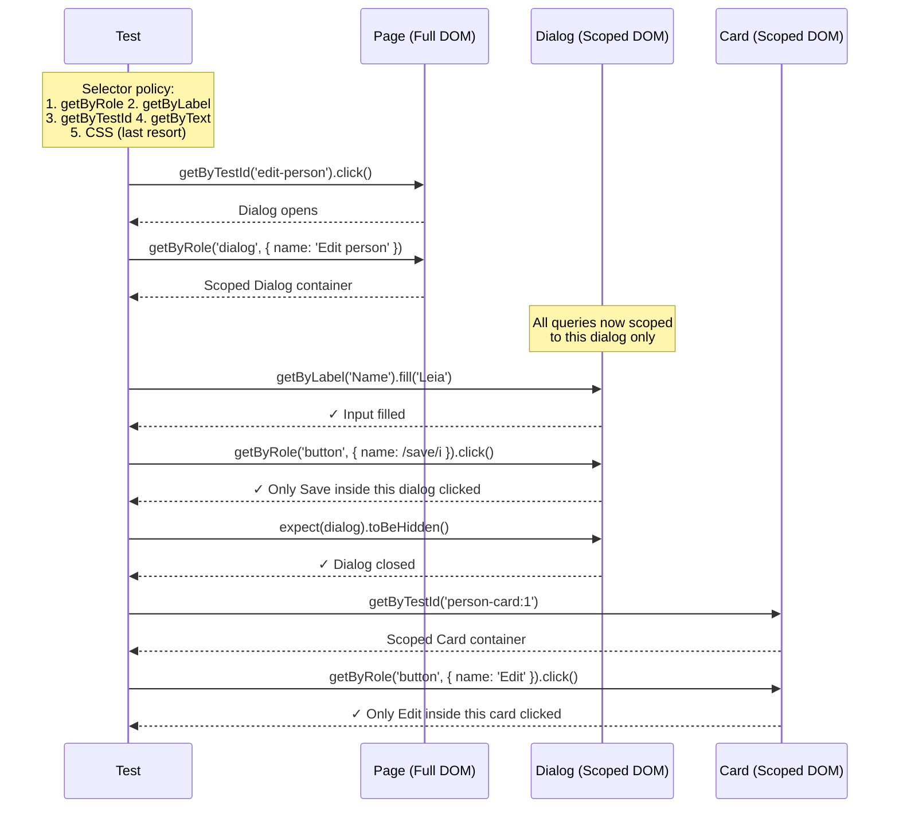

# Card 13: Scoped Queries and Selector Policy

## What This Pattern Solves

You have a page with two dialogs, three "Save" buttons, and four cards — each with their own "Edit" button. A test clicks `getByRole('button', { name: 'Save' })` and Playwright complains "strict mode violation: 3 elements found." Or worse — it clicks the wrong Save button and your test passes for the wrong reason. Scoped queries solve this by narrowing the DOM search space: find the container first, then query exclusively inside it — so `dialog.getByRole('button', { name: 'Save' })` can only match the Save button _inside that dialog_.

Combine this with a documented **selector policy** that ranks selector types by priority (accessible roles first, test IDs second, CSS last), and your entire team writes resilient locators that survive markup refactors.

## How It Works

1. **Find the container** using the most specific, stable locator available: `page.getByRole('dialog', { name: 'Edit person' })` or `page.getByTestId('person-card:1')`.
2. **Scope all subsequent queries** to that container — call `.getByRole()`, `.getByLabel()`, `.getByTestId()` on the container locator, not on `page`.
3. **Enforce the selector policy** in code review: `getByRole` with `name` for interactive elements, `getByLabel` for form inputs, `getByTestId` with context (e.g., `person-card:${id}`) for repeated/dynamic UI, text selectors for static content, and CSS only as a last resort.
4. Use **contextual test IDs** on container elements (not on every leaf element) — then query inside the container with role/text/label, keeping the DOM free of test-ID noise.

## Code Example

```typescript
import { test, expect } from '@playwright/test';
import { personCardLocator } from '../e2e-patterns/person/locators';
import { PersonPage } from '../e2e-patterns/person/PersonPage';

// ── e2e-patterns/person/locators.ts — contextual test ID helper ──
// export function personCardLocator(page: Page, personId: string) {
//   return page.getByTestId(`person-card:${personId}`);
// }

// ── Test: scoped query inside a dialog ────────────────────
test('scoped query: dialog first, then button and label inside', async ({ page }) => {
  await PersonPage.open(page, '1', '/cards/13');

  // Open the dialog
  await page.getByTestId('edit-person').click();

  // Scope: find the dialog container FIRST
  const dialog = page.getByRole('dialog', { name: 'Edit person' });
  await expect(dialog).toBeVisible();

  // All queries are now scoped INSIDE the dialog
  await dialog.getByLabel('Name').fill('Leia');
  await dialog.getByRole('button', { name: /^save$/i }).click();

  // Dialog disappears
  await expect(dialog).toBeHidden();
  await expect(page.getByTestId('person-name')).toHaveText('Leia');
});

// ── Test: scoped query inside a card ──────────────────────
test('test-id with context: person-card:id then role inside', async ({ page }) => {
  await PersonPage.open(page, '1', '/cards/13');

  // Scope: find the card container first
  const card = personCardLocator(page, '1');
  await expect(card).toBeVisible();

  // All queries are scoped INSIDE that card
  await expect(card.getByTestId('person-name')).toHaveText('Luke Skywalker');
  await card.getByRole('button', { name: 'Edit' }).click();

  // Dialog opens (scoped to the full page — it's not inside the card)
  await expect(page.getByRole('dialog', { name: 'Edit person' })).toBeVisible();
});
```

## Run This Example

```bash
pnpm test src/13-scoped-queries
```

## Prerequisites

- **Card 12**: Understanding the locators/actions/flows layer structure
- **Card 11**: Familiarity with `getByRole()`, `getByLabel()`, `getByTestId()`

## Key Concepts

- **Scope narrowing**: Find the nearest meaningful container, then chain queries inside it. The locator tree mirrors the DOM tree — no ambiguity.
- **Selector priority policy** (ordered from most to least resilient):
  1. `getByRole(name)` — accessible, survives CSS refactors, best for interactive elements
  2. `getByLabel(text)` — tied to `<label>` elements, ideal for form inputs
  3. `getByTestId(context)` — explicit contract between test and markup, use on containers
  4. `getByText(text)` — for static content that users see
  5. CSS selectors — last resort, fragile to markup changes
- **Contextual test IDs**: Use `data-testid` on container elements with a context prefix (e.g., `person-card:1`, `person-card:2`), then query inside with roles and labels. Avoid slapping a test ID on every leaf element.
- **Strict mode safety**: When a query is scoped to a container, Playwright's strict mode only considers matches _inside_ that container — so you never get "3 elements found" for a button that appears once per card.

## When to Use This Pattern

- ✓ Every test that touches dialogs, modals, or drawers (isolate Save/Cancel buttons)
- ✓ Pages with repeated cards, rows, or list items (scope to the specific item)
- ✓ Tables with per-row action buttons (scope to the row, then find the button)
- ✓ Teams with multiple contributors — the selector policy keeps everyone consistent
- ✓ When refactoring CSS classes won't break your tests (use roles, not classes)
- ✗ Single-element pages without repeated UI (scoping adds unnecessary indirection)
- ✗ When the container itself is unstable (fix the container's selector first)

## Common Mistakes

1. **Querying from `page` instead of the scoped container**:
   ```typescript
   // ✗ WRONG — still querying the full page, strict mode violation
   const dialog = page.getByRole('dialog', { name: 'Edit person' });
   await page.getByRole('button', { name: /save/i }).click();
   // ^^ could match a Save button outside the dialog

   // ✓ CORRECT — scoped to the dialog
   const dialog = page.getByRole('dialog', { name: 'Edit person' });
   await dialog.getByRole('button', { name: /save/i }).click();
   // ^^ only matches Save buttons inside this dialog
   ```

2. **Using test IDs on every leaf element**:
   ```typescript
   // ✗ WRONG — test-ID spam, brittle to structural changes
   <div data-testid="person-card:1">
     <span data-testid="person-card:1-name">Luke</span>
     <span data-testid="person-card:1-height">172</span>
     <button data-testid="person-card:1-edit-btn">Edit</button>
     <button data-testid="person-card:1-delete-btn">Delete</button>
   </div>

   // ✓ CORRECT — test ID on container only, query inside with role/text
   <div data-testid="person-card:1">
     <span>Luke</span>
     <span>172</span>
     <button>Edit</button>
     <button>Delete</button>
   </div>
   // card.getByRole('button', { name: 'Edit' })
   ```

3. **Using CSS selectors as the first choice**:
   ```typescript
   // ✗ WRONG — fragile to CSS refactors
   await page.locator('.dialog-container .btn-primary.save-button').click();

   // ✓ CORRECT — resilient to markup changes
   const dialog = page.getByRole('dialog', { name: 'Edit person' });
   await dialog.getByRole('button', { name: /save/i }).click();
   ```

4. **Not using regex for flexible name matching**:
   ```typescript
   // ✗ WRONG — exact match breaks on minor text changes
   dialog.getByRole('button', { name: 'Save changes' })

   // ✓ CORRECT — regex tolerates "Save", "Save changes", "Save & close"
   dialog.getByRole('button', { name: /save/i })
   ```

5. **Scoping too early or too late**: Scope to the nearest _meaningful_ container. Scoping to `<body>` is useless; scoping to a `<span>` wrapper is too fragile. Dialogs, cards, rows, sections — these are the right granularity.

## Flow Diagram



## Related Patterns

- **Previous**: Card 12 (Locators → Actions → Flows) — The layer structure where scoped queries live
- **Next**: Card 14 (Region Objects) — Reusable wrapper classes for scoped containers (dialogs, toasts)
- **Foundation**: Card 11 (Login Flow) — `getByLabel()` and `getByRole()` basics
- **Complementary**: Card 17 (Accessibility with Axe) — Scoped queries ensure your locators match accessible markup
- **Stability**: Card 18 (Stability Techniques) — How scoped queries eliminate flaky strict-mode violations
