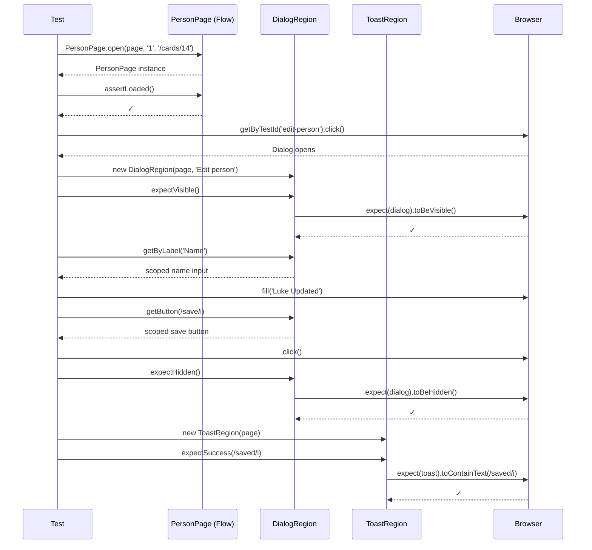

# Card 14: Region Objects (Component-Scoped Helpers)

## What This Pattern Solves

Your dialogs, toasts, sidebars, and modals appear across a dozen different pages. Without region objects, every test re-implements the same locator chains: `page.getByRole('dialog', { name: 'Edit person' })`, then `dialog.getByLabel('Name')`, then `dialog.getByRole('button', { name: /save/i })`. You end up with a giant page class that tries to own every UI region, or copy-pasted selectors that diverge over time. Region objects solve this by giving each reusable UI region its own small, focused class — scoped, self-contained, and importable from any test.

A region object is not a page object. It doesn't own navigation or business flows. It just wraps one UI region (a dialog, a toast, a sidebar) and exposes its locators plus common assertion helpers.

## How It Works

1. Create a class that takes `page` and any region-specific parameters (e.g., the dialog's accessible name).
2. Expose a method that returns the region's root locator (e.g., `dialog()` returns `page.getByRole('dialog', { name })`).
3. Add scoped query methods — `getByLabel()`, `getButton()` — that chain off the root locator so all queries stay inside the region.
4. Add assertion helpers — `expectVisible()`, `expectHidden()`, `expectSuccess()` — so tests read like natural language.
5. Import and instantiate the region object in any test that needs it — no page class required.

## Code Example

```typescript
// ── e2e-patterns/regions/DialogRegion.ts ──────────────────
import type { Locator, Page } from '@playwright/test';
import { expect } from '@playwright/test';

// Page-rooted region. Query methods return a Locator synchronously, so
// callers chain actions directly: region.getButton(/save/i).click().
export class DialogRegion {
  constructor(
    private page: Page,
    private name: string,
  ) {}

  dialog(): Locator {
    return this.page.getByRole('dialog', { name: this.name });
  }

  getByLabel(label: string): Locator {
    return this.dialog().getByLabel(label);
  }

  getButton(name: string | RegExp): Locator {
    return this.dialog().getByRole('button', { name });
  }

  async expectVisible(): Promise<void> {
    await expect(this.dialog()).toBeVisible();
  }

  async expectHidden(): Promise<void> {
    await expect(this.dialog()).toBeHidden();
  }
}

// ── e2e-patterns/regions/ToastRegion.ts ───────────────────
import type { Page } from '@playwright/test';
import { expect } from '@playwright/test';

export class ToastRegion {
  constructor(private page: Page) {}

  toast() {
    return this.page.getByRole('status');
  }

  async expectSuccess(message: RegExp | string): Promise<void> {
    await expect(this.toast()).toContainText(message);
  }
}

// ── e2e-patterns/components/Modal.ts ──────────────────────
import type { Locator } from '@playwright/test';

// Container-rooted component: receives a Locator (its root), not Page.
// Every locator and interaction descends from this.root.
export class Modal {
  readonly nameInput: Locator;
  readonly confirmButton: Locator;

  constructor(private root: Locator) {
    this.nameInput = this.root.getByLabel('Name');
    this.confirmButton = this.root.getByRole('button', { name: /save/i });
  }

  async fillName(name: string): Promise<void> {
    await this.nameInput.fill(name);
  }

  async confirm(): Promise<void> {
    await this.confirmButton.click();
  }
}

// ── Test: using both regions together ─────────────────────
import { test, expect } from '@playwright/test';
import { ToastRegion } from '../e2e-patterns/regions/ToastRegion';
import { DialogRegion } from '../e2e-patterns/regions/DialogRegion';
import { Modal } from '../e2e-patterns/components/Modal';
import { PersonPage } from '../e2e-patterns/person/PersonPage';

test('ToastRegion expectSuccess after edit save', async ({ page }) => {
  const personPage = await PersonPage.open(page, '1', '/cards/14');
  await personPage.assertLoaded();

  // Open the edit dialog
  await page.getByTestId('edit-person').click();

  // Use DialogRegion — query methods return Locators synchronously
  const dialogRegion = new DialogRegion(page, 'Edit person');
  await dialogRegion.expectVisible();
  await dialogRegion.getByLabel('Name').fill('Luke Updated');
  await dialogRegion.getButton(/save/i).click();
  await dialogRegion.expectHidden();

  // Use ToastRegion — same pattern, different region
  const toastRegion = new ToastRegion(page);
  await toastRegion.expectSuccess(/saved/i);
});

// ── Test: container-rooted Modal (Locator root, no Page) ──
test('container-rooted Modal: locator-root, no Page dependency', async ({ page }) => {
  await PersonPage.open(page, '1', '/cards/14');
  await page.getByTestId('edit-person').click();

  const dialog = page.getByRole('dialog', { name: 'Edit person' });
  const modal = new Modal(dialog);

  await expect(modal.nameInput).toBeVisible();
  await modal.fillName('Container Leia');
  await modal.confirm();

  await expect(dialog).toBeHidden();
  await expect(page.getByTestId('person-name')).toHaveText('Container Leia');
});
```

## Run This Example

```bash
pnpm test src/14-region-objects
```

## Prerequisites

- **Card 12**: Understanding the locators/actions/flows architecture
- **Card 13**: Scoped queries and selector policy (region objects build on scoping)

## Key Concepts

- **Region, not page**: A region object owns one UI region — it doesn't know about navigation, page structure, or other regions. This keeps it small and reusable.
- **Constructor parameters**: The region takes `page` plus any configuration it needs (e.g., dialog name). No global state, no singletons — instantiate wherever needed.
- **Scoped locators**: All locator methods chain off the region's root element — `this.dialog().getByLabel('Name')` can only match inputs inside that dialog.
- **Assertion helpers as methods**: `expectVisible()`, `expectHidden()`, `expectSuccess()` — semantic names that make tests read like specifications, not DOM scripts.
- **Composable with flows**: Region objects work alongside `PersonPage` and other flows — they don't replace them, they complement them for cross-cutting UI regions.

## When to Use This Pattern

- ✓ Dialogs, modals, drawers that appear on multiple pages
- ✓ Toast/snackbar notifications used across the app
- ✓ Sidebars, navbars, headers that are shared across pages
- ✓ Any UI region that appears in 3+ tests — extract it once
- ✓ When you want assertion helpers like `expectSuccess()` instead of raw `expect(toast).toContainText(...)`
- ✗ For a region that appears in exactly one test (inline scoped queries from Card 13 are sufficient)
- ✗ For full-page flows (use Card 12 flows instead — region objects don't own navigation)
- ✗ When the region has no reusable behavior (a simple `<div>` doesn't need a class)

## Common Mistakes

1. **Making region objects too large**:
   ```typescript
   // ✗ WRONG — region object trying to be a page object
   class DialogRegion {
     async openEditDialog() { /* navigate */ }
     async saveForm() { /* fill all fields + click */ }
     async assertAllFields() { /* 10 assertions */ }
     // This should be a Flow, not a Region
   }

   // ✓ CORRECT — region object only knows about its own UI region
   class DialogRegion {
     dialog() { /* root locator */ }
     getByLabel(label: string) { /* scoped input */ }
     getButton(name: string | RegExp) { /* scoped button */ }
     expectVisible() { /* visibility assertion */ }
     expectHidden() { /* hidden assertion */ }
   }
   ```

2. **Not scoping queries to the region root**:
   ```typescript
   // ✗ WRONG — querying from page, not the dialog
   getByLabel(label: string): Locator {
     return this.page.getByLabel(label); // could match outside the dialog!
   }

   // ✓ CORRECT — chaining off the dialog's root locator
   getByLabel(label: string): Locator {
     return this.dialog().getByLabel(label); // only inside this dialog
   }
   ```

3. **Using `new` inside a `beforeEach` without reassigning**:
   ```typescript
   // ✗ WRONG — stale reference if page changes (rare in Playwright fixtures)
   let dialog: DialogRegion;
   test.beforeEach(async ({ page }) => {
     dialog = new DialogRegion(page, 'Edit person');
     // page is fresh per test, but dialog is created once
   });

   // ✓ CORRECT — create region inside the test, or use a fixture
   test('edit flow', async ({ page }) => {
     const dialog = new DialogRegion(page, 'Edit person');
   });
   ```

4. **Duplicating region logic in flows**: If `PersonPage` has a method that fills and submits a dialog, consider whether that logic belongs in the region object or in an action. Region objects provide the primitives; flows compose them.

5. **Not exporting region classes**: Region objects are meant to be imported across test files. If a region is only used in one file, it probably doesn't need its own class yet — extract it when the second file needs it.

## Flow Diagram



## Related Patterns

- **Previous**: Card 13 (Scoped Queries) — Region objects formalize scoped queries into reusable classes
- **Next**: Card 15 (Done Signals) — Region objects provide the assertion helpers that serve as done signals
- **Foundation**: Card 12 (Locators → Actions → Flows) — Region objects sit alongside flows for cross-cutting UI
- **Advanced**: Card 21 (App Driver Fixture) — Region objects integrated into the central test fixture
- **Complementary**: Card 18 (Stability Techniques) — Region objects eliminate flaky locators with centralized definitions
