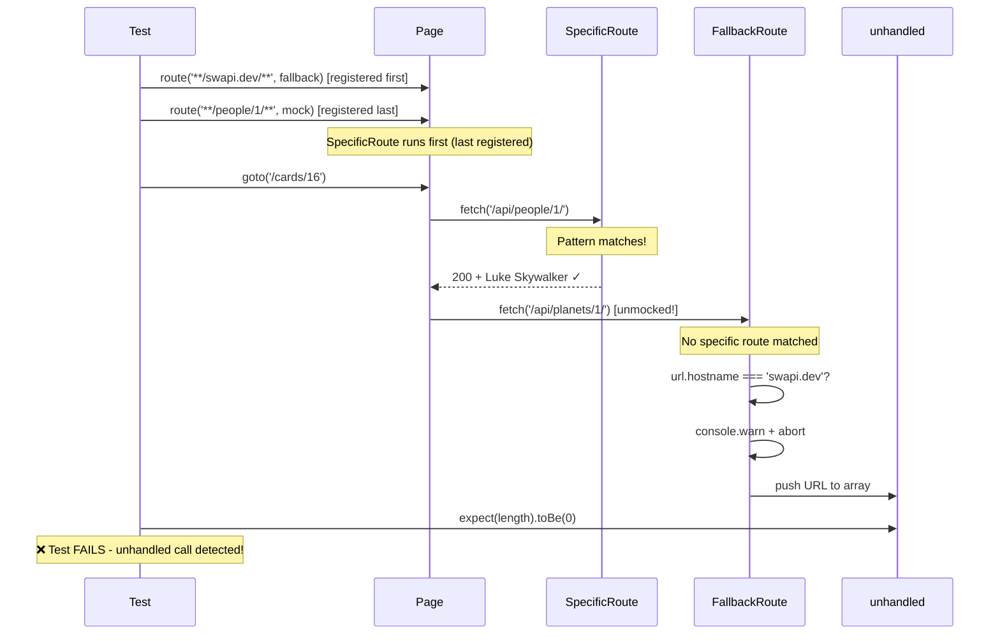

# Card 16: Debug Unhandled Requests

## What This Pattern Solves

Card 04 introduced strict mocking: a single fallback that aborts every unmocked request and fails the test. That works well in CI, but **during development** you often want a softer approach—log which calls are unhandled without breaking the build, or apply different rules to different domains. Maybe you want to warn about stray calls to `swapi.dev` but still fail for requests to your own API. This card shows how to implement **gradual strictness** with a fallback route that has domain-aware logic.

## How It Works

1. Register a **fallback route** with a broad pattern (e.g., `**/swapi.dev/**` or `**/*`)
2. Inside the fallback handler, inspect `route.request().url()` and apply **custom logic per domain**:
   - For `swapi.dev` URLs that slipped through: log a warning and abort
   - For other hosts: abort and push to an `unhandled[]` array so the test can fail
3. Register **specific routes** for endpoints you mock (they run first due to Playwright's reverse-order precedence)
4. After navigation, assert `unhandled.length === 0` to confirm all expected requests were handled
5. During active debugging, you can temporarily `console.warn` instead of failing—then tighten back to strict mode

## Code Example

```typescript
import { test, expect } from '@playwright/test';
import { makePerson } from '../swapi/builders';

test.describe('16-debug-unhandled-requests: Custom unhandled behavior', () => {
  test('handles people/1; fallback would log/abort other swapi URLs', async ({ page }) => {
    const unhandledSwapi: string[] = [];

    // 1. Fallback: catches anything to swapi.dev not matched by specific routes
    await page.route('**/swapi.dev/**', async (route) => {
      // Domain-aware logic: could also console.warn for external APIs
      // while aborting harder for internal endpoints
      unhandledSwapi.push(route.request().url());
      await route.abort('blockedbyclient');
    });

    // 2. Specific mock for people/1 (registered LAST, runs FIRST)
    await page.route('**/swapi.dev/api/people/1/**', (route) =>
      route.fulfill({
        json: makePerson({ name: 'Luke Skywalker', height: '172' }),
      }),
    );

    await page.goto('/cards/16');

    await expect(page.getByTestId('person-name')).toHaveText('Luke Skywalker');

    // 3. Verify no unhandled requests hit the fallback
    expect(unhandledSwapi).toHaveLength(0);
  });

  test('LIFO route order: last-registered route matches first', async ({ page }) => {
    const calls: string[] = [];

    await page.route('**/swapi.dev/api/people/1/**', async (route) => {
      calls.push('first');
      await route.fallback();
    });

    await page.route('**/swapi.dev/api/people/1/**', async (route) => {
      calls.push('second');
      await route.fulfill({
        json: makePerson({ name: 'LIFO Luke', height: '172' }),
      });
    });

    await page.goto('/cards/16');
    await expect(page.getByTestId('person-name')).toHaveText('LIFO Luke');
    expect(calls).toEqual(['second']);
  });
});
```

## Run This Example

```bash
pnpm test src/16-debug-unhandled-requests
```

## Prerequisites

- **Card 04**: Understanding the fallback route pattern and route order
- **Card 02**: Basic `page.route()` and `route.fulfill()` knowledge
- Concepts: URL parsing, route fallback, debugging workflows

## Key Concepts

- **Fallback route**: A broad route handler that catches all unmatched requests for a domain
- **Gradual strictness**: Start with `console.warn` during development, escalate to test failure in CI
- **Domain-aware fallback**: Different behavior for different hosts (warn for external, fail for internal)
- **Route order precedence**: Last registered handler runs first; specific routes override the fallback
- **Unhandled tracking**: Collect URLs in an array for assertion and easy debugging output
- **route.abort()**: Cancels the request with `'blockedbyclient'`—no real network call is made

## When to Use This Pattern

- ✓ When debugging which APIs your page calls unexpectedly
- ✓ When you want domain-specific behavior (warn for CDN, error for your API)
- ✓ During development to log unhandled calls without failing tests
- ✓ As a stepping stone toward strict mocking (Card 04)
- ✗ In CI where strict mode (Card 04) is preferred for deterministic failures
- ✗ For production monitoring—use actual logging/observability tools
- ✗ When you have full confidence all routes are mocked (no fallback needed)

## Common Mistakes

1. **Wrong route order—specific route registered before fallback**:
   ```typescript
   // ❌ WRONG - specific route registered first, won't run due to Playwright order
   await page.route('**/people/1/**', mockHandler);
   await page.route('**/swapi.dev/**', fallbackHandler);

   // ✓ CORRECT - fallback first, specific last (runs first)
   await page.route('**/swapi.dev/**', fallbackHandler);
   await page.route('**/people/1/**', mockHandler);
   ```

2. **Forgetting to assert the unhandled array**:
   ```typescript
   // ❌ WRONG - unhandled requests silently ignored
   const unhandled: string[] = [];
   await page.route('**/*', (route) => {
     unhandled.push(route.request().url());
     route.abort();
   });
   // Test passes even with unhandled requests

   // ✓ CORRECT - always assert
   expect(unhandled).toHaveLength(0);
   ```

3. **Leaving debug logging in CI**:
   ```typescript
   // ❌ WRONG - console.warn in CI masks real issues
   await page.route('**/*', (route) => {
     console.warn('Unhandled:', route.request().url());
     route.abort();
   });

   // ✓ CORRECT - gate on an environment variable or remove before committing
   const isDebug = process.env.DEBUG_UNHANDLED === '1';
   await page.route('**/*', (route) => {
     if (isDebug) console.warn('Unhandled:', route.request().url());
     else route.abort();
   });
   ```

4. **Using `route.continue()` instead of `route.abort()` in fallback**:
   - `continue()` forwards the request to the real network—defeats the purpose
   - Use `abort('blockedbyclient')` for intentional blocking in mocked tests

## Flow Diagram



## Related Patterns

- **Previous**: Card 15 (Done Signals) - Waiting for network to settle before assertions
- **Next**: Card 17 (Accessibility with Axe) - Catch a11y violations alongside functional tests
- **Foundation**: Card 04 (Mock Only What You Need) - The strict fallback this pattern softens
- **Complementary**: Card 10 (Per-Test Overrides) - Combine with domain-aware fallback for error scenarios
- **Compare**: Card 05 (Proxy to Real API) - Opposite approach: allow real requests, patch the response
