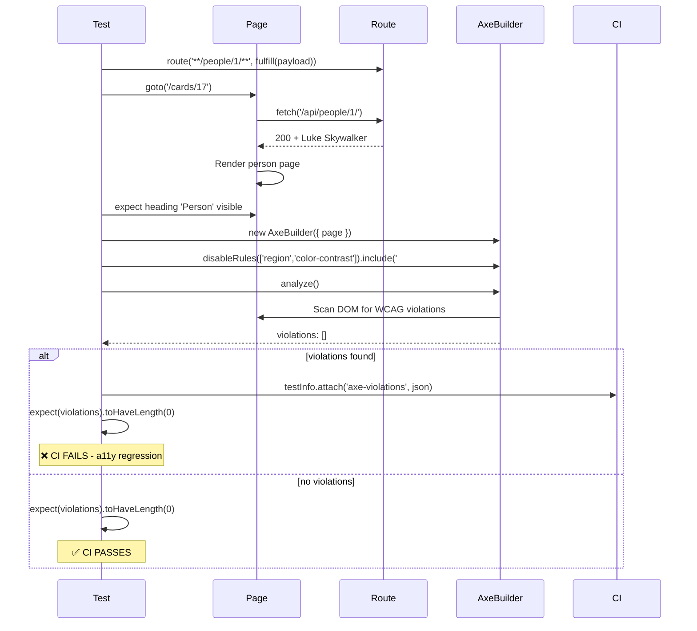

# Card 17: Accessibility with Axe

## What This Pattern Solves

Manual accessibility testing is slow, inconsistent, and often forgotten. Automated tools like axe-core can catch ~57% of WCAG violations instantly—missing labels, insufficient color contrast, duplicate IDs, invalid ARIA, missing landmark regions. By integrating axe scans into your Playwright tests, every page you test also gets an **accessibility audit** that fails the build when regressions are introduced. This shifts accessibility from a manual afterthought to an automated CI gate.

## How It Works

1. Install `@axe-core/playwright` and import `AxeBuilder`
2. Navigate to the page under test and assert it's fully loaded (heading visible, network idle)
3. Create a new `AxeBuilder({ page })` instance and optionally disable or include specific rules
4. Scope the scan with `include('#app')` / `exclude('[data-testid="toast"]')` and `disableRules([...])`, then call `analyze()` to run against the rendered DOM
5. Attach `violations` (and `passes`) to the report with `testInfo.attach(...)` so failures carry context without noisy `console.log`
6. Assert `violations.length === 0` to fail the test when new violations appear
7. Optionally run a second, tag-scoped scan with `withTags([...])` to enforce a specific WCAG level (e.g. WCAG 2.2 AA)

## Code Example

```typescript
import { test, expect } from '@playwright/test';
import AxeBuilder from '@axe-core/playwright';
import { makePerson } from '../swapi/builders';

test.describe('17-accessibility-axe: Axe scan', () => {
  test('person page has no accessibility violations', async ({ page }, testInfo) => {
    await page.route('**/swapi.dev/api/people/1/**', (route) =>
      route.fulfill({
        json: makePerson({
          name: 'Luke Skywalker',
          height: '172',
          mass: '77',
          url: 'https://swapi.dev/api/people/1/',
        }),
      }),
    );

    await page.goto('/cards/17');
    await expect(page.getByRole('heading', { name: 'Person' })).toBeVisible();

    const accessibilityScanResults = await new AxeBuilder({ page })
      .disableRules(['region', 'color-contrast'])
      .include('#app')
      .exclude('[data-testid="toast"]')
      .analyze();

    // Attach results to the report instead of console.log
    await testInfo.attach('axe-violations', {
      body: JSON.stringify(accessibilityScanResults.violations, null, 2),
      contentType: 'application/json',
    });

    await testInfo.attach('axe-passes', {
      body: JSON.stringify(accessibilityScanResults.passes, null, 2),
      contentType: 'application/json',
    });

    expect(accessibilityScanResults.violations).toHaveLength(0);
  });

  test('scan with tags: restrict to WCAG 2.2 AA rules only', async ({ page }, testInfo) => {
    await page.route('**/swapi.dev/api/people/1/**', (route) =>
      route.fulfill({
        json: makePerson({
          name: 'Axe Tags Luke',
          height: '172',
          mass: '77',
        }),
      }),
    );

    await page.goto('/cards/17');
    await expect(page.getByRole('heading', { name: 'Person' })).toBeVisible();

    const results = await new AxeBuilder({ page })
      .withTags(['wcag2a', 'wcag2aa', 'wcag21a', 'wcag21aa', 'wcag22aa'])
      .disableRules(['region', 'color-contrast'])
      .analyze();

    await testInfo.attach('axe-tagged-violations', {
      body: JSON.stringify(results.violations, null, 2),
      contentType: 'application/json',
    });

    expect(results.violations).toHaveLength(0);
  });
});
```

## Run This Example

```bash
pnpm test src/17-accessibility-axe
```

## Prerequisites

- **Card 01-02**: Basic `page.goto()` and assertions
- **Card 03**: Full mock payloads so the page renders completely
- Package: `@axe-core/playwright` (`pnpm add -D @axe-core/playwright`)
- Concepts: WCAG, ARIA, axe-core rule IDs

## Key Concepts

- **AxeBuilder**: The axe-core integration for Playwright; runs accessibility checks against the live DOM
- **analyze()**: Returns a results object with `violations`, `passes`, `incomplete`, and `inapplicable` arrays
- **disableRules()**: Suppress rules that aren't relevant (e.g., `'region'` when your page doesn't use landmark roles)
- **include()/exclude()**: Scope the scan to specific elements using CSS selectors
- **withTags()**: Filter by WCAG level, e.g., `['wcag2a', 'wcag2aa']`
- **Impact severity**: `critical`, `serious`, `moderate`, `minor`—helps prioritize fixes

## When to Use This Pattern

- ✓ On every critical user flow (login, checkout, settings)
- ✓ In CI to catch accessibility regressions before they reach production
- ✓ When building or refactoring UI components
- ✓ Alongside functional tests—no extra navigation cost
- ✗ As a replacement for manual testing with screen readers
- ✗ On rapidly-changing prototypes (fix issues when the UI stabilizes)
- ✗ On pages that require complex user interaction to render (axe scans the current DOM state)

## Common Mistakes

1. **Scanning before the page is fully loaded**:
   ```typescript
   // ❌ WRONG - scanning before the UI renders produces false passes
   await page.goto('/cards/17');
   const results = await new AxeBuilder({ page }).analyze(); // page may not be ready

   // ✓ CORRECT - wait for a visible element first
   await page.goto('/cards/17');
   await expect(page.getByRole('heading', { name: 'Person' })).toBeVisible();
   const results = await new AxeBuilder({ page }).analyze();
   ```

2. **Disabling too many rules without justification**:
   ```typescript
   // ❌ WRONG - blanket suppression hides real issues
   const results = await new AxeBuilder({ page })
     .disableRules(['color-contrast', 'label', 'button-name', 'image-alt'])
     .analyze();

   // ✓ CORRECT - disable only what's necessary, with a comment explaining why
   const results = await new AxeBuilder({ page })
     .disableRules(['region']) // page scope doesn't require landmarks
     .analyze();
   ```

3. **Not capturing violations before asserting**:
   ```typescript
   // ❌ WRONG - test fails with no context
   expect(accessibilityScanResults.violations).toHaveLength(0);
   // expected 0, got 3 — but WHAT violations?

   // ✓ CORRECT - attach violations to the report so the HTML report shows what broke
   await testInfo.attach('axe-violations', {
     body: JSON.stringify(accessibilityScanResults.violations, null, 2),
     contentType: 'application/json',
   });
   expect(accessibilityScanResults.violations).toHaveLength(0);
   ```

4. **Running axe on every test unnecessarily**:
   - Axe scans add ~100-500ms per call
   - Run on key pages, not every `page.goto()` in a large suite

## Flow Diagram



## Related Patterns

- **Previous**: Card 16 (Debug Unhandled Requests) - Debugging tools to pair with accessibility checks
- **Next**: Card 18 (Stability Techniques) - Reduce flake so accessibility scans are reliable
- **Foundation**: Card 03 (Full Mock Payload) - Mock complete data so the page renders fully
- **Complementary**: Card 15 (Done Signals) - Wait for page stability before scanning
- **CI Integration**: Card 22 (Failure Artifacts) - Capture violation details when axe scans fail
