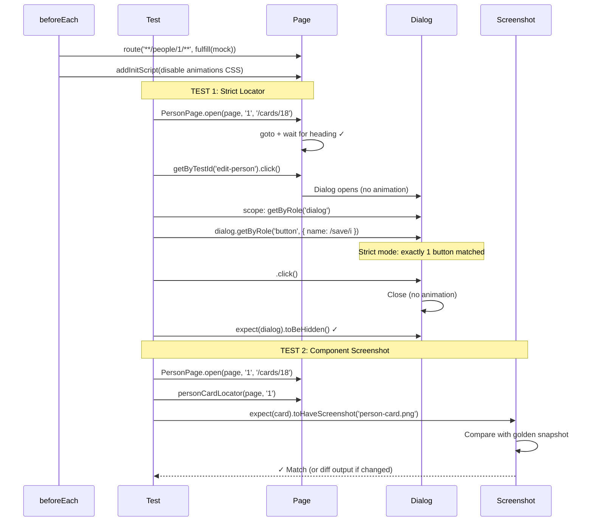

# Card 18: Stability Techniques

## What This Pattern Solves

UI tests are notorious for timing flake: a CSS transition hasn't finished, an animation is mid-flight, or a lazy-loaded component hasn't appeared. When CI fails intermittently, teams lose trust in tests and start ignoring failures. This card bundles three techniques that eliminate the most common sources of flake: disabling animations globally, scoping locators to avoid ambiguity, and using component-level visual snapshots instead of brittle full-page comparisons.

## How It Works

1. **Disable animations globally**: Inject CSS in `page.addInitScript()` that sets `transition: none !important` and `animation: none !important` on all elements before the page loads. This freezes the UI in its final state immediately.
2. **Use strict, scoped locators**: Instead of querying the whole page for a button, first scope to the parent container (e.g., `page.getByRole('dialog')`), then find the button inside it. Playwright's strict mode catches duplicates instead of silently picking one.
3. **Component-level screenshots**: Use `expect(locator).toHaveScreenshot()` against a specific component (like a person card) rather than full-page screenshots. Smaller targets mean fewer false positives when unrelated UI changes. The screenshot test is tagged `\{ tag: '@visual' \}` so visual checks can be filtered in or out of a run independently of functional tests.

## Code Example

```typescript
import { test, expect } from '@playwright/test';
import { personCardLocator } from '../e2e-patterns/person/locators';
import { PersonPage } from '../e2e-patterns/person/PersonPage';
import { makePerson } from '../swapi/builders';

test.describe('18-stability-techniques: Disable animations, strict locators, screenshots', () => {
  test.beforeEach(async ({ page }) => {
    await page.route('**/swapi.dev/api/people/1/**', (route) =>
      route.fulfill({
        json: makePerson({
          name: 'Luke Skywalker',
          height: '172',
          mass: '77',
          url: 'https://swapi.dev/api/people/1/',
        }),
      }),
    );
    await page.addInitScript(() => {
      const css = '* { transition: none !important; animation: none !important; }';
      const inject = () => {
        const style = document.createElement('style');
        style.textContent = css;
        const root = document.head ?? document.documentElement;
        root.appendChild(style);
      };
      // The init script can run before document.documentElement exists.
      // Inject now if the root is ready, otherwise wait for DOMContentLoaded.
      if (document.documentElement) {
        inject();
      } else {
        document.addEventListener('DOMContentLoaded', inject, { once: true });
      }
    });
  });

  test('strict locator: scope to dialog then button', async ({ page }) => {
    await PersonPage.open(page, '1', '/cards/18');
    await page.getByTestId('edit-person').click();

    const dialog = page.getByRole('dialog', { name: 'Edit person' });
    await expect(dialog).toBeVisible();
    await dialog.getByRole('button', { name: /save/i }).click();
    await expect(dialog).toBeHidden();
  });

  test('component screenshot: person card', { tag: '@visual' }, async ({ page }) => {
    await PersonPage.open(page, '1', '/cards/18');
    const card = personCardLocator(page, '1');
    await expect(card).toBeVisible();
    await expect(card).toHaveScreenshot('person-card.png');
  });
});
```

## Run This Example

```bash
pnpm test src/18-stability-techniques
```

## Prerequisites

- **Card 12**: Understanding the Locators → Actions → Flows pattern
- **Card 14**: Using reusable locators like `personCardLocator`
- **Card 15**: Understanding done signals (dialog visibility) before clicking
- Concepts: CSS specificity, Playwright strict mode, visual regression testing

## Key Concepts

- **addInitScript()**: Injects JavaScript before any page script runs—perfect for disabling animations
- **Strict mode**: Playwright throws when multiple elements match a locator; scoping forces you to be precise
- **Scoped locators**: Chain locators starting from a container (e.g., `dialog.getByRole('button')`)
- **toHaveScreenshot()**: Playwright's built-in visual comparison; first run creates a golden snapshot, subsequent runs compare
- **Component screenshots**: Target a specific test-id element rather than the full viewport for stable diffs
- **`@visual` tag**: The screenshot test is declared with `test('...', \{ tag: '@visual' \}, async (\{ page \}) => \{ ... \})` so it can be selected or skipped via `--grep @visual`
- **Animation disabling CSS**: `* { transition: none !important; animation: none !important; }` suppresses all CSS transitions and animations

## When to Use This Pattern

- ✓ **Default for CI**—animation disabling should be in every project's global setup
- ✓ When dialogs, modals, or accordions animate open/close
- ✓ When visual regression testing critical UI components
- ✓ When CI tests flake intermittently due to timing
- ✓ Paired with `prefers-reduced-motion: reduce` media query in your app
- ✗ When testing animation-specific behavior (test those in isolation)
- ✗ For full-page screenshots—prefer component-level for maintainability
- ✗ Overusing `toHaveScreenshot()` on every element—reserve for critical UI surfaces

## Common Mistakes

1. **Forgetting to disable animations in the right scope**:
   ```typescript
   // ❌ WRONG - addInitScript in a single test, not beforeEach
   test('some test', async ({ page }) => {
     await page.addInitScript(() => { /* ... */ });
     // Other tests in the describe don't get this
   });

   // ✓ CORRECT - put it in beforeEach or a custom fixture
   test.beforeEach(async ({ page }) => {
     await page.addInitScript(() => {
       document.documentElement.style.setProperty(
         '--anim-speed', '0s'
       );
     });
   });
   ```

2. **Lazy locators instead of scoped queries**:
   ```typescript
   // ❌ WRONG - locates button anywhere on the page, can match multiple
   await page.getByRole('button', { name: /save/i }).click();

   // ✓ CORRECT - scope to the dialog first
   const dialog = page.getByRole('dialog', { name: 'Edit person' });
   await dialog.getByRole('button', { name: /save/i }).click();
   ```

3. **Full-page screenshots that break on any layout change**:
   ```typescript
   // ❌ WRONG - fails when header height, font rendering, or unrelated element changes
   await expect(page).toHaveScreenshot('full-page.png');

   // ✓ CORRECT - targets only the component under test
   const card = page.getByTestId('person-card:1');
   await expect(card).toHaveScreenshot('person-card.png');
   ```

4. **Not committing initial screenshot snapshots**:
   - First run creates `person-card-1-chromium-darwin.png`
   - Commit these golden files or CI will fail on every new environment
   - Use `--update-snapshots` flag to regenerate: `pnpm test src/18 --update-snapshots`

## Flow Diagram



## Related Patterns

- **Previous**: Card 17 (Accessibility with Axe) - Stable pages make axe scans more reliable
- **Next**: Card 19 (Auth Storage State) - Skip UI login for faster, more stable tests
- **Foundation**: Card 12 (Locators → Actions → Flows) - Structure that makes scoped locators natural
- **Foundation**: Card 14 (Region Objects) - Reusable dialog/toast helpers
- **Complementary**: Card 15 (Done Signals) - Combine with explicit wait signals instead of animation blocking
- **CI Integration**: Card 22 (Failure Artifacts) - Capture screenshot diffs when visual tests fail
