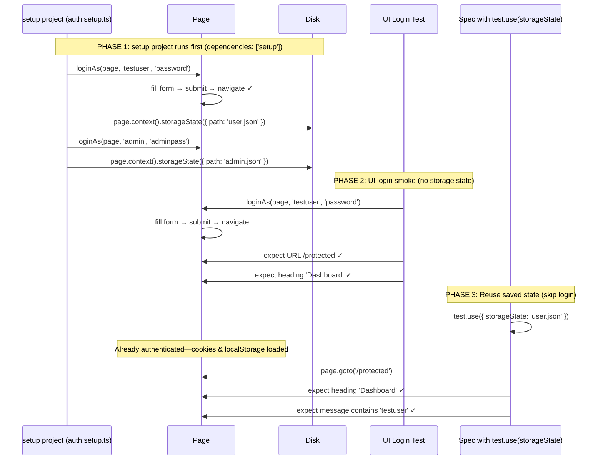

# Card 19: Auth Storage State

## What This Pattern Solves

Every test that needs authentication would repeat the same login flow—filling forms, clicking buttons, waiting for redirects—adding 2-5 seconds per test and multiplying the risk of flake from UI interactions. You want most tests to start **already authenticated** so they're fast, stable, and focused on what they actually test. At the same time, you still need at least one test that exercises the real login UI to catch regressions in the auth flow itself.

## How It Works

1. **A `setup` project saves state once per role**: `src/auth.setup.ts` is a dedicated setup project that performs the UI login a single time for each role (`testuser`, `admin`) and writes the resulting storage state to `playwright/.auth/user.json` and `playwright/.auth/admin.json`. There is no `test.beforeAll` — the file is produced before any functional spec runs.
2. **Wire it via `dependencies: ['setup']`**: In `playwright.config.ts`, the functional projects declare `dependencies: ['setup']`, so Playwright runs the setup project first and only starts the specs once the `.auth/*.json` files exist on disk.
3. **Specs consume a role with `test.use(\{ storageState \})`**: Each spec (or `describe` block) selects a role with `test.use(\{ storageState: 'playwright/.auth/user.json' \})`. The test starts **already authenticated** — no per-test UI login, no `beforeAll`.
4. **Keep one real UI login smoke test**: One test still runs `loginAs(page, ...)` against the real login form so a regression in the auth UI is caught. It runs without a saved `storageState`.
5. **Simulated storage state**: For quick, isolated cases you can also use `page.evaluate()` to set `localStorage` directly, then navigate to a protected page — no login UI and no saved file needed.

## Code Example

The `setup` project logs in once per role and saves the storage state to disk:

```typescript
// src/auth.setup.ts
import * as fs from 'fs';
import { test as setup, expect } from '@playwright/test';
import { loginAs } from './e2e-patterns/login/flow';

const AUTH_DIR = 'playwright/.auth';
const USER_FILE = `${AUTH_DIR}/user.json`;
const ADMIN_FILE = `${AUTH_DIR}/admin.json`;
const MARKER = `${AUTH_DIR}/.setup-done`;

setup('authenticate as user', async ({ page }) => {
  fs.mkdirSync(AUTH_DIR, { recursive: true });
  await loginAs(page, 'testuser', 'password');
  await expect(page.getByTestId('dashboard-message')).toContainText('testuser');
  await page.context().storageState({ path: USER_FILE });
});

setup('authenticate as admin', async ({ page }) => {
  fs.mkdirSync(AUTH_DIR, { recursive: true });
  await loginAs(page, 'admin', 'adminpass');
  await expect(page.getByTestId('dashboard-message')).toContainText('admin');
  await page.context().storageState({ path: ADMIN_FILE });
  fs.writeFileSync(MARKER, 'setup-completed');
});
```

Wire it in `playwright.config.ts` so functional projects depend on it:

```typescript
projects: [
  { name: 'setup', testMatch: /auth\.setup\.ts/ },
  {
    name: 'chromium',
    use: { ...devices['Desktop Chrome'] },
    dependencies: ['setup'],
  },
],
```

The spec consumes the saved state with `test.use(\{ storageState \})` — no `beforeAll`, no per-test UI login:

```typescript
import { test, expect } from '@playwright/test';
import { loginAs } from '../e2e-patterns/login/flow';

const roleFiles = {
  user: 'playwright/.auth/user.json',
  admin: 'playwright/.auth/admin.json',
};

test.describe('19-auth-storage-state: Auth and storage state', () => {
  // The storageState files are produced once by the `setup` project
  // (src/auth.setup.ts), wired via `dependencies: ['setup']`. Specs here just
  // consume them — no per-test UI login, no beforeAll.

  test('UI login smoke: submit form and land on protected page', async ({
    page,
  }) => {
    // Keep one real UI login: some tests genuinely need to exercise the login UI.
    const dashboardPage = await loginAs(page, 'testuser', 'password');

    await dashboardPage.assertLoaded();
    await expect(page).toHaveURL(/protected/);
    await expect(dashboardPage.heading).toBeVisible();
    await expect(dashboardPage.dashboardMessage).toContainText('testuser');
  });

  test('simulated storage state: set auth then visit protected', async ({
    page,
  }) => {
    await page.goto('/login');
    await page.evaluate(() => {
      localStorage.setItem('auth', '1');
      localStorage.setItem('user', 'stored-user');
    });
    await page.goto('/protected');
    await expect(page.getByRole('heading', { name: 'Dashboard' })).toBeVisible();
    await expect(page.getByTestId('dashboard-message')).toContainText(
      'stored-user',
    );
  });

  test.describe('reuse saved user state', () => {
    test.use({ storageState: roleFiles.user });

    test('open protected without UI login', async ({ page }) => {
      await page.goto('/protected');
      await expect(page.getByRole('heading', { name: 'Dashboard' })).toBeVisible();
      await expect(page.getByTestId('dashboard-message')).toContainText(
        'testuser',
      );
    });
  });

  test.describe('admin role', () => {
    test.use({ storageState: roleFiles.admin });

    test('admin accesses protected without login', async ({ page }) => {
      await page.goto('/protected');
      await expect(page.getByRole('heading', { name: 'Dashboard' })).toBeVisible();
      await expect(page.getByTestId('dashboard-message')).toContainText('admin');
    });
  });
});
```

## Run This Example

```bash
pnpm test src/19-auth-storage-state
```

## Prerequisites

- **Card 11**: Understanding login flows (fill form, submit, wait for URL)
- **Card 12**: Locators → Actions → Flows pattern (the `loginAs` flow function)
- Concepts: Browser contexts, localStorage, cookies, Playwright projects and `dependencies`

## Key Concepts

- **storageState**: A JSON file containing cookies and localStorage from an authenticated session. A spec loads it with `test.use(\{ storageState \})` to skip login.
- **setup project**: A dedicated project (`src/auth.setup.ts`, matched by `testMatch: /auth\.setup\.ts/`) that performs the UI login once per role and writes the storage state to disk.
- **`dependencies: ['setup']`**: Declared on the functional projects so Playwright runs the setup project first; functional specs only start after `playwright/.auth/*.json` exists.
- **context.storageState(\{ path \})**: Inside the setup project, saves the current context's cookies and local/session storage to a file (`playwright/.auth/user.json`, `.../admin.json`).
- **`test.use(\{ storageState: file \})`**: Applied at spec or `describe` scope so every test in that scope starts already authenticated as that role — no `beforeAll`, no per-test login.
- **Per-role files**: One storage-state file per role (`user.json`, `admin.json`) lets different `describe` blocks run as different users.
- **UI login smoke test**: A test that runs without storage state to validate the real login form still works.

## When to Use This Pattern

- ✓ **Default for any authenticated app**—keep exactly one UI login smoke test
- ✓ When tests take too long due to repeated login
- ✓ When login is non-deterministic (e.g., CAPTCHA, 2FA in test environments)
- ✓ When testing different roles (admin, user, guest)—create a storage state per role
- ✓ In CI where every second of test time counts
- ✗ When login IS what you're testing (use Card 11 for thorough form testing)
- ✗ When the app doesn't have authentication
- ✗ For the login page itself—those tests should start unauthenticated

## Common Mistakes

1. **Logging in per test instead of using the `setup` project**:
   ```typescript
   // ❌ WRONG - every test re-runs the UI login, slow and flaky
   test.beforeEach(async ({ page }) => {
     await loginAs(page, 'user', 'pass');
   });

   // ✓ CORRECT - login once in src/auth.setup.ts, consume the saved state
   test.use({ storageState: 'playwright/.auth/user.json' });
   test('open protected', async ({ page }) => {
     await page.goto('/protected');
   });
   ```

2. **Forgetting `dependencies: ['setup']` on functional projects**:
   ```typescript
   // ❌ WRONG - specs run before the .auth/*.json files exist
   { name: 'chromium', use: { ...devices['Desktop Chrome'] } }

   // ✓ CORRECT - setup runs first, files are guaranteed on disk
   {
     name: 'chromium',
     use: { ...devices['Desktop Chrome'] },
     dependencies: ['setup'],
   }
   ```

3. **Including auth files in version control**:
   ```bash
   # playwright/.auth/*.json should be gitignored
   # These files contain session cookies and tokens
   echo "playwright/.auth/" >> .gitignore
   ```

4. **Outdated storage state after auth system changes**:
   - If the server rotates tokens or changes cookie names, saved storage state becomes invalid
   - Tests using stale state will fail—re-run the `setup` project to regenerate

5. **Not having a smoke test with real UI login**:
   ```typescript
   // ❌ WRONG - every test uses saved state, no one verifies login form works
   // If the login page breaks, no test catches it until production

   // ✓ CORRECT - keep at least one UI login test without storage state
   test('UI login smoke', async ({ page }) => {
     await loginAs(page, 'testuser', 'password');
     await expect(page).toHaveURL(/protected/);
   });
   ```

## Flow Diagram



## Related Patterns

- **Previous**: Card 18 (Stability Techniques) - Stable pages make storage state tests even faster
- **Next**: Card 20 (API Seeding & Cleanup) - Reset backend state between tests for deterministic auth
- **Foundation**: Card 11 (Login Flow) - The UI login flow captured in `loginAs`
- **Foundation**: Card 12 (Locators → Actions → Flows) - The flow pattern that `loginAs` follows
- **Complementary**: Card 21 (App Driver Fixture) - Combine storage state with a custom fixture for even simpler test setup
- **Compare**: Card 10 (Per-Test Overrides) - Use per-test overrides for unauthenticated vs. authenticated scenarios
