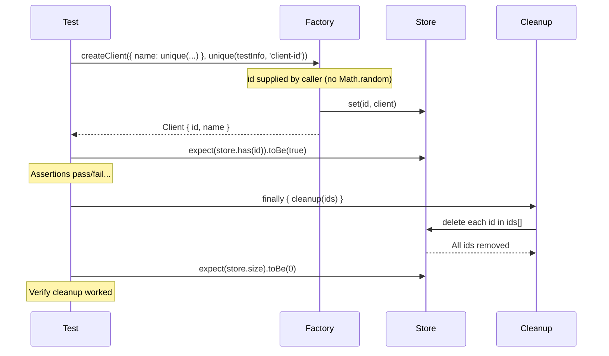

# Card 20: API Seeding and Cleanup

## What This Pattern Solves

Tests that create data (entities, records, API resources) need to clean up after themselves, otherwise subsequent runs fail from collisions - duplicate IDs, stale state, or capacity limits. Simple `afterEach` hooks are unreliable because they run even when setup fails (no IDs to clean) and can't be composed for complex flows. This card introduces **factory functions** for creating test entities, **try/finally** for guaranteed cleanup, and **unique naming** so parallel test workers never clash.

## How It Works

1. Define a **factory function** (`createClient(partial, id)`) that takes an explicit `id` from the caller and stores the entity. The id comes from the worker-namespaced `unique(testInfo, ...)` helper, so it's collision-free and reproducible — no unseeded `Math.random()`.
2. Track created IDs in an array so you know exactly what to tear down
3. Use `try { ... } finally { cleanup(ids) }` instead of `afterEach` — cleanup runs deterministically, even if the test fails
4. Give each entity a **unique name** via `unique(testInfo, 'prefix')` so parallel workers can't collide
5. Assert cleanup worked: after `finally` runs, the store should be empty or the created IDs invalid
6. For repeated patterns, promote the factory + cleanup pair into a **fixture** (see Card 07)

## Code Example

```typescript
import { test as base, expect } from '@playwright/test';
import { unique } from '../e2e-patterns/helpers/unique';

type Client = { id: string; name: string };
const store = new Map<string, Client>();

// The id is supplied by the caller using the worker-namespaced `unique()`
// helper, so seeded data is collision-free under parallel runs and the id is
// reproducible from the test (no unseeded Math.random()).
function createClient(partial: Partial<Client>, id: string): Client {
  const client = { id, name: partial.name ?? 'Unnamed', ...partial };
  store.set(id, client);
  return client;
}

async function cleanup(ids: string[]): Promise<void> {
  await Promise.all(
    ids.map((id) => {
      store.delete(id);
      return Promise.resolve();
    }),
  );
}

let workerStoreCleanupCount = 0;

const test = base.extend<object, { workerCleanupTracker: number }>({
  workerCleanupTracker: [
    async ({}, use) => {
      await use(++workerStoreCleanupCount);
      store.clear();
    },
    { scope: 'worker' },
  ],
});

test.describe('20-api-seeding-cleanup: Factories and cleanup', () => {
  test.beforeEach(() => {
    store.clear();
  });

  test('createClient + cleanup in finally', async ({}, testInfo) => {
    const createdIds: string[] = [];
    try {
      const client = createClient(
        { name: unique(testInfo, 'client') },
        unique(testInfo, 'client-id'),
      );
      createdIds.push(client.id);
      expect(store.has(client.id)).toBe(true);
      expect(client.name).toContain('client');
    } finally {
      await cleanup(createdIds);
    }
    expect(store.size).toBe(0);
  });

  test('cleanup in finally runs and removes created ids', async (
    {},
    testInfo,
  ) => {
    const createdIds: string[] = [];
    try {
      const client = createClient(
        { name: unique(testInfo, 'client') },
        unique(testInfo, 'client-id'),
      );
      createdIds.push(client.id);
    } finally {
      await cleanup(createdIds);
    }
    expect(createdIds.every((id) => !store.has(id))).toBe(true);
  });

  test('request.post factory: seed via API with auth headers', async ({
    request,
  }) => {
    const response = await request.get('/api/health', {
      headers: {
        Authorization: 'Bearer test-token',
      },
    });

    expect(response.status()).toBe(200);
  });
});
```

## Run This Example

```bash
pnpm test src/20-api-seeding-cleanup
```

## Prerequisites

- **Card 07**: Understanding fixture patterns for reusable setup/teardown
- **Card 03-04**: Comfort with mocking and route handlers
- Concepts: factory functions, try/finally, idempotency, parallel test isolation

## Key Concepts

- **Factory function**: A function that creates a fully-formed entity with defaults and persists it. It takes the `id` as an explicit argument (`createClient(partial, id)`) — the test passes `unique(testInfo, 'client-id')`, so the id is deterministic and never relies on `Math.random()`. Accepts a `Partial<T>` so callers override only what they need.
- **try/finally cleanup**: The `finally` block runs whether the test passes, fails, or throws — guaranteeing cleanup. More deterministic than `afterEach` which can't access `testInfo` and runs separately.
- **unique() helper**: Generates `${prefix}-${project}-${workerIndex}-${retry}-${timestamp}` strings so parallel workers never share names. Eliminates "duplicate key" flakes.
- **Created ID tracking**: An array that records every entity created during the test. The `finally` block reads this array to know exactly what to delete — no guessing, no stale data.
- **Promoting to fixture**: When many tests share the same factory + cleanup pattern, move it into a `test.extend` fixture (see Card 21). The test just calls `fixture.createClient({...})` and cleanup happens automatically.

## When to Use This Pattern

- ✓ Tests that create persistent data (database rows, API resources, files)
- ✓ Parallel test suites where multiple workers create entities simultaneously
- ✓ Flows where the number of created entities varies per test (track in array)
- ✓ Tests that need deterministic cleanup even when assertions fail
- ✗ Read-only tests that never create data (no cleanup needed)
- ✗ When the system under test has its own transaction rollback (e.g., test DB with RDBMS transactions)

## Common Mistakes

1. **Using `afterEach` instead of `try/finally`**:
   ```typescript
   // ❌ WRONG — afterEach runs even when beforeEach fails (nothing to clean)
   test.afterEach(async () => { await cleanup(allIds); });

   // ✓ CORRECT — finally runs only after the try block, with access to local scope
   const ids: string[] = [];
   try {
     const client = createClient({}, unique(testInfo, 'client-id'));
     ids.push(client.id);
   } finally {
     await cleanup(ids);
   }
   ```

2. **Not tracking created IDs explicitly**:
   ```typescript
   // ❌ WRONG — deleteEverything() is too broad, wipes other test data
   await deleteAllRecords();

   // ✓ CORRECT — track what you created, delete only those
   const ids: string[] = [];
   ids.push(createClient({}, unique(testInfo, 'client-id')).id);
   // ... later
   await cleanup(ids);
   ```

3. **Hardcoded names causing collisions in parallel runs**:
   ```typescript
   // ❌ WRONG — two parallel workers both create "test-client" with a shared id
   createClient({ name: 'test-client' }, 'test-client');

   // ✓ CORRECT — unique name AND unique id from testInfo metadata
   createClient(
     { name: unique(testInfo, 'client') },
     unique(testInfo, 'client-id'),
   );
   ```

4. **Skipping the post-cleanup assertion**:
   ```typescript
   // ❌ WRONG — cleanup ran, but did it actually delete?
   } finally { await cleanup(ids); }

   // ✓ CORRECT — assert the store is empty after cleanup
   } finally { await cleanup(ids); }
   expect(store.size).toBe(0);
   ```

## Flow Diagram



## Related Patterns

- **Previous**: Card 19 (Auth Storage State) — Setup/teardown for auth state
- **Next**: Card 21 (App Driver Fixture) — Promote repeated factory+cleanup into a fixture
- **Foundation**: Card 07 (Patch Fixtures) — Fixture-based setup/teardown patterns
- **Complementary**: Card 09 (Faker Builders) — Use Faker in factory functions for realistic test data
- **Complementary**: Card 23 (API-Only Tests) — Use the request fixture for API-level seeding/cleanup
