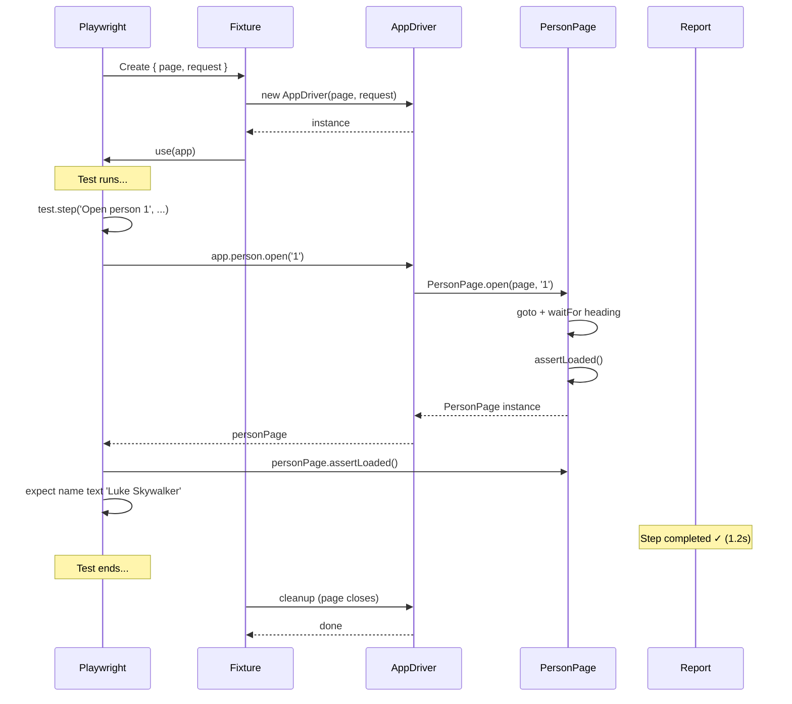

# Card 21: App Driver Fixture

## What This Pattern Solves

As test suites grow, tests accumulate repetitive setup: navigating to pages, waiting for load signals, and plumbing together region objects (toasts, dialogs) and flow objects (login, person page). Copy-pasting this wiring into every test bloats specs and makes refactoring painful. The **App Driver** pattern provides a single entry point — a fixture that holds `page` and `request`, exposes high-level methods like `app.person.open('1')`, and keeps tests focused on behaviour, not plumbing.

## How It Works

1. Create an `AppDriver` class that wraps `page` and `request`, exposing domain objects via getters: `app.person`, `app.auth`
2. Each getter returns a flow object with composable methods (e.g. `person.open(id)` returns a `PersonPage`)
3. Register the `AppDriver` as a bespoke per-file fixture via `base.extend<\{ app: AppDriver \}>(\{ ... \})`. The fixture installs the API mock with `page.route(...)` and then hands the test a fresh `app` built from `page` and `request` — so specs never repeat route setup in a `beforeEach`
4. In tests, use `await app.person.open('1')` instead of manually navigating and waiting; assert through the returned page object (`personPage.name`), and log in through `app.auth.loginAs(...)`
5. Wrap major actions in `test.step()` so the HTML report shows a readable, hierarchical trace of what happened
6. Tests read like plain English: open page → assert loaded → assert content

## Code Example

```typescript
import { test as base, expect } from '@playwright/test';
import { AppDriver } from '../e2e-patterns/AppDriver';
import { makePerson } from '../swapi/builders';

const test = base.extend<{ app: AppDriver }>({
  app: async ({ page, request }, use) => {
    await page.route('**/swapi.dev/api/people/1/**', (route) =>
      route.fulfill({
        json: makePerson({
          name: 'Luke Skywalker',
          height: '172',
          mass: '77',
          url: 'https://swapi.dev/api/people/1/',
        }),
      }),
    );
    await use(new AppDriver(page, request));
  },
});

test.describe('21-app-driver-fixture: App driver fixture and test.step', () => {
  test('app.person.open returns PersonPage', async ({ app }) => {
    const personPage = await test.step('Open person 1', async () => {
      return app.person.open('1');
    });

    await personPage.assertLoaded();
    await expect(personPage.name).toHaveText('Luke Skywalker');
  });

  test('test.step wraps flow for report', async ({ app }) => {
    await test.step('Open person and assert name', async () => {
      const personPage = await app.person.open('1');
      await personPage.assertLoaded();
      await expect(personPage.name).toHaveText('Luke Skywalker');
    });
  });

  test('composed fixture: extend AppDriver with test-specific helper', async ({
    app,
  }) => {
    const personPage = await app.person.open('1');

    const verifyPerson = async (expectedName: string) => {
      await expect(personPage.name).toHaveText(expectedName);
    };

    await verifyPerson('Luke Skywalker');
  });

  test('app.auth.loginAs: login and navigate to protected page', async ({
    app,
  }) => {
    const dashboard = await app.auth.loginAs('testuser', 'password');

    await dashboard.assertLoaded();
    await expect(app.page).toHaveURL(/protected/);
    await expect(dashboard.dashboardMessage).toContainText('testuser');
  });

  test('app.auth.loginAs with admin credentials', async ({ app }) => {
    const dashboard = await app.auth.loginAs('admin', 'adminpass');

    await expect(app.page).toHaveURL(/protected/);
    await expect(dashboard.heading).toBeVisible();
    await expect(dashboard.dashboardMessage).toContainText('admin');
  });
});
```

## Run This Example

```bash
pnpm test src/21-app-driver-fixture
```

## Prerequisites

- **Card 12**: Understanding the 3-layer model (Locators → Actions → Flows)
- **Card 07**: Understanding fixture lifecycle and `test.extend`
- **Card 02**: Comfort with `page.route()` for mocking APIs
- Concepts: dependency injection, facade pattern, test fixtures, test.step

## Key Concepts

- **AppDriver class**: A thin facade that holds `page` and `request`, exposing domain objects via typed getters. Never holds mutable state — it's stateless wiring that connects your test to the app's surfaces.
- **Fixture via test.extend**: `base.extend<{ app: AppDriver }>({ ... })` creates a typed fixture that Playwright auto-injects into every test. The fixture's `use()` callback runs for the test's lifetime; cleanup can run after `use()` returns.
- **test.step()**: Wraps a block of code with a label. The HTML report shows each step as a collapsible section with timing, screenshots, and logs. Use it for every major action: navigation, form submission, data assertion.
- **Return-next-page pattern**: Flow methods like `PersonPage.open(page, id)` navigate, wait for load, construct a `PersonPage`, call `assertLoaded()`, and return it. The test chains from there: `const page = await app.person.open('1')`.
- **Getters for namespacing**: `app.person.open(...)` reads more naturally than `openPersonPage(...)`. Getters also allow lazy construction — the underlying flow objects are only created when accessed.

## When to Use This Pattern

- ✓ Suites with 10+ tests that share the same pages and flows
- ✓ When tests repeatedly navigate to the same page and assert content
- ✓ When you want readable HTML reports with meaningful step names
- ✓ Multi-domain apps with distinct surfaces (e.g., admin dashboard + public site)
- ✗ Single-file or single-test suites — the fixture overhead isn't justified
- ✗ When the app under test changes rapidly — the driver needs constant updates

## Common Mistakes

1. **Skipping test.step for key actions**:
   ```typescript
   // ❌ WRONG — report shows one flat test with no structure
   const personPage = await app.person.open('1');
   await expect(page.getByTestId('name')).toHaveText('Luke');

   // ✓ CORRECT — report shows nested steps with timing
   await test.step('Open person 1 and verify name', async () => {
     const personPage = await app.person.open('1');
     await personPage.assertLoaded();
     await expect(page.getByTestId('name')).toHaveText('Luke');
   });
   ```

2. **Putting assertions inside the AppDriver**:
   ```typescript
   // ❌ WRONG — AppDriver should not assert, tests do
   class AppDriver {
     async expectPersonName(name: string) {
       await expect(this.page.getByTestId('name')).toHaveText(name);
     }
   }

   // ✓ CORRECT — Driver exposes page/locators, test asserts
   test('shows person', async ({ app }) => {
     await app.person.open('1');
     await expect(app.page.getByTestId('name')).toHaveText('Luke');
   });
   ```

3. **Forgetting that fixtures are fresh per test**:
   ```typescript
   // ❌ WRONG — AppDriver won't persist state across tests
   let driver: AppDriver;
   test.beforeAll(async ({ app }) => { driver = app; });

   // ✓ CORRECT — each test gets a new app fixture with fresh page
   test('test 1', async ({ app }) => { /* fresh */ });
   test('test 2', async ({ app }) => { /* also fresh */ });
   ```

4. **Not exposing `page` on the AppDriver**:
   ```typescript
   // ❌ WRONG — test can't access page for raw assertions
   // ✓ CORRECT — readonly `page` property lets tests call locators directly
   class AppDriver {
     constructor(readonly page: Page, readonly request?: APIRequestContext) {}
   }
   ```

## Flow Diagram



## Related Patterns

- **Previous**: Card 20 (API Seeding and Cleanup) — Promote seeding into app driver methods
- **Next**: Card 22 (Failure Artifacts) — Debug failures with the app driver present
- **Foundation**: Card 12 (Locators → Actions → Flows) — The 3-layer model that the AppDriver orchestrates
- **Foundation**: Card 07 (Patch Fixtures) — Fixture lifecycle and `test.extend` deep dive
- **Complementary**: Card 14 (Region Objects) — Region objects compose naturally inside AppDriver getters
- **Complementary**: Card 19 (Auth Storage State) — Combine with AppDriver for authenticated flows
