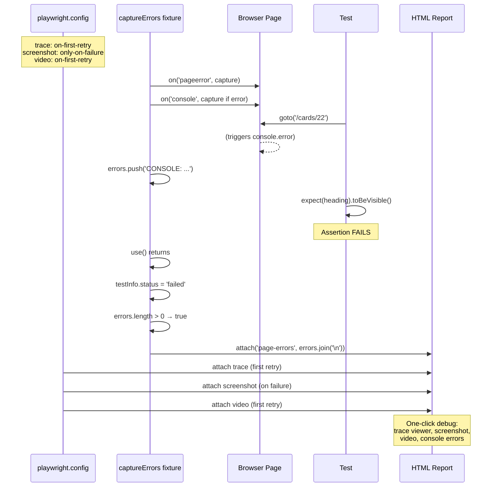

# Card 22: Failure Artifacts

## What This Pattern Solves

A test fails in CI and you open the report — but all you see is "expected A, received B". No console errors, no stack trace from the browser, no clue what the page actually rendered. You spend 20 minutes reproducing locally. This card shows how to configure Playwright to **automatically capture diagnostic data on failure** — traces, screenshots, videos, and console errors — so you can debug any failure in under a minute from the HTML report alone.

## How It Works

1. Configure `trace: 'on-first-retry'`, `screenshot: 'only-on-failure'`, and `video: 'on-first-retry'` in `playwright.config.ts` so artifacts are captured without slowing passing tests
2. Create an **auto-fixture** (`captureErrors`) that subscribes to `page.on('pageerror')` (uncaught exceptions) and `page.on('console')` (console.error calls) during the test
3. After the test completes (via `use()`), check `testInfo.status !== 'passed'` — if the test failed and errors were captured, attach them with `testInfo.attach('page-errors', ...)`
4. The fixture is `{ auto: true }`, so it runs for every test without the test needing to mention it
5. Add a requested `lastApiResponse` fixture that mocks an endpoint, records the served body, and attaches it as `last-api-response` JSON after the test
6. Open the HTML report: each failed test now has a trace viewer, screenshot, video, a "page-errors" attachment with all browser-side errors, and the captured API response
6. Retries: first attempt captures trace/video; if it passes on retry, you still have diagnostics from the failed attempt

## Code Example

```typescript
import { test as base, expect } from '@playwright/test';

const test = base.extend<{
  captureErrors: void;
  lastApiResponse: { response: { status: number; body: unknown } | null };
}>({
  captureErrors: [
    async ({ page }, use, testInfo) => {
      const errors: string[] = [];
      page.on('pageerror', (e) => {
        errors.push(`PAGEERROR: ${e.message}`);
      });
      page.on('console', (msg) => {
        if (msg.type() === 'error') {
          errors.push(`CONSOLE: ${msg.text()}`);
        }
      });
      await use();
      if (testInfo.status !== 'passed' && errors.length > 0) {
        await testInfo.attach('page-errors', {
          body: errors.join('\n'),
          contentType: 'text/plain',
        });
      }
    },
    { auto: true },
  ],
  lastApiResponse: async ({ page }, use) => {
    const ref: { response: { status: number; body: unknown } | null } = {
      response: null,
    };

    await page.route('**/swapi.dev/api/people/1/**', async (route) => {
      ref.response = {
        status: 200,
        body: { name: 'Luke Skywalker', height: '172', mass: '77' },
      };
      await route.fulfill({
        status: 200,
        contentType: 'application/json',
        json: ref.response.body,
      });
    });

    await use(ref);

    if (ref.response) {
      await test.info().attach('last-api-response', {
        body: JSON.stringify(ref.response, null, 2),
        contentType: 'application/json',
      });
    }
  },
});

test.describe('22-failure-artifacts: Error capture fixture', () => {
  // captureErrors is an auto fixture: it runs for every test without being
  // requested, and attaches collected errors only when the test does not pass.
  test('passing test attaches nothing', async ({ page }) => {
    await page.goto('/cards/22');
    await expect(page.getByRole('heading', { name: 'Person' })).toBeVisible();
  });

  test('lastApiResponse captures and attaches the API body', async ({
    page,
    lastApiResponse,
  }) => {
    await page.goto('/cards/22');
    await expect(page.getByRole('heading', { name: 'Person' })).toBeVisible();

    expect(lastApiResponse.response).not.toBeNull();
    expect(lastApiResponse.response!.status).toBe(200);
    expect(lastApiResponse.response!.body).toEqual(
      expect.objectContaining({ name: 'Luke Skywalker' }),
    );
  });
});
```

## Run This Example

```bash
pnpm test src/22-failure-artifacts
```

## Prerequisites

- **Card 07**: Understanding fixture lifecycle and `test.extend`
- **Card 01**: Understanding the Playwright config file
- Concepts: browser events, test lifecycle hooks, HTML reporter attachments

## Key Concepts

- **Auto-fixture**: A fixture with `{ auto: true }` runs for every test in the suite automatically. The test doesn't need to destructure it (but can, for clarity). Perfect for cross-cutting concerns like error capture, timing, or logging.
- **page.on('pageerror')**: Listens for uncaught JavaScript exceptions in the page. These are fatal errors that crash the app — you definitely want them in the report.
- **page.on('console')**: Listens for all console output. Filter to `msg.type() === 'error'` to capture `console.error()` calls without noise from `console.log()`.
- **testInfo.attach()**: Adds an arbitrary artifact (text, JSON, binary) to the test result. Visible in the HTML report under the "Attachments" section. Name it descriptively (`page-errors`, `network-requests`, `api-responses`).
- **Conditional attachment**: Only attach errors when `testInfo.status !== 'passed'`. Passing tests don't need the noise; failing ones get maximum diagnostic data.
- **trace/screenshot/video config**: Set in `playwright.config.ts` under `use:`. `on-first-retry` means artifacts are only captured on retries (not first attempt), keeping CI fast for passing suites. `only-on-failure` captures only when the test fails.

## When to Use This Pattern

- ✓ Every CI suite — there's no reason not to capture diagnostics on failure
- ✓ Heisenbugs that only fail in CI and never locally
- ✓ Tests that interact with complex JavaScript apps (race conditions, unhandled rejections)
- ✓ Onboarding new team members — they can read the report without reproducing
- ✗ Local development with `--ui` mode (use the built-in trace viewer instead, or toggle artifacts off for speed)

## Common Mistakes

1. **Not filtering console to errors only**:
   ```typescript
   // ❌ WRONG — attaches every console.log, huge attachment
   page.on('console', (msg) => errors.push(msg.text()));

   // ✓ CORRECT — only console.error calls
   page.on('console', (msg) => {
     if (msg.type() === 'error') errors.push(`CONSOLE: ${msg.text()}`);
   });
   ```

2. **Attaching errors on passing tests**:
   ```typescript
   // ❌ WRONG — every test gets an error attachment, even passing ones
   await testInfo.attach('page-errors', { body: errors.join('\n'), ... });

   // ✓ CORRECT — only attach when the test actually failed
   if (testInfo.status !== 'passed' && errors.length > 0) {
     await testInfo.attach('page-errors', { body: errors.join('\n'), ... });
   }
   ```

3. **Capturing trace on every test (not just retry)**:
   ```typescript
   // ❌ WRONG — slows CI by 2-5x for passing suites
   use: { trace: 'on' }

   // ✓ CORRECT — trace only on retry, screenshot only on failure
   use: {
     trace: 'on-first-retry',
     screenshot: 'only-on-failure',
     video: 'on-first-retry',
   }
   ```

4. **Forgetting to handle the `use()` lifecycle correctly**:
   ```typescript
   // ❌ WRONG — subscribing after use() so no errors are captured
   await use();
   page.on('pageerror', handler);

   // ✓ CORRECT — subscribe before use(), capture during test, attach after
   page.on('pageerror', handler);
   await use();
   if (failed) await testInfo.attach(...);
   ```

## Flow Diagram



## Related Patterns

- **Previous**: Card 21 (App Driver Fixture) — Errors captured with full app driver context
- **Next**: Card 23 (API-Only Tests) — Debug API test failures with request-level diagnostics
- **Foundation**: Card 07 (Patch Fixtures) — Auto-fixture lifecycle deep dive
- **Complementary**: Card 16 (Debug Unhandled Requests) — Another diagnostic technique for mocked APIs
- **Complementary**: Card 18 (Stability Techniques) — Reduce flake so these artifacts fire less often
