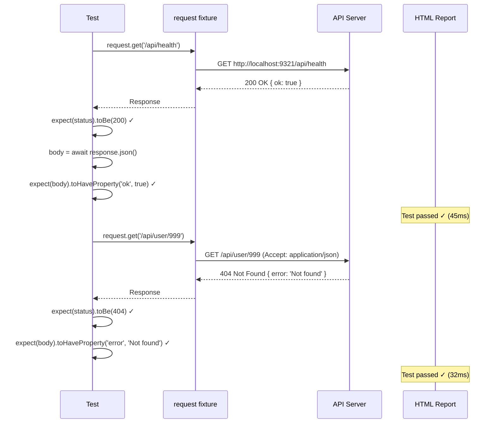

# Card 23: API-Only Tests

## What This Pattern Solves

Not every test needs a browser. When you want to validate an HTTP API contract — status codes, response bodies, headers — launching a full browser with page rendering is wasteful. It's slower, consumes more CI resources, and introduces visual rendering flakiness where none should exist. Playwright's **`request`** fixture lets you write focused, fast API tests using the same test runner, assertions, and reporting you already use for browser tests.

## How It Works

1. Use the **`request`** fixture (an `APIRequestContext`) directly in tests — no `page` or `browser` needed
2. Call `request.get(url, { headers })` or `request.post(url, { data })` to make HTTP calls
3. Assert on `response.status()` for HTTP status codes (200, 404, etc.)
4. Parse the body with `await response.json()` and assert on structured data
5. Relative URLs work because `request` inherits `baseURL` from `playwright.config.ts`
6. Tests run in parallel, fully isolated, and produce the same HTML report with passes, failures, and attachments

## Code Example

```typescript
import { test, expect } from '@playwright/test';

interface User {
  id: string;
  name: string;
  role: string;
}

test.describe('23-api-only-tests: API tests with request fixture', () => {
  test('GET /api/health returns 200 and ok: true', async ({ request }) => {
    const response = await request.get('/api/health');
    expect(response.status()).toBe(200);

    const body = (await response.json()) as { ok: boolean };
    expect(body.ok).toBe(true);
  });

  test('GET /api/user/1 with Accept header returns user JSON', async ({
    request,
  }) => {
    const response = await request.get('/api/user/1', {
      headers: { Accept: 'application/json' },
    });
    expect(response.status()).toBe(200);

    const body: User = await response.json();
    expect(body).toEqual({ id: '1', name: 'Alice', role: 'admin' });
    expect(body.id).toBe('1');
    expect(body.name).toBe('Alice');
    expect(body.role).toBe('admin');
  });

  test('GET /api/user/999 returns 404', async ({ request }) => {
    const response = await request.get('/api/user/999', {
      headers: { Accept: 'application/json' },
    });
    expect(response.status()).toBe(404);
    const body = (await response.json()) as { error: string };
    expect(body.error).toBe('Not found');
  });
});
```

## Run This Example

```bash
pnpm test src/23-api-only-tests
```

## Prerequisites

- **Card 01**: Understanding the Playwright test structure and `test.describe`
- **Card 10**: Understanding HTTP status codes and error scenarios
- Concepts: HTTP methods (GET, POST), REST APIs, JSON parsing, Playwright fixtures

## Key Concepts

- **`request` fixture**: Playwright's built-in `APIRequestContext` — an isolated HTTP client per test. No browser launched. Supports cookies, headers, and follows redirects automatically.
- **`baseURL` inheritance**: The `request` fixture uses `baseURL` from `playwright.config.ts`, so relative paths like `/api/health` resolve to `http://localhost:9321/api/health`. No hardcoded URLs in tests.
- **`response.status()`**: Returns the HTTP status code as a number. Assert for 200 (success), 201 (created), 404 (not found), 401 (unauthorized), etc.
- **`response.json()`**: Parses the response body as JSON. Call `await` to unwrap the promise. Returns a plain JavaScript object — assert with `toEqual`, `toHaveProperty`, or `toMatchObject`.
- **Headers configuration**: Pass `{ headers: { Accept: 'application/json' } }` to set request headers. Use for content negotiation, auth tokens, or custom headers.
- **Separation of concerns**: API tests validate the contract (status codes, body shape). Browser tests validate the UI (rendering, interactivity). Keep them in separate spec files.

## When to Use This Pattern

- ✓ Validating REST API endpoints return correct status codes and bodies
- ✓ Health-check and smoke tests (fast, run first in CI)
- ✓ Contract testing when the frontend and backend are developed separately
- ✓ Seeding or resetting data via API before/after UI tests
- ✓ Testing error responses (404, 422, 500) without rendering error pages
- ✗ Testing UI rendering, interactions, or page navigation (use browser tests)
- ✗ Testing WebSocket or SSE connections (request is HTTP only)

## Common Mistakes

1. **Forgetting `await` when calling `response.json()`**:
   ```typescript
   // ❌ WRONG — body is a Promise, not the parsed object
   const body = response.json();
   expect(body.ok).toBe(true); // Always passes (Promise is truthy)

   // ✓ CORRECT — await the parsing
   const body = await response.json();
   expect(body.ok).toBe(true);
   ```

2. **Hardcoding full URLs instead of using `baseURL`**:
   ```typescript
   // ❌ WRONG — breaks when port or host changes
   await request.get('http://localhost:9321/api/health');

   // ✓ CORRECT — relative path, uses baseURL from config
   await request.get('/api/health');
   ```

3. **Not setting `Accept` header for content negotiation**:
   ```typescript
   // ❌ WRONG — server might return HTML instead of JSON
   const res = await request.get('/api/user/1');
   const body = await res.json(); // Might fail on HTML response

   // ✓ CORRECT — explicitly request JSON
   const res = await request.get('/api/user/1', {
     headers: { Accept: 'application/json' },
   });
   ```

4. **Mixing API and browser concerns in one test**:
   ```typescript
   // ❌ WRONG — using page to assert API responses
   test('health check', async ({ page }) => {
     const res = await page.request.get('/api/health');
   });

   // ✓ CORRECT — use the request fixture, no browser launched
   test('health check', async ({ request }) => {
     const res = await request.get('/api/health');
   });
   ```

## Flow Diagram



## Related Patterns

- **Previous**: Card 22 (Failure Artifacts) — Debug failing API tests with response body attachments
- **Next**: Card 24 (Parameterized Tests) — Generate multiple API tests from a data set
- **Foundation**: Card 01 (First Browser Test) — Same test runner, different fixture
- **Complementary**: Card 20 (API Seeding and Cleanup) — Use request fixture for seeding before UI tests
- **Complementary**: Card 10 (Per-Test Overrides) — Apply mock override concepts to API request handlers
