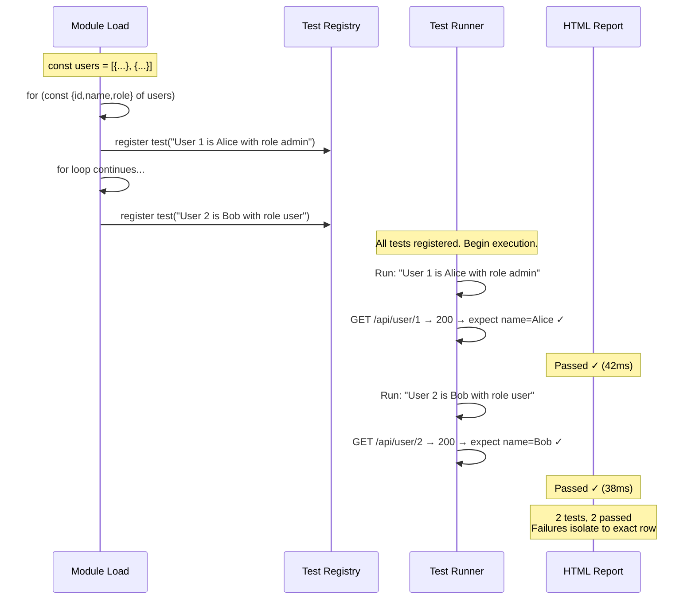

# Card 24: Parameterized Tests

## What This Pattern Solves

You need to run the same test logic against five user IDs, three locales, or ten API endpoints. Without parameterization, you'd copy-paste the test five, three, or ten times — changing only the input values. This creates a maintenance nightmare: if the assertion logic changes, you must update every copy. Missing one produces inconsistent behavior and false confidence. **Parameterized tests** let you define a data set once and generate one test per row automatically, keeping specs DRY and failures pinpoint-accurate.

## How It Works

1. Define a **data array** of test cases — each entry is an object with the inputs and expected outputs
2. Use a **`for...of` loop** over the array, calling `test(title, async ({ ... }) => { ... })` inside the loop
3. Each iteration registers a **separate test** with a distinct title that includes the input values — reports show exactly which row failed
4. The test body uses the loop variable (`id`, `name`, `role`) directly — no dynamic key lookups
5. Failures isolate to one row: "User 2 is Bob with role user" fails, not "one of the parameterized tests failed"
6. For more complex needs, consider `test.describe.each` (table-style) or `test.extend` (factory-style)

## Code Example

```typescript
import { test, expect } from '@playwright/test';

interface User {
  id: string;
  name: string;
  role: string;
}

const users: User[] = [
  { id: '1', name: 'Alice', role: 'admin' },
  { id: '2', name: 'Bob', role: 'user' },
];

for (const { id, name, role } of users) {
  test(`User ${id} is ${name} with role ${role}`, async ({ request }) => {
    const response = await request.get(`/api/user/${id}`, {
      headers: { Accept: 'application/json' },
    });
    expect(response.status()).toBe(200);

    const body: User = await response.json();
    expect(body.id).toBe(id);
    expect(body.name).toBe(name);
    expect(body.role).toBe(role);
  });
}

test('all users have required fields', async ({ request }) => {
  for (const { id } of users) {
    const response = await request.get(`/api/user/${id}`, {
      headers: { Accept: 'application/json' },
    });
    expect(response.status()).toBe(200);

    const body: User = await response.json();
    expect(body).toMatchObject({
      id: expect.any(String),
      name: expect.any(String),
      role: expect.any(String),
    });
  }
});
```

## Run This Example

```bash
pnpm test src/24-parameterized-tests
```

## Prerequisites

- **Card 23**: Understanding the `request` fixture for API-only tests
- **Card 01**: Understanding the Playwright test structure
- Concepts: loops in JavaScript, test registration, data-driven testing

## Key Concepts

- **Data-driven testing**: Define a data set separately from test logic. Each row in the data set becomes one test. Changing the data set changes what is tested without touching test logic.
- **`for...of` loop with `test()`**: The simplest form of parameterization. The loop runs at module load time (before any test executes), registering N tests. Each test closure captures its row's values via the loop variable.
- **Descriptive test titles**: Embed variables in the test name: `` `User ${id} is ${name} with role ${role}` ``. When a test fails, the report title tells you exactly which input failed — no need to read the body.
- **`test.describe.each`**: An alternative API that takes a table: `test.describe.each([{ a: 1, b: 2 }])('desc', ({ a, b }) => { ... })`. More declarative but less flexible than `for...of` for dynamic titles and complex setup.
- **`test.extend` for parameterization**: When parameters affect fixture setup (e.g., different storage states per user role), use `test.extend` with per-project or per-describe options rather than `for...of`.
- **Isolation**: Each generated test gets its own fixtures, context, and lifecycle. A failure in "User 1" does not affect "User 2" — they are independent tests.

## When to Use This Pattern

- ✓ Testing the same endpoint with different IDs, roles, or locales
- ✓ API contract tests for multiple resources (users, products, orders)
- ✓ Validation tests: same logic, different invalid inputs
- ✓ Cross-browser or cross-viewport tests (parameterize by device)
- ✓ Smoke tests: verify multiple endpoints return 200
- ✗ When the data set is huge (100+ rows) — use a single test that loops internally with `test.step` per row, or select a representative sample
- ✗ When each row needs entirely different test logic — write separate tests; parameterization requires shared logic

## Common Mistakes

1. **Registering tests inside another test**:
   ```typescript
   // ❌ WRONG — loop inside a test body, not at module scope
   test('parameterized', async ({ request }) => {
     for (const u of users) {
       const res = await request.get(`/api/user/${u.id}`);
       expect(res.status()).toBe(200); // One failure stops the loop
     }
   });

   // ✓ CORRECT — loop at module scope, each row is its own test
   for (const { id, name, role } of users) {
     test(`User ${id}`, async ({ request }) => {
       const res = await request.get(`/api/user/${id}`);
       expect(res.status()).toBe(200);
     });
   }
   ```

2. **Vague test titles that hide which row failed**:
   ```typescript
   // ❌ WRONG — title doesn't say which user, report is ambiguous
   for (const u of users) {
     test('user has correct name and role', async ({ request }) => {
       // ...
     });
   }

   // ✓ CORRECT — title includes the distinguishing values
   for (const { id, name, role } of users) {
     test(`User ${id} is ${name} with role ${role}`, async ({ request }) => {
       // ...
     });
   }
   ```

3. **Closing over a mutable variable**:
   ```typescript
   // ❌ WRONG — all tests share the same `user` variable (last value)
   for (const user of users) {
     test(`User ${user.id}`, async ({ request }) => {
       expect((await (await request.get(`/api/user/${user.id}`)).json()).name)
         .toBe(user.name);
     });
   }
   // All tests will use the last user's data!
   // (This is actually safe with `const` + block scope in ES modules, but
   //  be careful with `var` or non-block-scoped variables.)

   // ✓ CORRECT — destructure in the loop head for clarity and safety
   for (const { id, name, role } of users) {
     test(`User ${id}`, async ({ request }) => {
       expect((await (await request.get(`/api/user/${id}`)).json()).name)
         .toBe(name);
     });
   }
   ```

4. **Not considering that all tests are registered upfront**:
   ```typescript
   // ❌ WRONG — dynamic data fetch won't work (module-load time, not test time)
   const users = await fetch('/api/users').then(r => r.json());
   for (const u of users) { test(...) }

   // ✓ CORRECT — define data statically, or use test.extend / globalSetup
   const users = [
     { id: '1', name: 'Alice', role: 'admin' },
     { id: '2', name: 'Bob', role: 'user' },
   ];
   ```

## Flow Diagram



## Related Patterns

- **Previous**: Card 23 (API-Only Tests) — Most parameterized tests use the request fixture
- **Foundation**: Card 01 (First Browser Test) — Understanding test registration and lifecycle
- **Complementary**: Card 21 (App Driver Fixture) — Parameterize roles or user types with app driver
- **Complementary**: Card 10 (Per-Test Overrides) — Combine parameterization with error scenario overrides
- **Advanced**: Card 19 (Auth Storage State) — Parameterize by user role with different storage states
