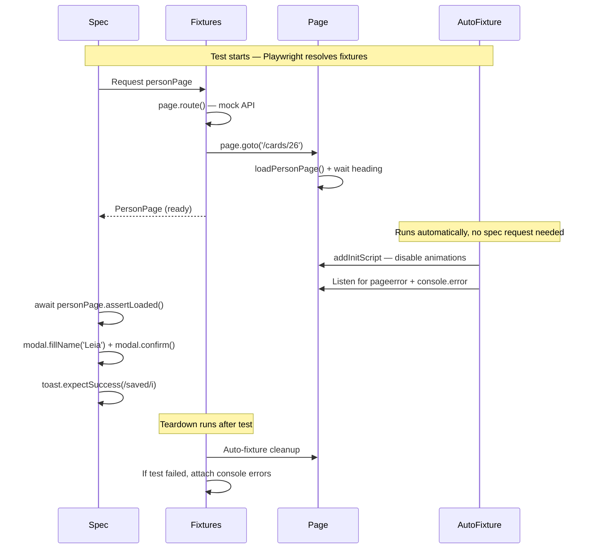

# Card 26: Full Architecture — Fixture Composition at Scale

## What This Pattern Solves

Individual patterns work in isolation. Real codebases have 100+ specs, 50+ pages, cross-cutting concerns (animations, error capture, third-party blocking), and multiple auth roles. Without a composition strategy, every spec file becomes a snowflake of `page.route()`, `page.goto()`, `new PageObject()`, and duplicated setup. Fixing a selector means updating 40 files.

The solution: **one fixture file is the composition root**. Every test in the suite imports `test` and `expect` from `fixtures.ts` — never from `@playwright/test`. Fixtures own construction, setup, teardown, and cross-cutting concerns. Specs describe business intent in 5-15 lines.

## How It Works

1. **`fixtures.ts` exports `test` and `expect`** — specs import from here, never from `@playwright/test`.
2. **Page fixtures deliver pre-loaded pages** — the fixture handles `page.route()` mocking and `page.goto()` navigation. The test receives a ready-to-assert page.
3. **Component fixtures are lazy** — only built when a test requests them. No construction overhead for unused components.
4. **Flow fixtures are closures** — `loginAsDefaultUser` is wrapped in `use(() => loginAs(...))` so specs call it, not import the raw flow function. The closure returns the `DashboardPage` the flow lands on, so the spec asserts through the page object instead of re-deriving raw locators.
5. **Auto-fixtures run silently** — `disableAnimations` and `capturePageErrors` apply to every test without being requested. They run before the test, clean up after.
6. **Page objects own their components** — `PersonPage.openEditDialog()` constructs and returns a container-rooted `Modal` scoped to the dialog. The spec never calls `new Modal(...)` or knows how the dialog is rooted; the `Modal` takes a `Locator` root, not `Page`, so it composes anywhere.

## Code Example

```typescript
// e2e-patterns/fixtures.ts — THE composition root
import { test as base, expect } from '@playwright/test';
import { PersonPage } from './person/PersonPage';
import { DashboardPage } from './dashboard/DashboardPage';
import { ToastRegion } from './regions/ToastRegion';
import { loginAs } from './login/flow';

type Fixtures = {
  personPage: PersonPage;
  disableAnimations: void;
  capturePageErrors: void;
  loginAsDefaultUser: () => Promise<DashboardPage>;
  toast: ToastRegion;
};

export const test = base.extend<Fixtures>({
  // Page fixture: pre-loaded, pre-mocked
  personPage: async ({ page }, use) => {
    await page.route('**/swapi.dev/api/people/1/**', (route) =>
      route.fulfill({
        status: 200,
        contentType: 'application/json',
        body: JSON.stringify({
          name: 'Luke Skywalker',
          height: '172',
          mass: '77',
          url: 'https://swapi.dev/api/people/1/',
          films: [],
        }),
      }),
    );
    const personPage = await PersonPage.open(page, '1', '/cards/26');
    await use(personPage);
  },

  // Auto-fixture: disable CSS animations for every test
  disableAnimations: [
    async ({ page }, use) => {
      await page.addInitScript(() => {
        const style = document.createElement('style');
        style.textContent =
          '*, *::before, *::after { transition: none !important; animation: none !important; }';
        if (document.documentElement) {
          document.documentElement.appendChild(style);
        } else {
          document.addEventListener('DOMContentLoaded', () => {
            document.documentElement.appendChild(style);
          });
        }
      });
      await use();
    },
    { auto: true },
  ],

  // Auto-fixture: capture console errors silently
  capturePageErrors: [
    async ({ page }, use, testInfo) => {
      const errors: string[] = [];
      page.on('pageerror', (err) => errors.push(`pageerror: ${err.message}`));
      page.on('console', (msg) => {
        if (msg.type() === 'error') errors.push(`console.error: ${msg.text()}`);
      });
      await use();
      if (testInfo.status !== 'passed' && errors.length > 0) {
        await testInfo.attach('console-errors', {
          body: errors.join('\n'),
          contentType: 'text/plain',
        });
      }
    },
    { auto: true },
  ],

  // Flow fixture: login wrapped as callable closure that returns the
  // DashboardPage the flow lands on, so specs assert through the page object.
  loginAsDefaultUser: async ({ page }, use) => {
    await use(() => loginAs(page, 'testuser', 'password'));
  },

  // Component fixture: lazy, only built when requested
  toast: async ({ page }, use) => {
    await use(new ToastRegion(page));
  },
});

export { expect };
```

```typescript
// src/26-full-architecture/full-architecture.spec.ts
// Spec imports test/expect from fixtures.ts — never from @playwright/test
import { test, expect } from '../e2e-patterns/fixtures';

test.describe('26-full-architecture: Fixture composition for 1000-test suites', () => {
  test('page fixture delivers pre-loaded and pre-mocked PersonPage', async ({
    personPage,
  }) => {
    // No page.route(), no page.goto(), no construction — fixture did it all.
    await personPage.assertLoaded();
    // Auto-fixtures disableAnimations and capturePageErrors already ran.
  });

  test('edit flow: page object exposes a container-rooted Modal + toast component', async ({
    personPage,
    toast,
  }) => {
    // The page object owns the dialog locator and the container-rooted Modal.
    // The spec never sees `new Modal(...)`: it asks for the modal and drives it.
    const modal = await personPage.openEditDialog();

    await expect(modal.nameInput).toBeVisible();
    await modal.fillName('Architecture Leia');
    await modal.confirm();

    await toast.expectSuccess(/saved/i);
    await expect(personPage.name).toHaveText('Architecture Leia');
  });

  test('login flow as callable fixture: call it, do not import it', async ({
    page,
    loginAsDefaultUser,
  }) => {
    const dashboardPage = await loginAsDefaultUser();

    await expect(page).toHaveURL(/protected/);
    // Assert through the page object the flow returned, not raw locators.
    await expect(dashboardPage.heading).toBeVisible();
    await expect(dashboardPage.dashboardMessage).toContainText('testuser');
  });
});
```

## Run This Example

```bash
pnpm test src/26-full-architecture
```

## Prerequisites

- **Card 12**: Locators → Actions → Flows (the 3-layer model)
- **Card 14**: Region Objects (container-rooted components)
- **Card 15**: Done Signals (web-first assertions, waitForApi)
- **Card 19**: Auth Storage State (login flow)
- **Card 21**: App Driver Fixture (test.extend)
- **Card 22**: Failure Artifacts (error capture)
- Concepts: fixture composition, DI for tests, lazy construction

## Key Concepts

- **Composition root**: One `fixtures.ts` file exports `test` and `expect`. Every spec in the suite imports from it. Never from `@playwright/test`.
- **Fixtures own construction**: Pages, components, data — everything is a fixture. Specs never call `new`.
- **Fixtures own teardown**: Setup goes before `await use(value)`, cleanup goes after. Tests can't forget to clean up.
- **Lazy fixtures**: Fixtures are only built when a test requests them. A spec that doesn't need a toast doesn't pay for one.
- **Auto-fixtures**: `{ auto: true }` means the fixture runs for every test without being requested. Use for cross-cutting concerns.
- **Flow fixtures as closures**: Wrap `loginAs` in `use(() => loginAs(...))` so it's a callable function, not an import. The closure returns the next page object (`DashboardPage`) so specs assert through it.
- **Page objects own their components**: `PersonPage.openEditDialog()` returns a container-rooted `Modal` scoped to the dialog. The `Modal` takes a `Locator` root, so it works in any dialog, on any page, without duplicating selectors, and the spec never constructs it.

## When to Use This Pattern

- ✓ **Default for any suite with 10+ specs** — prevents selector and setup duplication
- ✓ When the same page appears in 5+ spec files
- ✓ When cross-cutting concerns (animations, error capture) apply to every test
- ✓ When different teams contribute to the same test suite
- ✓ When you need type-safe configuration across all tests
- ✗ For a single spec file with one page — inline setup is simpler
- ✗ When the fixture file grows beyond 200 lines — split into domain fixture files

## Common Mistakes

1. **Importing from `@playwright/test` in specs**:
   ```typescript
   // ❌ WRONG — spec imports from @playwright/test
   import { test, expect } from '@playwright/test';

   // ✓ CORRECT — spec imports from fixtures.ts
   import { test, expect } from '../e2e-patterns/fixtures';
   ```

2. **Constructing objects in specs**:
   ```typescript
   // ❌ WRONG — spec constructs objects, duplicates setup
   test('...', async ({ page }) => {
     await page.route('**/api/**', ...);
     await page.goto('/page');
     const pageObject = new PersonPage(page);
   });

   // ✓ CORRECT — fixture provides everything
   test('...', async ({ personPage }) => {
     await personPage.assertLoaded();
   });
   ```

3. **Forgetting teardown in fixtures**:
   ```typescript
   // ❌ WRONG — no cleanup after use()
   testUser: async ({}, use) => {
     const user = await createUser();
     await use(user);
     // User never deleted — pollutes database
   };

   // ✓ CORRECT — cleanup after use()
   testUser: async ({}, use) => {
     const user = await createUser();
     await use(user);
     await deleteUser(user.id);
   };
   ```

4. **Making every fixture auto**:
   - Only use `{ auto: true }` for truly cross-cutting concerns
   - Most fixtures should be requested explicitly — makes tests self-documenting
   - Auto-fixtures add overhead to every test

## Flow Diagram



## Related Patterns

- **Foundation**: Card 12 (Locators → Actions → Flows) — the layers composed here
- **Foundation**: Card 14 (Region Objects) — container-rooted Modal pattern
- **Foundation**: Card 19 (Auth Storage State) — login flow wrapped in fixture
- **Foundation**: Card 21 (App Driver Fixture) — `test.extend` basics
- **Foundation**: Card 22 (Failure Artifacts) — error capture as auto-fixture
- **Compare**: Card 02-10 — individual mocking patterns, now composed into one fixture
