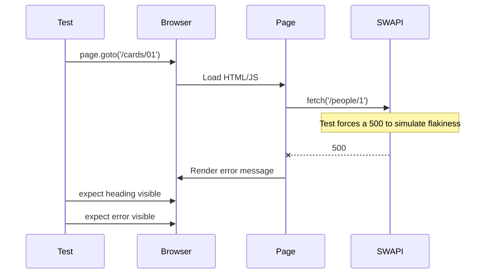

# Card 01: First Browser Test

## What This Pattern Solves

Before mocking APIs, you need the basics of browser automation: opening a page, waiting for elements, and asserting on them. This card shows those basics and demonstrates why the rest of the cookbook mocks. When the page depends on a live external API, you cannot control whether the call succeeds, so the test cannot be deterministic.

## How It Works

1. Playwright opens the browser and navigates to `/cards/01` (the person demo page).
2. The page fetches a person from SWAPI.
3. To show a flaky external dependency, this test forces that fetch to return a 500.
4. The page renders its error state, and the test asserts on the page structure and that error.

A real test against the live SWAPI would pass or fail depending on the API's mood that day. Cards 02 onward remove that uncertainty by mocking the response.

## Code Example

```typescript
test('shows an error when the external API fails', async ({ page }) => {
  await page.route('**/swapi.dev/api/people/**', (route) =>
    route.fulfill({ status: 500 }),
  );

  await page.goto('/cards/01');

  await expect(page.getByRole('heading', { name: 'Person' })).toBeVisible();
  await expect(page.getByTestId('error')).toBeVisible();
});
```

## Run This Example

```bash
pnpm test src/01-first-browser-test
```

## Prerequisites

None. Start here. This is your first Playwright test.

## Key Concepts

- **page.goto()**: Navigates to a URL. Relative URLs use the `baseURL` from config.
- **expect().toBeVisible()**: Waits for an element to appear, auto-waiting up to the timeout.
- **getByRole()**: Accessibility-friendly selector, Playwright's recommended default.
- **getByTestId()**: Selector for elements with a `data-testid` attribute.

## When to Use This Pattern

- Smoke tests against a real staging or production environment.
- Learning Playwright basics before moving on to mocking.
- Verifying page structure loads correctly.

Avoid an unmocked external API in CI: it is slow, it cannot test data variations, and you cannot control edge cases.

## Common Mistakes

- Using `waitForTimeout()` instead of `expect().toBeVisible()`. Prefer web-first assertions that auto-wait.
- Asserting on data content while the API is live, which produces flaky results when the data changes.
- Accepting either success or failure in one test. A test that passes on both branches verifies nothing.

## Flow Diagram



## Related Patterns

- **Next**: Card 02 (Mock Your First API) makes this test deterministic with mocking.
- **Contrast**: Card 05 (Proxy to Real API) when you want real data with patches.
