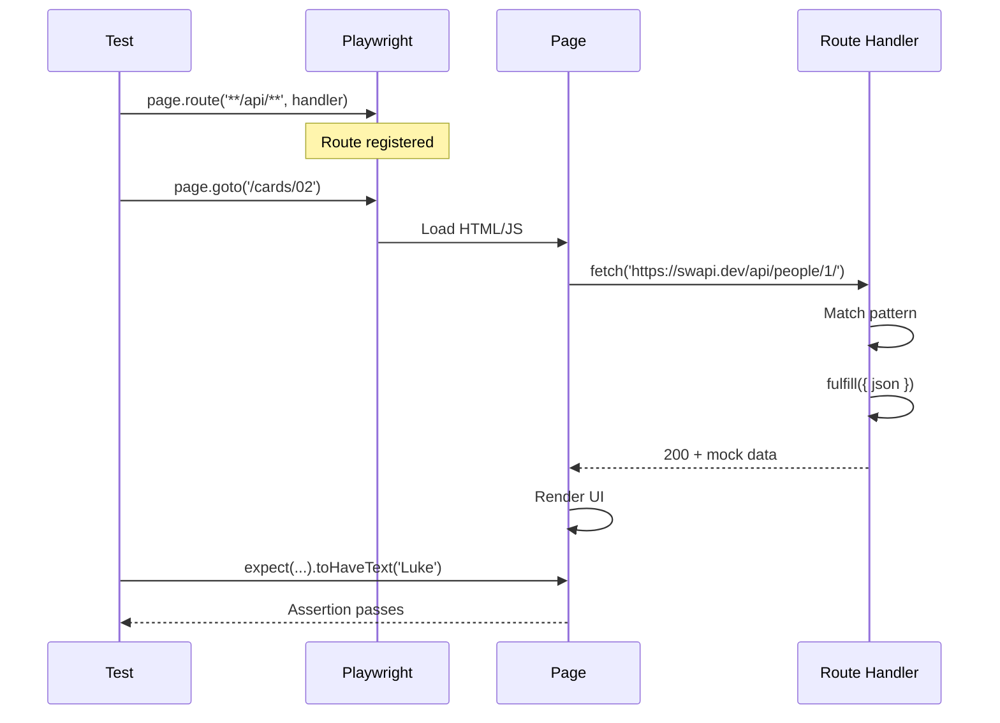

# Card 02: Mock Your First API

## What This Pattern Solves

A page that fetches from an external API (like SWAPI) gives you slow, flaky tests that fail when the API is down (see Card 01). Mocking the response makes the test fast and deterministic.

## How It Works

1. Register a route handler before navigating to the page.
2. Use `page.route()` to intercept requests matching a pattern.
3. Use `route.fulfill({ json })` to return mock data.
4. The page receives your mock response instead of hitting the real API.
5. Assert on the UI rendering your deterministic data.

Every later card builds on this.

## Code Example

```typescript
import type { SwapiPerson } from '../swapi/schema.js';

test('GET people/1 returns mocked person in UI', async ({ page }) => {
  const luke = {
    name: 'Luke Skywalker',
    height: '172',
  } satisfies Partial<SwapiPerson>;

  // Register the route before navigation.
  await page.route('**/swapi.dev/api/people/1/**', (route) =>
    route.fulfill({ json: luke }),
  );

  // Navigate. The fetch is intercepted.
  await page.goto('/cards/02');

  // Assert on deterministic data.
  await expect(page.getByTestId('person-name')).toHaveText('Luke Skywalker');
  await expect(page.getByTestId('person-height')).toHaveText('172');
});
```

`satisfies Partial<SwapiPerson>` type-checks the inline payload against the real schema without forcing you to fill every field.

## Run This Example

```bash
pnpm test src/02-mock-first-api
```

## Prerequisites

- **Card 01**: Basic browser navigation and assertions.
- Concepts: HTTP requests, JSON responses, API mocking.

## Key Concepts

- **page.route(pattern, handler)**: Registers a request interceptor. The pattern can be a glob (`**/*.jpg`) or a regex.
- **route.fulfill({ json })**: Returns a mock response without hitting the network. Passing `json` serializes the object and sets the `application/json` content type for you. You can also pass `status`, `body`, and `headers`.
- **Order matters**: Register routes before `page.goto()`, or the request you want to intercept fires first.
- **Pattern matching**: Use `**` for glob segments. `**/people/1/**` matches any URL containing that path.

## When to Use This Pattern

- Making tests fast and deterministic.
- Testing UI behavior with specific API responses.
- Avoiding external API dependencies in CI.
- Controlling test data exactly.

Reach for a staging environment when you need to test the real integration, and the Card 05 proxy pattern when the API contract is still unknown.

## Common Mistakes

1. **Registering the route after navigation**:
   ```typescript
   // Wrong: too late, request already sent.
   await page.goto('/cards/02');
   await page.route('**/api/**', handler);

   // Right: route registered first.
   await page.route('**/api/**', handler);
   await page.goto('/cards/02');
   ```

2. **Pattern doesn't match the actual request**:
   - Use the browser DevTools Network tab to see exact URLs.
   - `'**/people/1/**'` matches `https://swapi.dev/api/people/1/`.
   - Be specific enough to avoid matching unintended requests.

3. **Hand-building the JSON body**:
   ```typescript
   // Verbose: stringify and set the content type yourself.
   route.fulfill({
     status: 200,
     contentType: 'application/json',
     body: JSON.stringify(luke),
   });

   // Simpler: let fulfill do it.
   route.fulfill({ json: luke });
   ```

## Flow Diagram



## Related Patterns

- **Previous**: Card 01 (First Browser Test) shows why mocking is necessary.
- **Next**: Card 03 (Full Mock Payload) covers more complete mock structures.
- **Advanced**: Card 05 (Proxy to Real API) for real data with patches.
- **Compare**: Card 06 (Record & Replay) records mocks instead of writing them.
