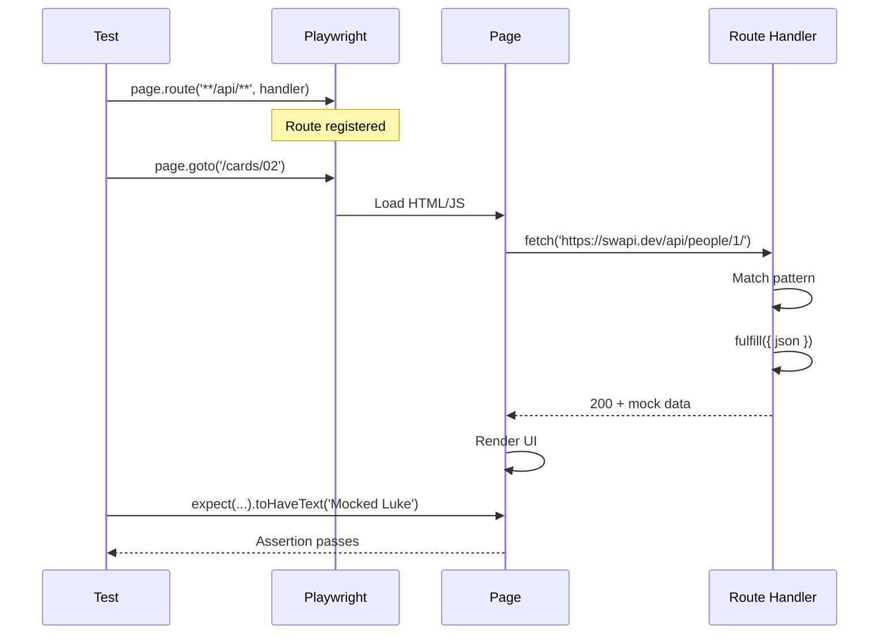

# Card 02: Mock Your First API

## What This Pattern Solves

A page that fetches from an external API (like SWAPI) gives you slow, flaky tests that fail when the API is down (see Card 01). Mocking the response makes the test fast and deterministic.

But speed and determinism are only half the story. A real backend can only give you the responses it happens to give; **interception gives you every response it could ever give, on demand**. Once you control the boundary you can test things that are impossible to trigger reliably against a real API: exact error messages for a 500 or 404, what the UI shows while a slow response is in flight, malformed payloads, and recovery after transient failures. Card 10 (Failure Injection) builds each of those on the one mechanism this card teaches.

## How It Works

1. Register a route handler before navigating to the page.
2. Use `page.route()` to intercept requests matching a pattern.
3. Use `route.fulfill({ json })` to return mock data.
4. The page receives your mock response instead of hitting the real API.
5. Assert on the UI rendering your deterministic data.

Every later card builds on this.

## Code Example

```typescript
import type { SwapiPerson } from '../swapi/schema.js';

test('GET people/1 returns mocked person in UI', async ({ page }) => {
  // Sentinel value the real API can never return: a green assertion proves
  // the mock served the response, not swapi.dev.
  const luke = {
    name: 'Mocked Luke',
    height: '172',
  } satisfies Partial<SwapiPerson>;

  // Register the route before navigation.
  await page.route('**/swapi.dev/api/people/1/**', (route) =>
    route.fulfill({ json: luke }),
  );

  // Navigate. The fetch is intercepted.
  await page.goto('/cards/02');

  // Assert on deterministic data.
  await expect(page.getByTestId('person-name')).toHaveText('Mocked Luke');
  await expect(page.getByTestId('person-height')).toHaveText('172');
});
```

`satisfies Partial<SwapiPerson>` type-checks the inline payload against the real schema without forcing you to fill every field.

## Run This Example

```bash
pnpm test src/02-mock-first-api
```

## Prerequisites

- **Card 01**: Basic browser navigation and assertions.
- Concepts: HTTP requests, JSON responses, API mocking.

## Key Concepts

- **page.route(pattern, handler)**: Registers a request interceptor. The pattern can be a glob (`**/*.jpg`) or a regex.
- **route.fulfill({ json })**: Returns a mock response without hitting the network. Passing `json` serializes the object and sets the `application/json` content type for you. You can also pass `status`, `body`, and `headers`.
- **Order matters**: Register routes before `page.goto()`, or the request you want to intercept fires first.
- **Pattern matching**: Use `**` for glob segments. `**/people/1/**` matches any URL containing that path.
- **Sentinel mock data**: Use values the real API can never return (`'Mocked Luke'`, not `'Luke Skywalker'`). If the mock data mirrors reality, a passing assertion can't tell you whether your mock served the response or the real API did.

## When to Use This Pattern

- Making tests fast and deterministic.
- Testing UI behavior with specific API responses.
- Avoiding external API dependencies in CI.
- Controlling test data exactly.

Reach for a staging environment when you need to test the real integration, and the Card 05 proxy pattern when the API contract is still unknown.

## Common Mistakes

1. **Registering the route after navigation**:
   ```typescript
   // Wrong: too late, request already sent.
   await page.goto('/cards/02');
   await page.route('**/api/**', handler);

   // Right: route registered first.
   await page.route('**/api/**', handler);
   await page.goto('/cards/02');
   ```

2. **Pattern doesn't match the actual request**:
   - Use the browser DevTools Network tab to see exact URLs.
   - `'**/people/1/**'` matches `https://swapi.dev/api/people/1/`.
   - Be specific enough to avoid matching unintended requests.

3. **Hand-building the JSON body**:
   ```typescript
   // Verbose: stringify and set the content type yourself.
   route.fulfill({
     status: 200,
     contentType: 'application/json',
     body: JSON.stringify(luke),
   });

   // Simpler: let fulfill do it.
   route.fulfill({ json: luke });
   ```

4. **Mock data that mirrors the real API**:
   ```typescript
   // Weak: swapi.dev really does return 'Luke Skywalker' for people/1.
   // If the route pattern breaks and the request leaks to the network,
   // this still passes — a false green.
   route.fulfill({ json: { name: 'Luke Skywalker' } });
   await expect(page.getByTestId('person-name')).toHaveText('Luke Skywalker');

   // Strong: only your mock can produce this value, and the assertion
   // makes it obvious to readers what was mocked.
   route.fulfill({ json: { name: 'Mocked Luke' } });
   await expect(page.getByTestId('person-name')).toHaveText('Mocked Luke');
   ```

## Flow Diagram


```mermaid
sequenceDiagram
    participant Test
    participant Playwright
    participant Page
    participant Route Handler

    Test->>Playwright: page.route('**/api/**', handler)
    Note over Playwright: Route registered
    Test->>Playwright: page.goto('/cards/02')
    Playwright->>Page: Load HTML/JS
    Page->>Route Handler: fetch('https://swapi.dev/api/people/1/')
    Route Handler->>Route Handler: Match pattern
    Route Handler->>Route Handler: fulfill({ json })
    Route Handler-->>Page: 200 + mock data
    Page->>Page: Render UI
    Test->>Page: expect(...).toHaveText('Mocked Luke')
    Page-->>Test: Assertion passes
```

## Related Patterns

- **Previous**: Card 01 (First Browser Test) shows why mocking is necessary.
- **Next**: Card 03 (Full Mock Payload) covers more complete mock structures.
- **Advanced**: Card 05 (Proxy to Real API) for real data with patches.
- **Compare**: Card 06 (Record & Replay) records mocks instead of writing them.
