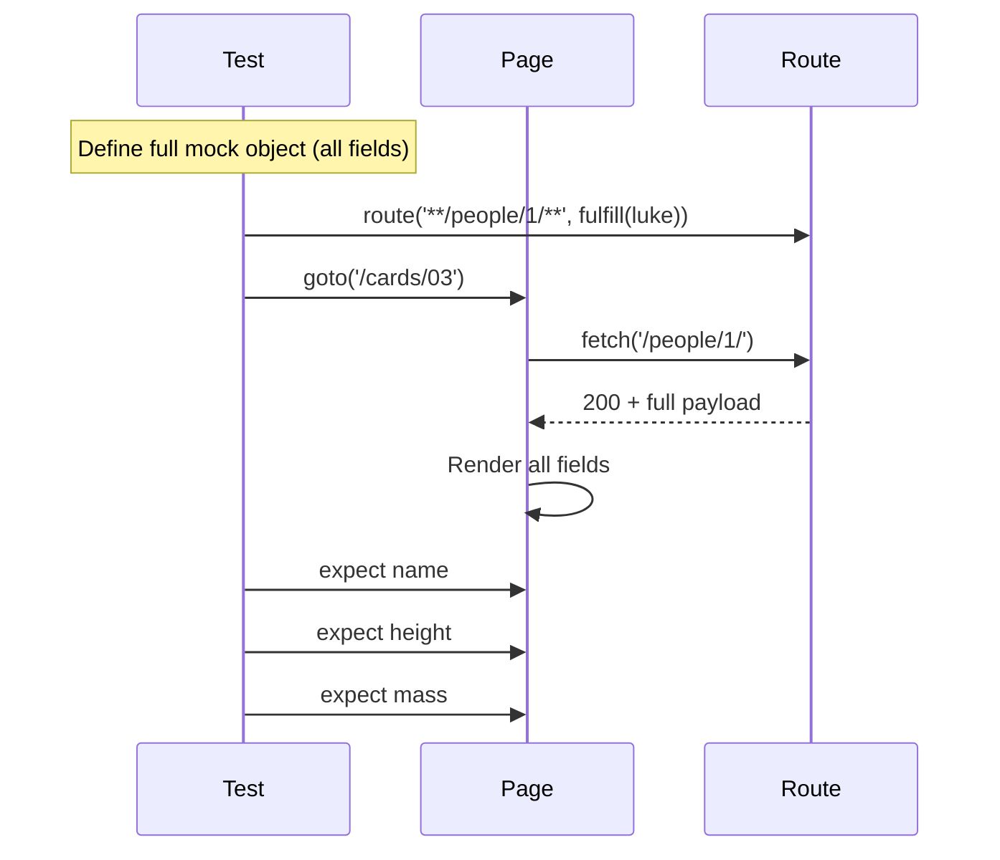

# Card 03: Full Mock Payload

## What This Pattern Solves

When your UI displays many fields from an API response, mock the complete data structure rather than a couple of fields. Minimal mocks work for simple cases, but real screens read more fields, and you want every one of them present so the test exercises the same shape the app sees in production.

## How It Works

1. Define a mock object that matches the API's structure.
2. Include every field the UI reads, even ones you do not assert on.
3. Pass that payload to `route.fulfill({ json })`.
4. Assert on multiple fields to verify the UI renders correctly.

Typing the object with `satisfies SwapiPerson` keeps the mock honest: drop a field or misspell one and TypeScript fails the build.

## Code Example

```typescript
import type { SwapiPerson } from '../swapi/schema.js';

const luke = {
  name: 'Luke Skywalker',
  height: '172',
  mass: '77',
  url: 'https://swapi.dev/api/people/1/',
  films: [
    'https://swapi.dev/api/films/1/',
    'https://swapi.dev/api/films/2/',
  ],
} satisfies SwapiPerson;

test('displays full person details', async ({ page }) => {
  await page.route('**/swapi.dev/api/people/1/**', (route) =>
    route.fulfill({ json: luke }),
  );

  await page.goto('/cards/03');

  await expect(page.getByTestId('person-name')).toHaveText('Luke Skywalker');
  await expect(page.getByTestId('person-height')).toHaveText('172');
  await expect(page.getByTestId('person-mass')).toHaveText('77');
});
```

## Run This Example

```bash
pnpm test src/03-full-mock-payload
```

## Prerequisites

- **Card 02**: Basic `page.route()` and `route.fulfill()`.
- Concepts: JSON data structures, API contracts.

## Key Concepts

- **Complete data structure**: Include every field the schema defines, not only what you assert on.
- **Contract testing**: Your mock represents the API contract. If the API changes, the mock changes too.
- **Inline fixtures**: Mock data lives in the test file, so the expected shape is visible at a glance.
- **Type-safe payloads**: `satisfies SwapiPerson` checks the object against the schema without widening its type.

## When to Use This Pattern

- When the UI displays three or more fields from a response.
- When you want to confirm the UI handles the full data structure.
- For contract tests that verify your app works with the API's shape.
- When you want tests to run offline and stay deterministic.

Switch to Card 06 (record fixtures) when the response has dozens of fields, Card 05 (proxy) when you want real data with small patches, and the minimal Card 02 mock when you only read one or two fields.

## Common Mistakes

1. **Incomplete payloads producing wrong output**:
   ```typescript
   // Missing fields the UI reads.
   const incomplete = { name: 'Luke' };
   // The UI reads height, gets undefined, and renders an empty or "undefined" cell.

   // Include every field.
   const complete = { name: 'Luke', height: '172', mass: '77', /* ... */ };
   ```
   A missing field rarely crashes the page. It renders blank or literal `undefined`, which is a silent bug that a full payload avoids.

2. **Not updating mocks when the API changes**:
   - If the API adds required fields, update your mocks.
   - Use Card 08 (Zod validation) to catch schema mismatches.

3. **Hardcoding IDs that don't match the test**:
   - Keep `url` consistent with the person you test. For person 1, the URL is `.../people/1/`.

## Flow Diagram



## Related Patterns

- **Previous**: Card 02 (Mock Your First API) covers minimal mock basics.
- **Next**: Card 04 (Mock Only What You Need) adds strict mode to catch unhandled requests.
- **Alternative**: Card 06 (Record Fixtures) captures real responses instead of hand-writing them.
- **Complementary**: Card 08 (Zod Validation) validates mock data against the schema.
- **Compare**: Card 07 (Patch Fixtures) for real data with specific overrides.
