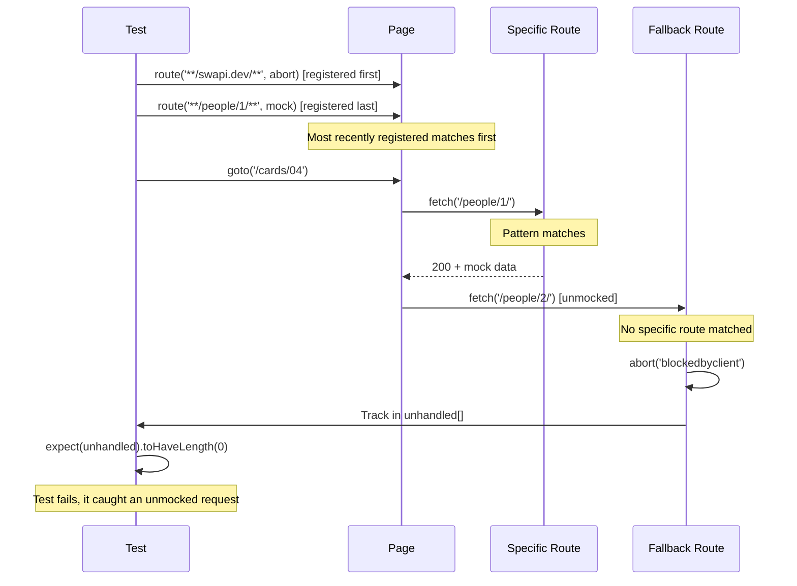

# Card 04: Mock Only What You Need

## What This Pattern Solves

When you mock APIs, an unmocked request can slip through to the real network. That causes flaky tests, unexpected external calls in CI, and failures that are hard to trace. You want only the endpoints you explicitly mock to be reachable. Everything else should fail fast.

## How It Works

1. Register a fallback route with a broad pattern (such as `**/swapi.dev/**`) that aborts.
2. Register specific routes for the endpoints you want to mock.
3. Playwright matches the most recently registered route first, so a specific route registered last wins over the fallback.
4. Any unhandled request hits the fallback and is aborted.
5. Track aborted URLs in an array and assert it stays empty.

This is strict mode for API mocking. Nothing gets through unless you allow it.

## Code Example

```typescript
import type { SwapiPerson } from '../swapi/schema.js';

test('strict mocking: only mocked endpoints allowed', async ({ page }) => {
  const luke = {
    name: 'Luke Skywalker',
    height: '172',
  } satisfies Partial<SwapiPerson>;

  const unhandled: string[] = [];

  // Fallback catches everything (registered first).
  await page.route('**/swapi.dev/**', (route) => {
    unhandled.push(route.request().url());
    route.abort('blockedbyclient');
  });

  // Specific mock (registered last, so it matches first).
  await page.route('**/swapi.dev/api/people/1/**', (route) =>
    route.fulfill({ json: luke }),
  );

  await page.goto('/cards/04');

  await expect(page.getByTestId('person-name')).toHaveText('Luke Skywalker');
  expect(unhandled).toHaveLength(0);
});
```

## Run This Example

```bash
pnpm test src/04-mock-only-what-you-need
```

## Prerequisites

- **Card 02**: Basic `page.route()` mocking.
- **Card 03**: Writing full mock payloads.
- Concepts: route order, request aborting, strict testing.

## Key Concepts

- **Route order**: The most recently registered route matches first. Register the fallback first, then specific mocks.
- **route.abort()**: Cancels a request with no network call. Common reasons: `'blockedbyclient'`, `'failed'`, `'accessdenied'`.
- **Fallback pattern**: A broad glob like `**/swapi.dev/**` or `**/*` catches unhandled requests.
- **Unhandled tracking**: An array that collects URLs hitting the fallback, useful for debugging.
- **Strict mode**: The test fails if any unmocked request is attempted.

## When to Use This Pattern

- As the default in CI, so tests never accidentally reach real APIs.
- When debugging why tests are slow, since it catches real network calls.
- When you want confidence that your mocks are complete.
- In suites with many endpoints to mock.

Skip the strictness while you are still exploring an API (use the Card 05 proxy first) or during rapid prototyping.

## Common Mistakes

1. **Wrong route order** (specific route registered first):
   ```typescript
   // Wrong: the specific route never runs, the fallback matches first.
   await page.route('**/people/1/**', mockHandler);
   await page.route('**/swapi.dev/**', abortHandler);

   // Right: fallback first, specific last.
   await page.route('**/swapi.dev/**', abortHandler);
   await page.route('**/people/1/**', mockHandler);
   ```

2. **Forgetting about other requests**:
   - Pages often load CSS, fonts, images, and analytics.
   - Mock them too, or scope the fallback to the API host like `**/swapi.dev/**`.

3. **Aborting with the wrong error type**:
   - Use `'blockedbyclient'` for intentional blocks.
   - `'failed'` can surface a different network error in the page.

4. **Not checking the unhandled array**:
   ```typescript
   // Wrong: collected but never asserted, so the test passes anyway.
   const unhandled: string[] = [];
   await page.route('**/*', (route) => unhandled.push(route.request().url()));

   // Right: assert it.
   expect(unhandled).toHaveLength(0);
   ```

## Flow Diagram



## Related Patterns

- **Previous**: Card 03 (Full Mock Payload) covers writing complete mocks.
- **Next**: Card 05 (Proxy to Real API) takes the opposite approach, allowing real requests and patching results.
- **Advanced**: Card 16 (Debug Unhandled Requests) for the workflow when the fallback catches requests.
- **Complementary**: Card 15 (Done Signals) for waiting on network idle.
- **Compare**: Card 02 (Basic Mocking) has no strictness, so requests can leak to the network.
