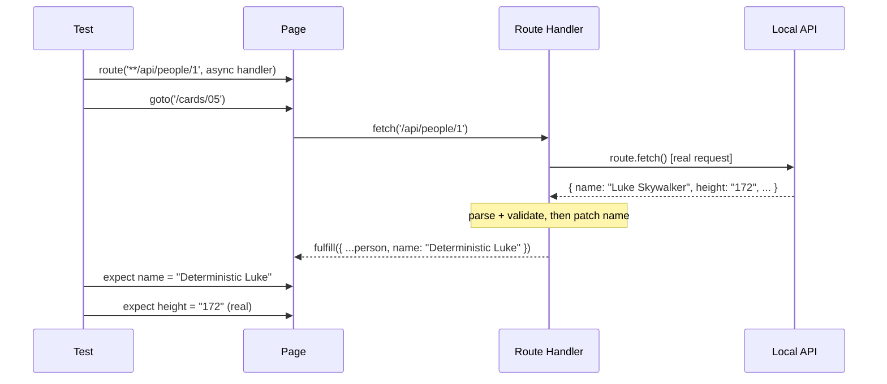

# Card 05: Proxy to Real API (Hybrid Mocking)

## What This Pattern Solves

You want real data from an API to test against its actual structure, but you also need a deterministic value to assert on. A full mock (Card 03) gives control but freezes the shape; a live call gives the shape but no stable value. Proxying does both: fetch the real response, then patch the one or two fields the test pins on.

## How It Works

1. The route handler intercepts the request.
2. `route.fetch()` performs the real request and returns the Response.
3. Parse the JSON. Validate it with a schema (Card 08) so the patched object is typed.
4. Override the fields you need to control, such as `name`.
5. Fulfill with the patched object. Untouched fields keep their real values.

This example proxies a local `/api/people/1` endpoint rather than swapi.dev, so it runs offline and stays deterministic while still exercising the real `route.fetch()` path.

### Proxying a real remote API

Point the route glob at the upstream host and the mechanism is identical:

```typescript
await page.route('**/swapi.dev/api/people/1/**', async (route) => {
  const response = await route.fetch();
  const person = SwapiPersonSchema.parse(await response.json());
  await route.fulfill({ json: { ...person, name: 'Deterministic Luke' } });
});
```

A real upstream adds network latency and flake, so the test inherits the API's uptime. For CI, record the response once (Card 06) and replay it offline.

## Code Example

```typescript
import { SwapiPersonSchema } from '../swapi/schema.js';

await page.route('**/api/people/1', async (route) => {
  const response = await route.fetch();           // real request
  const person = SwapiPersonSchema.parse(await response.json()); // typed, validated

  await route.fulfill({ json: { ...person, name: 'Deterministic Luke' } });
});

await page.goto('/cards/05');

await expect(page.getByTestId('person-name')).toHaveText('Deterministic Luke');
await expect(page.getByTestId('person-height')).toHaveText('172'); // real value
```

`route.fulfill({ json })` serializes the object and sets `application/json` for you, so there is no manual `JSON.stringify`.

## Run This Example

```bash
pnpm test src/05-proxy-to-real-api
```

## Prerequisites

- **Card 02**: Basic `page.route()` and `route.fulfill()`.
- **Card 03**: When to use full versus minimal mocks.
- **Card 08**: Validating an untrusted response with Zod.

## Key Concepts

- **route.fetch()**: Runs the real request and returns a Response. The handler must be `async`.
- **Validate at the boundary**: The proxied JSON is untrusted. `SwapiPersonSchema.parse()` narrows it to a typed `SwapiPerson` and fails loudly if the contract drifts.
- **Selective patching**: Override only the fields the assertion depends on. Leave the rest real.
- **Response methods**: `response.status()`, `response.json()`, `response.headers()`.

## When to Use This Pattern

- ✓ Exploring an unfamiliar API while still asserting on a fixed value.
- ✓ You want the real response shape but one or two predictable fields.
- ✓ Integration tests against a staging API with controlled test data.
- ✗ In CI without network access to the upstream API (use Card 06 fixtures).
- ✗ When the API is slow or rate-limited (tests inherit that latency).
- ✗ When you need fully offline tests with no real call (use Card 03 or 06).

## Common Mistakes

1. **Synchronous handler**: `route.fetch()` returns a Promise. The handler must be `async` and you must `await` both the fetch and `response.json()`.
2. **Skipping validation**: A raw `await response.json()` is typed `any`. Parse it with a schema so a changed contract fails at the boundary instead of at a confusing assertion later.
3. **Over-patching**: If you override most fields, drop the proxy and use a full mock (Card 03).

## Flow Diagram



## Related Patterns

- **Previous**: Card 04 (Mock Only What You Need), strict mocking with no network.
- **Next**: Card 06 (Record & Replay Fixtures), proxy once then replay offline.
- **Complementary**: Card 07 (Patch Fixtures), the same patching on recorded data.
- **Compare**: Card 03 (Full Mock), no network and full control.
