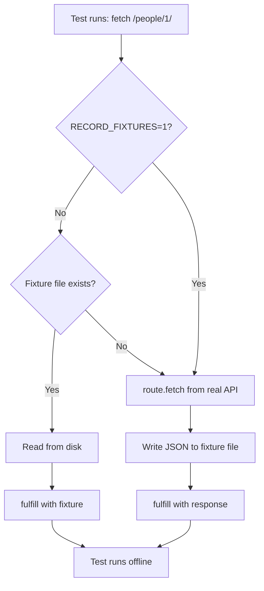

# Card 06: Record and Replay Fixtures

## What This Pattern Solves

Writing full mock payloads by hand (Card 03) is tedious and error-prone. Proxying to a real API (Card 05) needs network access on every run. Recording gives you both: capture real API responses once, save them to files, then replay from disk on later runs with no network and no hand-written mocks.

## How It Works

1. **Replay mode** (default): if the fixture file exists, read it from disk and fulfill with its contents.
2. **Record mode** (`RECORD_FIXTURES=1`): call the real API via `route.fetch()`, save the response to a fixture file, then fulfill with it.
3. If a fixture is missing, the handler falls through to a live `route.fetch()` and writes the result, so a first run with no fixtures behaves like recording.
4. After the fixtures exist, replay runs offline. Re-run record mode when the API contract changes.

This is the same approach as VCR (Ruby), Polly.js, and MSW.

## Code Example

```typescript
import path from 'node:path';
import fs from 'node:fs';

const FIXTURES_DIR = path.join(process.cwd(), 'test', 'fixtures');
const RECORD_MODE = process.env.RECORD_FIXTURES === '1';

test('GET people/1 uses recorded fixture', async ({ page }) => {
  await page.route('**/swapi.dev/api/people/**', async (route) => {
    const id = route.request().url().match(/\/people\/(\d+)/)?.[1] ?? '1';
    const file = path.join(FIXTURES_DIR, `swapi.people.${id}.json`);

    // Replay: use the fixture if it exists.
    if (!RECORD_MODE && fs.existsSync(file)) {
      const json = JSON.parse(fs.readFileSync(file, 'utf8'));
      return route.fulfill({ json });
    }

    // Record (or a missing fixture): fetch the real API, save, replay.
    const response = await route.fetch();
    const body = await response.text();
    fs.mkdirSync(FIXTURES_DIR, { recursive: true });
    fs.writeFileSync(file, body, 'utf8');
    await route.fulfill({ status: response.status(), headers: response.headers(), body });
  });

  await page.goto('/cards/06');
  await expect(page.getByTestId('person-name')).toBeVisible();
});
```

`FIXTURES_DIR` uses `process.cwd()` so the path resolves from the project root no matter where the test runs.

## Run This Example

```bash
# First time: record fixtures from the real API.
RECORD_FIXTURES=1 pnpm test src/06-record-and-replay-fixtures
# Or use the script.
pnpm test:record

# Later runs: replay from fixtures, no network.
pnpm test src/06-record-and-replay-fixtures
```

## Prerequisites

- **Card 05**: Using `route.fetch()` to proxy.
- **Card 03**: Why deterministic data matters.
- Concepts: file I/O, environment variables, fixture management.

## Key Concepts

- **Fixture files**: JSON files in `test/fixtures/` holding captured responses.
- **Record mode**: `RECORD_FIXTURES=1` forces a live fetch and overwrites fixtures.
- **Replay mode**: the default, reads from disk.
- **Live fallback**: a missing fixture triggers a live fetch and a write, so the cache fills itself on first run.
- **One-time setup**: record once, commit to git, the team shares the fixtures.

## When to Use This Pattern

- As the default for most teams, balancing convenience and control.
- When API responses are large or complex.
- For air-gapped CI environments, once fixtures are committed.
- When several tests need the same response.

Skip it when responses are tiny (Card 03 is simpler) or when you need to patch many fields (Card 07).

## Common Mistakes

1. **Forgetting to commit fixtures to git**:
   ```bash
   # Wrong: fixtures excluded from version control.
   echo "test/fixtures/" >> .gitignore

   # Right: fixtures are part of the test suite.
   git add test/fixtures/*.json
   git commit -m "Add API fixtures"
   ```

2. **Relying on the live fallback in CI**: a missing fixture falls through to a real network call. In an air-gapped CI that fetch fails. Commit the fixtures so replay never needs the network.

3. **Stale fixtures** (API changed, fixtures did not):
   - Re-run record mode periodically and review the diff.
   - Validate fixtures against a schema with Card 08 (Zod).

4. **Recording implicitly in CI**:
   ```typescript
   // Wrong: CI silently records when a fixture is absent.
   const RECORD_MODE = !fs.existsSync(file);

   // Right: explicit env var control.
   const RECORD_MODE = process.env.RECORD_FIXTURES === '1';
   ```

## Flow Diagram



The missing-fixture branch fetches live and records rather than erroring, which is how the first run populates the cache.

## Related Patterns

- **Previous**: Card 05 (Proxy to Real API) for live proxying without saving.
- **Next**: Card 07 (Patch Fixtures) loads a fixture and overrides specific fields.
- **Complementary**: Card 08 (Zod Validation) checks fixtures against the schema.
- **Alternative**: Card 09 (Faker Builders) generates synthetic data instead of recording.
- **Workflow**: Card 05 (explore), Card 06 (record), Card 07 (patch for edge cases).
