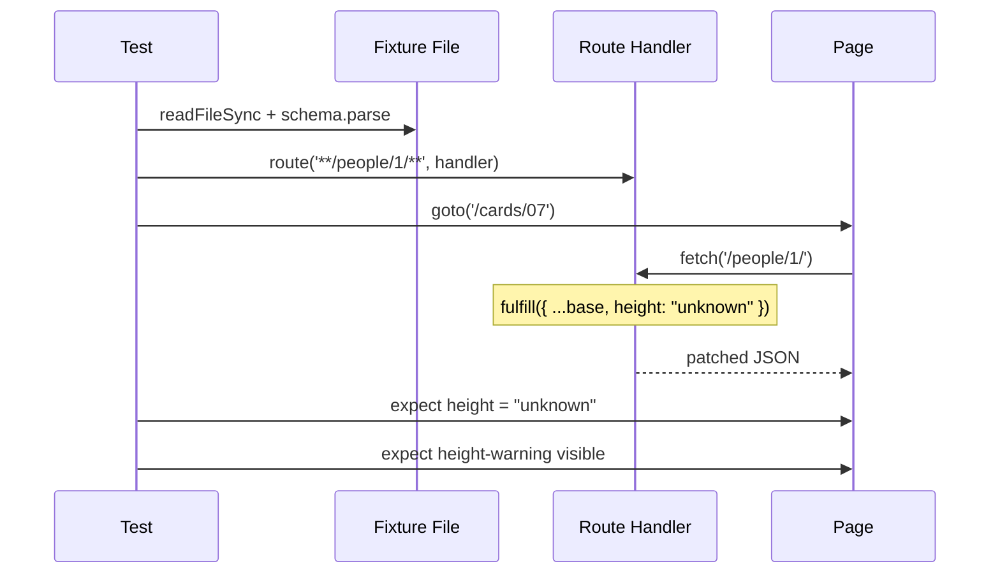

# Card 07: Patch Fixtures for Edge Cases

## What This Pattern Solves

You recorded a fixture (Card 06) and most tests pass against it. Now you need an edge case: height is `"unknown"`, or `films` is empty. Writing a separate fixture file per variation is wasteful. Load one base fixture, then patch the field the test cares about.

## How It Works

1. Read the base fixture from disk.
2. Parse it, and validate it with the schema so a stale fixture fails on load (Card 08).
3. Spread the base and override one or two fields.
4. Fulfill with the patched object.
5. Assert on the edge-case behavior. Card 07's page renders a `height-warning` when height is not numeric.

A spread copies the top level only. A patched field stays a sibling of the originals, so the rest of the response stays real.

## Code Example

```typescript
import { SwapiPersonSchema, type SwapiPerson } from '../swapi/schema.js';

const base: SwapiPerson = SwapiPersonSchema.parse(
  JSON.parse(fs.readFileSync(FIXTURE_FILE, 'utf8')),
);

await page.route('**/swapi.dev/api/people/1/**', (route) =>
  route.fulfill({ json: { ...base, height: 'unknown' } }),
);

await page.goto('/cards/07');

await expect(page.getByTestId('person-height')).toHaveText('unknown');
await expect(page.getByTestId('height-warning')).toBeVisible();
```

Typing `base` as `SwapiPerson` means a typo in the patched key is a compile error, and `route.fulfill({ json })` handles serialization.

## Run This Example

```bash
pnpm test src/07-patch-fixtures
```

## Prerequisites

- **Card 06**: Recording and replaying fixtures.
- **Card 03**: Full mock payloads.
- **Card 08**: Validating a fixture against a schema.

## Key Concepts

- **Base fixture**: The recorded happy-path response.
- **Shallow spread**: `{ ...base, field: value }` copies the top level and overrides one key. Nested objects need their own spread.
- **One source of truth**: Maintain one fixture and patch per scenario instead of duplicating files.
- **Validated on load**: Parsing the fixture with `SwapiPersonSchema` catches drift between the fixture and the real contract.

## When to Use This Pattern

- ✓ Edge cases such as empty arrays, missing values, or extreme numbers.
- ✓ One base fixture plus several variations (cheaper than several files).
- ✓ Driving UI fallback states without recording error responses.
- ✗ When every test needs different data (use Card 09 builders).
- ✗ When the base is tiny (write the mock inline per test).

## Common Mistakes

1. **Deep patching with a shallow spread**: `{ ...base, metadata: { source: 'test' } }` replaces the whole `metadata` object. Spread the nested object too: `metadata: { ...base.metadata, source: 'test' }`.
2. **Patching most of the response**: Overriding five or more fields means you are rebuilding the object. Record a new fixture or use a Card 09 builder.
3. **Skipping validation**: Parsing the fixture against the schema turns a stale fixture into a clear load-time error instead of a confusing assertion failure.

## Flow Diagram



## Related Patterns

- **Previous**: Card 06 (Record Fixtures), creates the base you patch.
- **Next**: Card 08 (Zod Validation), validate patched fixtures against the schema.
- **Complementary**: Card 05 (Proxy to Real API), the same patching on a live response.
- **Alternative**: Card 09 (Faker Builders), generate variations instead of patching.
