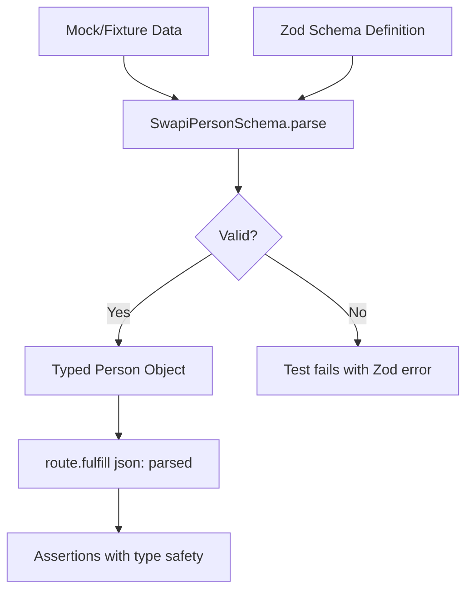

# Card 08: Validate with Zod Schemas

## What This Pattern Solves

TypeScript types help at compile time but do nothing at runtime. When API contracts change, fixtures drift, or mocks contain typos, you want runtime validation that fails the test immediately with a clear message. Zod gives you schemas that both validate data and produce the types you assert against.

## How It Works

1. Define a Zod schema describing the expected response shape.
2. Derive the TypeScript type from the schema with `z.infer<>`.
3. Parse the mock or fixture data with `schema.parse()`.
4. If the data does not match, Zod throws with a detailed error.
5. A successful parse returns fully typed data, and fulfilling the route with that parsed value keeps invalid data from ever reaching the page.

This catches contract drift before any assertion runs.

## Code Example

```typescript
import { SwapiPersonSchema } from '../swapi/schema.js';
import type { SwapiPerson } from '../swapi/schema.js';

// Schema lives in src/swapi/schema.ts and is shared across cards.
const knownGoodPerson: SwapiPerson = {
  name: 'Luke Skywalker',
  height: '172',
  mass: '77',
  url: 'https://swapi.dev/api/people/1/',
  films: [],
};

test('schema gates the boundary; only parsed data reaches the page', async ({ page }) => {
  // Parse before fulfill. The route serves the validated value, not the raw object.
  await page.route('**/swapi.dev/api/people/1/**', (route) =>
    route.fulfill({ json: SwapiPersonSchema.parse(knownGoodPerson) }),
  );

  await page.goto('/cards/08');

  await expect(page.getByTestId('person-name')).toHaveText('Luke Skywalker');
});
```

If you want to handle the failure path yourself instead of letting `parse()` throw, use `safeParse()`:

```typescript
const result = SwapiPersonSchema.safeParse(knownGoodPerson);
if (!result.success) {
  throw new Error(`Mock data failed schema: ${result.error}`);
}
await page.route('**/swapi.dev/api/people/1/**', (route) =>
  route.fulfill({ json: result.data }),
);
```

## Run This Example

```bash
pnpm test src/08-validate-with-zod
```

## Prerequisites

- **Card 03**: Understanding full mock payloads
- **Card 06**: Understanding fixtures
- Concepts: Runtime validation, schema definition, type inference

## Key Concepts

- **Zod schema**: Runtime validator (`z.object()`, `z.string()`, `z.array()`, etc.)
- **Type inference**: `z.infer<typeof Schema>` generates the TypeScript type
- **Parse vs safeParse**: `parse()` throws on error, `safeParse()` returns a success/error object
- **Schema composition**: Reuse one schema across tests
- **Contract validation**: Ensures mocks and fixtures match the expected API shape

## When to Use This Pattern

- Catching contract changes early across a suite
- Validating recorded fixtures (Card 06) have not drifted from the API
- Ensuring hand-written mocks (Card 03) are complete
- Generating TypeScript types from an API contract
- Skip it when the contract changes rapidly and the maintenance outweighs the benefit
- Skip it for tiny mocks with two or three fields

## Common Mistakes

1. **Letting parse throw without context**:
   ```typescript
   // Crashes with a raw Zod error
   const person = SwapiPersonSchema.parse(maybeInvalidData);

   // Use safeParse for a message you control
   const result = SwapiPersonSchema.safeParse(maybeInvalidData);
   if (!result.success) {
     throw new Error(`Mock data invalid: ${result.error}`);
   }
   ```

2. **Validating after the page loaded**:
   ```typescript
   // Too late: the page already fetched the raw mock
   await page.goto('/cards/08');
   const person = SwapiPersonSchema.parse(mockData);

   // Parse first, then fulfill with the parsed value
   await page.route('**/swapi.dev/api/people/1/**', (route) =>
     route.fulfill({ json: SwapiPersonSchema.parse(mockData) }),
   );
   await page.goto('/cards/08');
   ```

3. **Schema too strict** (brittle tests):
   - Validate only the fields you use.
   - Use `.passthrough()` to allow extra fields.
   - Use `.partial()` for optional fields.

4. **Redefining the schema per test**:
   ```typescript
   // Avoid: a fresh schema in every test
   test('...', () => {
     const schema = z.object({ name: z.string() });
   });

   // Import the shared schema from src/swapi/schema.ts
   import { SwapiPersonSchema } from '../swapi/schema.js';
   ```

## Flow Diagram



## Related Patterns

- **Previous**: Card 07 (Patch Fixtures), validate patched data against the schema
- **Next**: Card 09 (Faker Builders), combine schemas with generated data
- **Complementary**: Card 06 (Record Fixtures), validate recorded responses
- **Complementary**: Card 03 (Full Mock), confirm hand-written mocks are valid
- **Compare**: TypeScript types, compile-time only with no runtime check
