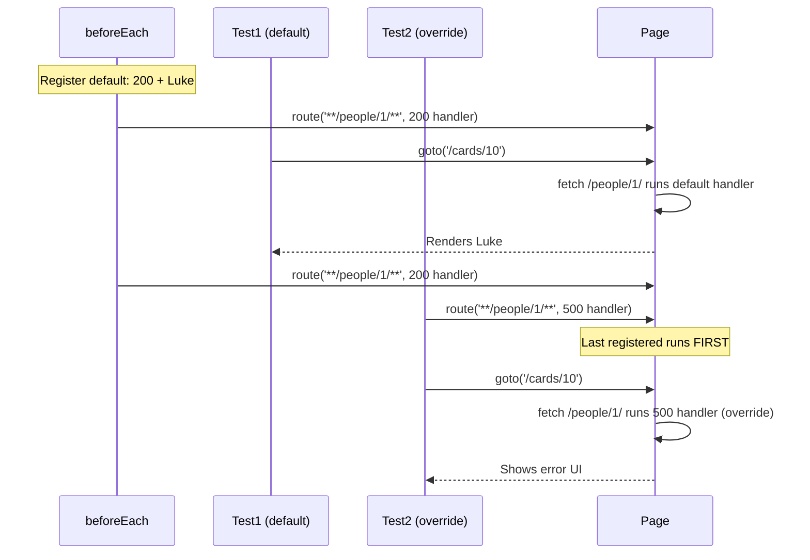

# Card 10: Per-Test Overrides (Error Scenarios)

## What This Pattern Solves

Most tests need the same happy path mock: a 200 with valid data. You also need to cover error responses such as 500s and 404s. Duplicating the happy-path setup in every test is wasteful. Set up a default handler once, then override it in the tests that need different behavior.

## How It Works

1. Register a default route handler in `beforeEach` (200 plus happy-path data).
2. Most tests navigate and get the default mock automatically.
3. Error tests register a second handler with the same URL pattern before navigating.
4. Playwright runs the last registered handler first, so the override wins.
5. The test asserts on the error UI.
6. Each test gets a fresh page and context, so overrides do not leak.

This keeps scenario testing DRY: one default, many overrides.

## Code Example

```typescript
import type { SwapiPerson } from '../swapi/schema.js';

const luke: SwapiPerson = {
  name: 'Luke Skywalker',
  height: '172',
  mass: '77',
  url: 'https://swapi.dev/api/people/1/',
  films: [],
};

test.describe('person page with error scenarios', () => {
  // Default: happy path for all tests.
  test.beforeEach(async ({ page }) => {
    await page.route('**/swapi.dev/api/people/1/**', (route) =>
      route.fulfill({ json: luke }),
    );
  });

  test('shows person with default mock', async ({ page }) => {
    await page.goto('/cards/10');
    await expect(page.getByTestId('person-name')).toHaveText('Luke Skywalker');
  });

  test('shows error UI when API returns 500', async ({ page }) => {
    // Override: register before goto.
    await page.route('**/swapi.dev/api/people/1/**', (route) =>
      route.fulfill({ status: 500, body: '' }),
    );

    await page.goto('/cards/10');

    await expect(page.getByTestId('error')).toBeVisible();
    await expect(page.getByTestId('error')).toContainText('500');
  });

  test('shows error UI when API returns 404', async ({ page }) => {
    await page.route('**/swapi.dev/api/people/1/**', (route) =>
      route.fulfill({ status: 404, body: 'Not Found' }),
    );

    await page.goto('/cards/10');

    await expect(page.getByTestId('error')).toBeVisible();
    await expect(page.getByTestId('error')).toContainText('404');
  });
});
```

## Run This Example

```bash
pnpm test src/10-per-test-overrides
```

## Prerequisites

- **Card 02**: Understanding `page.route()` and route order
- **Card 04**: Knowing route order (last registered runs first)
- Concepts: DRY principle, error-handling tests, route precedence

## Key Concepts

- **Default handler**: Common happy-path setup in `beforeEach`
- **Override pattern**: A second handler in specific tests runs first
- **Route precedence**: The last registered route handler runs first
- **Scenario testing**: Cover success and error responses
- **Fresh context**: Each test gets an isolated page, so there is no cross-test pollution

## When to Use This Pattern

- Testing error handling (4xx and 5xx responses)
- When several tests share one default plus a few error cases
- Skip it when every test needs a different mock and no default makes sense
- Skip it for single-test files where the setup is not reused

## Common Mistakes

1. **Overriding after navigation** (too late):
   ```typescript
   // The page already loaded with the default mock
   await page.goto('/cards/10');
   await page.route('**/swapi.dev/api/people/1/**', errorHandler);

   // Override before navigation
   await page.route('**/swapi.dev/api/people/1/**', errorHandler);
   await page.goto('/cards/10');
   ```

2. **Misreading route order**:
   ```typescript
   // Routes run in reverse order of registration
   await page.route('**/swapi.dev/api/people/1/**', defaultHandler);  // Runs SECOND
   await page.route('**/swapi.dev/api/people/1/**', errorHandler);    // Runs FIRST (overrides)
   ```

3. **A narrower override that the default still matches**:
   - If the override pattern is narrower, the default can still run.
   - Make the override pattern match or be broader than the default.

4. **Sharing mutable state across tests**:
   ```typescript
   // Shared context lets routes leak between tests
   const context = await browser.newContext();

   // Each test gets a fresh page from the fixture
   test('...', async ({ page }) => {
     // page is fresh per test
   });
   ```

## Flow Diagram



## Related Patterns

- **Previous**: Card 09 (Faker Builders), combine with builders for varied mock data
- **Next**: Card 11 (Login Flow), apply the override pattern to auth scenarios
- **Foundation**: Card 02 (Basic Mocking), understanding route handlers
- **Foundation**: Card 04 (Mock Only What You Need), understanding route order
- **Complementary**: Card 07 (Patch Fixtures), similar override pattern for fixture data
