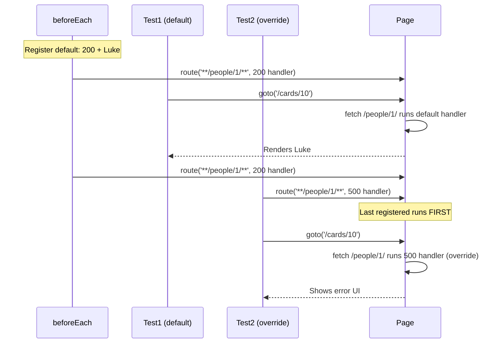

# Card 10: Per-Test Overrides (Failure Injection)

## What This Pattern Solves

A real backend only ever gives you the responses it happens to give. You can't ask staging for a 500 on demand, make it respond slowly for exactly one test, or have it fail twice and recover on the third call. Interception removes that limit: **every response the backend could ever produce is now available, deterministically, per test**. That's the real payoff of the mocking you learned in Cards 02–04 — not just speed, but reach. Error states, error *messages*, loading states, timeouts, and recovery flows all become testable.

The mechanics this card adds: most tests need the same happy-path mock (a 200 with valid data), while a handful need a failure. Duplicating the happy-path setup in every test is wasteful. Set up a default handler once, then override it in the tests that inject failures.

## How It Works

1. Register a default route handler in `beforeEach` (200 plus happy-path data).
2. Most tests navigate and get the default mock automatically.
3. Error tests register a second handler with the same URL pattern before navigating.
4. Playwright runs the last registered handler first, so the override wins.
5. The test asserts on the error UI.
6. Each test gets a fresh page and context, so overrides do not leak.

This keeps scenario testing DRY: one default, many overrides.

## Code Example

```typescript
import type { SwapiPerson } from '../swapi/schema.js';

const luke: SwapiPerson = {
  name: 'Mocked Luke',
  height: '172',
  mass: '77',
  url: 'https://swapi.dev/api/people/1/',
  films: [],
};

test.describe('person page with error scenarios', () => {
  // Default: happy path for all tests.
  test.beforeEach(async ({ page }) => {
    await page.route('**/swapi.dev/api/people/1/**', (route) =>
      route.fulfill({ json: luke }),
    );
  });

  test('shows person with default mock', async ({ page }) => {
    await page.goto('/cards/10');
    await expect(page.getByTestId('person-name')).toHaveText('Mocked Luke');
  });

  test('shows error UI when API returns 500', async ({ page }) => {
    // Override: register before goto.
    await page.route('**/swapi.dev/api/people/1/**', (route) =>
      route.fulfill({ status: 500, body: '' }),
    );

    await page.goto('/cards/10');

    await expect(page.getByTestId('error')).toBeVisible();
    await expect(page.getByTestId('error')).toContainText('500');
  });

  test('shows error UI when API returns 404', async ({ page }) => {
    await page.route('**/swapi.dev/api/people/1/**', (route) =>
      route.fulfill({ status: 404, body: 'Not Found' }),
    );

    await page.goto('/cards/10');

    await expect(page.getByTestId('error')).toBeVisible();
    await expect(page.getByTestId('error')).toContainText('404');
  });
});
```

## Beyond Status Codes

Status-code overrides are the start. Two failure modes only interception can reproduce reliably:

**Slow responses.** `route.abort('timedout')` fails *instantly* with a timeout label — no time actually passes. To test what the user sees while waiting, delay the fulfill:

```typescript
test('slow response: loading state shows while waiting, then data', async ({ page }) => {
  await page.route('**/swapi.dev/api/people/1/**', async (route) => {
    await new Promise((resolve) => setTimeout(resolve, 1_500));
    await route.fulfill({ json: luke });
  });

  await page.goto('/cards/10');

  await expect(page.getByTestId('loading')).toBeVisible();
  await expect(page.getByTestId('person-name')).toHaveText('Mocked Luke');
  await expect(page.getByTestId('loading')).toBeHidden();
});
```

**Transient failures.** The hardest backend behaviour to trigger for real: fail twice, succeed on the third call. With a call counter the sequence is exact — and `route.fallback()` hands the third request to the happy-path default from `beforeEach`:

```typescript
test('resilience: fails twice, retry succeeds on the third call', async ({ page }) => {
  let calls = 0;

  await page.route('**/swapi.dev/api/people/1/**', async (route) => {
    calls++;
    if (calls < 3) {
      await route.fulfill({ status: 500, body: '' });
    } else {
      await route.fallback(); // beforeEach default serves the person
    }
  });

  await page.goto('/cards/10');
  await expect(page.getByTestId('error')).toBeVisible();

  await page.getByTestId('retry').click();
  await expect(page.getByTestId('error')).toBeVisible();

  await page.getByTestId('retry').click();
  await expect(page.getByTestId('person-name')).toHaveText('Mocked Luke');
  expect(calls).toBe(3);
});
```

## Run This Example

```bash
pnpm test src/10-per-test-overrides
```

## Prerequisites

- **Card 02**: Understanding `page.route()` and route order
- **Card 04**: Knowing route order (last registered runs first)
- Concepts: DRY principle, error-handling tests, route precedence

## Key Concepts

- **Default handler**: Common happy-path setup in `beforeEach`
- **Override pattern**: A second handler in specific tests runs first
- **Route precedence**: The last registered route handler runs first
- **Failure injection**: Statuses, malformed bodies, delays, and call-sequenced failures — responses a real backend can't produce on demand
- **Delayed fulfill vs abort**: `abort('timedout')` is an instant failure; awaiting a delay before `fulfill` is how you test loading states and real slowness
- **Stateful handlers**: A counter in the closure scripts a per-call sequence (fail, fail, succeed); `route.fallback()` delegates to the next handler
- **Fresh context**: Each test gets an isolated page, so there is no cross-test pollution

## When to Use This Pattern

- Testing error handling (4xx and 5xx responses) and the exact error messages users see
- Testing loading states, spinners, and slow-network behaviour
- Testing retry and recovery flows (transient failures)
- When several tests share one default plus a few error cases
- Skip it when every test needs a different mock and no default makes sense
- Skip it for single-test files where the setup is not reused

## Common Mistakes

1. **Overriding after navigation** (too late):
   ```typescript
   // The page already loaded with the default mock
   await page.goto('/cards/10');
   await page.route('**/swapi.dev/api/people/1/**', errorHandler);

   // Override before navigation
   await page.route('**/swapi.dev/api/people/1/**', errorHandler);
   await page.goto('/cards/10');
   ```

2. **Misreading route order**:
   ```typescript
   // Routes run in reverse order of registration
   await page.route('**/swapi.dev/api/people/1/**', defaultHandler);  // Runs SECOND
   await page.route('**/swapi.dev/api/people/1/**', errorHandler);    // Runs FIRST (overrides)
   ```

3. **A narrower override that the default still matches**:
   - If the override pattern is narrower, the default can still run.
   - Make the override pattern match or be broader than the default.

4. **Sharing mutable state across tests**:
   ```typescript
   // Shared context lets routes leak between tests
   const context = await browser.newContext();

   // Each test gets a fresh page from the fixture
   test('...', async ({ page }) => {
     // page is fresh per test
   });
   ```

## Flow Diagram


```mermaid
sequenceDiagram
    participant beforeEach
    participant Test1 (default)
    participant Test2 (override)
    participant Page

    Note over beforeEach: Register default: 200 + Luke

    beforeEach->>Page: route('**/people/1/**', 200 handler)

    Test1 (default)->>Page: goto('/cards/10')
    Page->>Page: fetch /people/1/ runs default handler
    Page-->>Test1 (default): Renders Luke

    beforeEach->>Page: route('**/people/1/**', 200 handler)
    Test2 (override)->>Page: route('**/people/1/**', 500 handler)
    Note over Page: Last registered runs FIRST
    Test2 (override)->>Page: goto('/cards/10')
    Page->>Page: fetch /people/1/ runs 500 handler (override)
    Page-->>Test2 (override): Shows error UI
```

## Related Patterns

- **Previous**: Card 09 (Faker Builders), combine with builders for varied mock data
- **Next**: Card 11 (Login Flow), apply the override pattern to auth scenarios
- **Foundation**: Card 02 (Basic Mocking), understanding route handlers
- **Foundation**: Card 04 (Mock Only What You Need), understanding route order
- **Complementary**: Card 07 (Patch Fixtures), similar override pattern for fixture data
