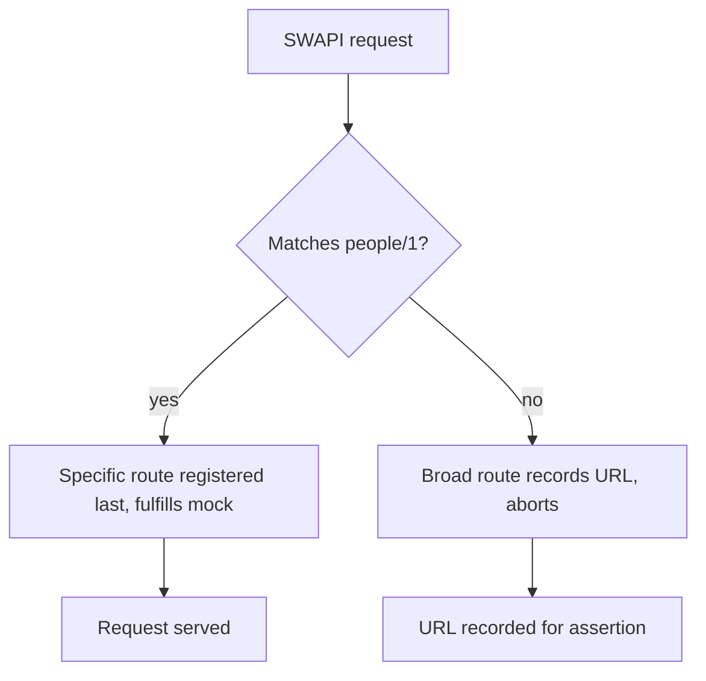

# Card 16: Logging and debugging unhandled calls

## Scenario

While you add routes, you want to see which requests go unhandled instead of letting them hit the real network. A broad catch-all records and aborts every stray SWAPI call, while your specific mocks still serve the URLs you expect.

## Aim

- Register a broad route over `**/swapi.dev/**` that records the URL and aborts the request.
- Register the specific route (`people/1`) after the broad one so real test traffic still gets its mock.
- Assert that nothing landed in the recorded list, which proves no unexpected SWAPI request slipped through.

## How it works

1. Register the broad route first: `page.route('**/swapi.dev/**', ...)` pushes `route.request().url()` onto an array, then calls `route.abort('blockedbyclient')`.
2. Register the specific route second: `page.route('**/swapi.dev/api/people/1/**', ...)` fulfills with the mocked person.
3. Load `/cards/16`. The page fetches people/1, which the specific route serves. The recorded array stays empty, so the test asserts `toHaveLength(0)`.

### Why ordering matters: LIFO

Playwright runs the most recently registered matching route first. When several routes match a URL, the last one you registered wins unless it calls `route.fallback()` to defer to an earlier route. Here both routes match the people/1 URL, so the specific route (registered last) handles it and the broad route never sees it. Any other SWAPI URL matches only the broad route, so it gets recorded and aborted. Register the catch-all first and the specific mocks last.

## When to use

- Debugging: answer "who is calling what?" without turning off routing.
- Guarding against real third-party traffic: record and abort anything your specific mocks did not cover, then assert the record is empty.
