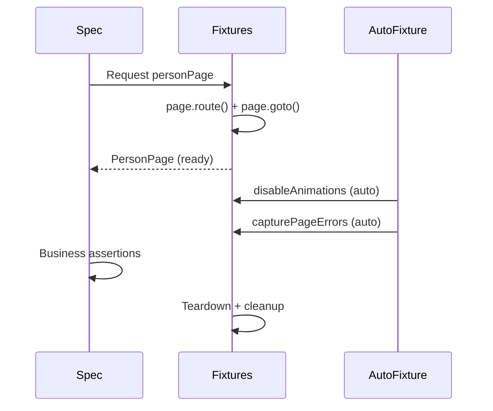

# Card 26: Full Architecture, Fixture Composition at Scale

## What This Pattern Solves

Individual patterns work in isolation. Real codebases have 100+ specs, 50+ pages, cross-cutting concerns (animations, error capture, third-party blocking), and multiple auth roles. Without a composition strategy, every spec file becomes a snowflake of `page.route()`, `page.goto()`, `new PageObject()`, and duplicated setup. Fixing a selector means updating 40 files.

The solution: **one fixture file is the composition root**. Every test in the suite imports `test` and `expect` from `fixtures.ts`, never from `@playwright/test`. Fixtures own page construction, setup, teardown, and cross-cutting concerns. Page objects own the locators of the components scoped inside them. Specs describe business intent in 5 to 15 lines.

## How It Works

1. **`fixtures.ts` exports `test` and `expect`**, the single import source for every spec.
2. **Page fixtures deliver pre-loaded pages**. The fixture handles `page.route()` mocking and `page.goto()` navigation.
3. **Component fixtures are lazy**, built only when a test requests them.
4. **Flow fixtures are closures**: the login flow is wrapped in `use(async () => ...)` so specs call it.
5. **Auto-fixtures run silently**. `disableAnimations` and `capturePageErrors` apply to every test without being requested.
6. **Container-rooted components compose**. `Modal` takes a `Locator` root, not `Page`. The page object that owns the dialog (`PersonPage`) constructs and exposes it, so the spec never touches `new` or the dialog selector.

## Code Example

See `src/e2e-patterns/fixtures.ts` for the full composition root.

```typescript
// Spec imports from fixtures.ts, the composition root
import { test, expect } from '../e2e-patterns/fixtures.js';

test('edit flow with composable fixtures', async ({ personPage, toast }) => {
  // The page object owns the dialog locator and the container-rooted Modal.
  // No `new`, no selector, no import of Modal in the spec.
  const modal = await personPage.openEditDialog();

  await modal.fillName('Architecture Leia');
  await modal.confirm();

  await toast.expectSuccess(/saved/i);
  await expect(personPage.name).toHaveText('Architecture Leia');
});
```

The container-rooted `Modal` still takes a `Locator`, not a `Page`, which is what
makes it reusable. The construction lives in the page object that owns the
dialog, so the spec gets one injected `personPage`, full autocomplete, and the
dialog selector defined in exactly one place:

```typescript
// PersonPage owns the trigger, the dialog locator, and the `new`
async openEditDialog(): Promise<Modal> {
  await this.page.getByTestId('edit-person').click();
  return new Modal(this.page.getByRole('dialog', { name: 'Edit person' }));
}
```

## Run This Example

```bash
pnpm test src/26-full-architecture
```

## Prerequisites

- **Card 12**: Locators → Actions → Flows (the 3-layer model)
- **Card 14**: Region Objects (container-rooted components)
- **Card 19**: Auth Storage State (login flow)
- **Card 21**: App Driver Fixture (test.extend)
- **Card 22**: Failure Artifacts (error capture)

## Key Concepts

- **Composition root**: One `fixtures.ts` exports `test` and `expect`. Every spec imports from it.
- **Fixtures own infrastructure**: Pages, flows, data, and cross-cutting concerns are fixtures. Specs never call `page.route`, `page.goto`, or `new PageObject(...)`.
- **Page objects own their components**: A scoped component (`Modal`) is constructed by the page object that owns its root locator and exposed via a method, so the spec never sees `new` or the selector.
- **Fixtures own teardown**: Setup before `await use(value)`, cleanup after. Tests can't forget to clean up.
- **Lazy fixtures**: Only built when requested. A spec without a toast doesn't pay for it.
- **Auto-fixtures**: `{ auto: true }` runs for every test. Use for cross-cutting concerns.
- **Flow fixtures as closures**: `use(async () => { ... })` wraps flows as callable functions.
- **Container-rooted components**: `Modal` takes a `Locator` root, so it works anywhere. The parent page object exposes it; the spec does not build it.

## When to Use This Pattern

- ✓ **Default for any suite with 10+ specs**: prevents selector and setup duplication
- ✓ When the same page appears in 5+ spec files
- ✓ When cross-cutting concerns apply to every test
- ✓ When different teams contribute to the same test suite
- ✗ For a single spec file, inline setup is simpler

## Common Mistakes

1. **Importing from `@playwright/test` in specs**: Always import from `fixtures.ts`.
2. **Setting up infrastructure in specs**: No `page.route()`, no `page.goto()`, no constructing page objects in spec files. That belongs in fixtures. Constructing a scoped component belongs in the page object that owns its root locator, not the spec.
3. **A fixture per scoped component**: Don't add a `makeModal(locator)` factory fixture for a component that's always the same dialog. Let the parent page object expose it. Reserve factory fixtures for genuinely generic components scoped to many ad-hoc roots.
4. **Forgetting teardown**: Cleanup goes after `await use(value)`.
5. **Making every fixture auto**: Only use `{ auto: true }` for truly cross-cutting concerns.

## Flow Diagram



## Related Patterns

- **Foundation**: Card 12 (Locators → Actions → Flows)
- **Foundation**: Card 14 (Region Objects)
- **Foundation**: Card 19 (Auth Storage State)
- **Foundation**: Card 21 (App Driver Fixture)
- **Foundation**: Card 22 (Failure Artifacts)
- **Compare**: Cards 02-10, individual mocking patterns, now composed
