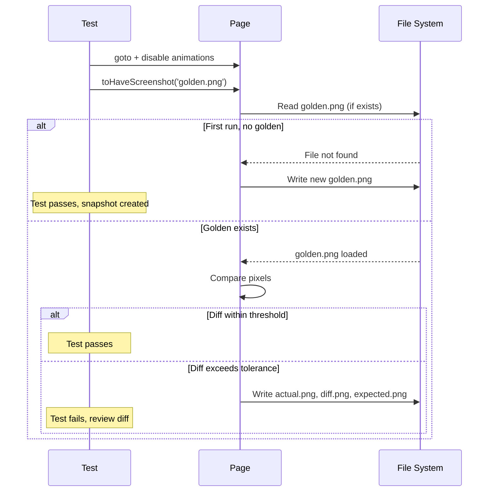

# Card 27: Visual Regression with `toHaveScreenshot`

## What This Pattern Solves

Card 18 introduced a single component screenshot. Real suites need more: handling anti-aliasing differences across OS and CI, masking volatile content (timestamps, random data), tuning sensitivity with `threshold` and `maxDiffPixels`, and applying shared CSS snapshots. This card covers the full `toHaveScreenshot` depth.

The three tests in this card compare against two committed golden images. Tests 1 and 3 share the same golden; test 3 adds a tolerance so it stays green under minor rendering variance.

## How It Works

1. A `beforeEach` disables animations so screenshots are stable, then mocks the API with deterministic data.
2. The first test takes an element-level screenshot of the person card, the default mode, pixel-perfect.
3. The second test uses `maxDiffPixels` and `threshold` to tolerate minor rendering differences (font rasterisation, sub-pixel anti-aliasing) across machines.
4. The third test compares against the same golden as the first test but passes `maxDiffPixels: 100`, showing how to add a tolerance to an existing snapshot without creating a new one.

To handle volatile regions (timestamps, random data), pass `mask` and `maskColor` so those areas never trigger a diff. These options are shown in the Code Example below.

The update workflow: delete the stale snapshot (or run with `--update-snapshots`) and Playwright writes a new golden image on the next run.

## Code Example

All `toHaveScreenshot` options in one place (`mask`, `maskColor`, and `stylePath` are documented here, not run as tests in this card):

```typescript
await expect(card).toHaveScreenshot('person-card.png', {
  maxDiffPixels: 100,    // tolerate up to 100 differing pixels
  threshold: 0.3,        // each pixel can differ by up to 30 %
  mask: [maskRect],      // ignore these areas
  maskColor: '#000000',  // fill masked areas with black
});
```

## Run This Example

```bash
pnpm test src/27-visual-regression

# Update golden snapshots after an intentional UI change:
pnpm test src/27-visual-regression --update-snapshots
```

## Prerequisites

- **Card 18**: First component screenshot (`toHaveScreenshot` basics).
- **Card 12/26**: PersonPage and page object patterns.

## Key Concepts

- **maxDiffPixels**: Absolute number of pixels allowed to differ. Good for small layout shifts.
- **threshold**: Per-pixel tolerance (0–1). 0.1 means a pixel can differ by 10 % and still pass. Useful for anti-aliasing.
- **mask**: Array of `{ x, y, width, height }` rectangles. Content inside is ignored. Use for timestamps, random data, ads.
- **maskColor**: CSS color to fill masked areas (defaults to black in diffs).
- **stylePath**: Path to a CSS file injected before the screenshot. Use for consistent font rendering across OS.
- **`--update-snapshots`**: CLI flag that overwrites golden images. Run once after an intentional UI change, commit the new snapshots, then remove the flag.

## When to Use This Pattern

- ✓ Critical UI components that must not regress visually.
- ✓ Design systems where a CSS change should be caught immediately.
- ✓ Cross-browser visual testing.
- ✗ Content that changes every deployment (use masking).
- ✗ Pages with animated SVG/canvas (disable animations first).

## Common Mistakes

1. **Not masking volatile content**: timestamps, "last updated" labels, and random data will fail every run. Mask them or use `maxDiffPixels`.
2. **Committing stale snapshots after `--update-snapshots` without reviewing**: always diff the new golden images before committing.
3. **Running visual tests on a different OS than CI**: font rasterisation varies. Use `threshold` to tolerate it, or run CI on a single OS.
4. **Full-page screenshots**: prefer element-level screenshots. A 1920×1080 diff is hard to review; a 300×200 card diff points straight at the change.

## Flow Diagram



## Related Patterns

- **Previous**: Card 18 (Stability Techniques), first screenshot.
- **Next**: Card 28 (Component Testing), mount components in isolation.
- **Complementary**: Card 26 (Full Architecture), auto-fixture for animation disabling.
