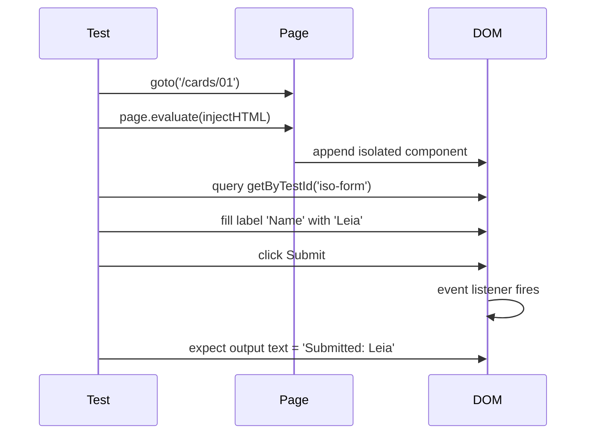

# Card 28: Component Testing

## What This Pattern Solves

The suite tests full pages, never a component in isolation. When a component has complex internal state, async behaviour, or many edge cases, testing it through the full page is slow and makes root-cause harder. Component testing lets you mount and assert on a single component, bypassing page-level routing, API mocking, and layout noise.

This card demonstrates component-level testing using Playwright's existing page-level primitives: inject a component into the running page and interact with it directly. The pattern works without `@playwright/experimental-ct-*` by leveraging `page.evaluate()` to mount markup and behaviour.

## How It Works

1. Navigate to any page to get a live DOM root.
2. Use `page.evaluate()` to inject the component's HTML, styles, and event handlers into the DOM.
3. Query the injected component with standard locators (`getByTestId`, `getByRole`, `getByLabel`).
4. Interact with it (fill, click) and assert on its state.

For teams already using `@playwright/experimental-ct-react` or `@playwright/experimental-ct-vue`, replace step 2 with the framework-specific `mount()` call.

## Code Example

```typescript
// Inject a form component in isolation
await page.evaluate(() => {
  const el = document.createElement('div');
  el.innerHTML = `
    <form data-testid="iso-form">
      <label for="iso-input">Name</label>
      <input id="iso-input" name="name" type="text" />
      <button type="submit" data-testid="iso-submit">Submit</button>
    </form>
    <output data-testid="iso-output"></output>
  `;
  document.body.appendChild(el);

  el.querySelector('form')!.addEventListener('submit', (e) => {
    e.preventDefault();
    const input = el.querySelector('#iso-input') as HTMLInputElement;
    document.querySelector('[data-testid="iso-output"]')!.textContent =
      `Submitted: ${input.value}`;
  });
});

await page.getByLabel('Name').fill('Leia');
await page.getByTestId('iso-submit').click();
await expect(page.getByTestId('iso-output')).toHaveText('Submitted: Leia');
```

For framework component testing with `@playwright/experimental-ct-*`:

```bash
npm install @playwright/experimental-ct-react
```

```typescript
// playwright-ct.config.ts
import { defineConfig, devices } from '@playwright/experimental-ct-react';
export default defineConfig({ ... });
```

```typescript
// component.spec.tsx
import { test, expect } from '@playwright/experimental-ct-react';
import { PersonCard } from './PersonCard';

test('renders name and height', async ({ mount }) => {
  const component = await mount(<PersonCard name="Luke" height="172" />);
  await expect(component.getByTestId('person-name')).toHaveText('Luke');
});
```

## Run This Example

```bash
pnpm test src/28-component-testing
```

## Prerequisites

- **Card 01**: `page.goto`, `expect().toBeVisible`, basic assertion patterns.
- **Card 13**: Scoped queries and container-first locators.

## Key Concepts

- **Component isolation**: Mount one component, test it. No page routing, no API mocking, no unrelated DOM.
- **`page.evaluate()` mount**: Inject raw HTML + JS behaviour. Works with any framework.
- **`@playwright/experimental-ct-*` mount**: First-class React/Vue/Svelte component mounting with framework-aware lifecycle.
- **Separate config**: CT suites use `playwright-ct.config.ts`, not the main `playwright.config.ts`. Different `testDir`, different `webServer`.

## When to Use This Pattern

- ✓ Complex components with many internal states (loading, empty, error, populated).
- ✓ Design-system components that need to be tested across all variants.
- ✓ Regression-testing a component's HTML output and interactions.
- ✗ Testing page-level orchestration (routing, auth, data fetching). Use page-level tests.
- ✗ When the component has no logic beyond rendering props. Use page-level tests.

## Common Mistakes

1. **Over-mocking in component tests**: If you mock every child component, you are testing a mock, not the component. Let children render.
2. **Forgetting to clean up injected DOM**: Multiple tests injecting into `document.body` can interfere. Use `beforeEach` to reset, or inject into a test-specific container.
3. **Using page-level routing in a component test**: Navigate to a blank page or use `about:blank`, then inject. Don't depend on the app's routing.

## Flow Diagram



## Related Patterns

- **Previous**: Card 27 (Visual Regression), element-level assertions.
- **Next**: Card 29 (Trace Viewer), debugging test failures.
- **Complementary**: Card 26 (Full Architecture), fixture composition for component-level setup.
