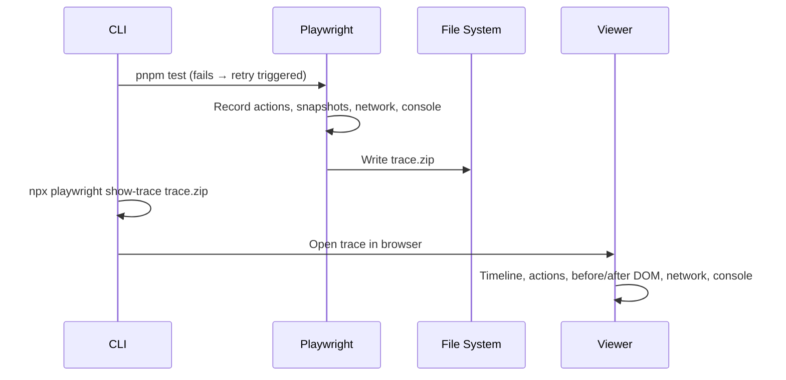

# Card 29: Trace Viewer

## What This Pattern Solves

The config sets `trace: 'on-first-retry'` but no card teaches the viewer. When a test fails, the trace records every action, network request, screenshot, console log, and assertion on a scrubbable timeline. Without it, you reconstruct failures from logs alone.

## How It Works

1. **Configure trace mode** in `playwright.config.ts`. The cookbook uses `trace: 'on-first-retry'`: traces are only recorded when a test retries (fails first attempt).
2. **Run tests**. Playwright writes trace files into `test-results/`.
3. **Open the trace** with `npx playwright show-trace <path>` or `npx playwright show-report` and click the trace icon.
4. **Navigate the viewer**: use the timeline to scrub through actions, inspect network calls (request/response headers, bodies), view DOM snapshots before/after each action, and read console logs.

## Trace Modes

| Mode | When traces are recorded |
|------|--------------------------|
| `'off'` | Never |
| `'on'` | Every test |
| `'on-first-retry'` | Only when a test retries (recommended for CI) |
| `'on-all-retries'` | Every retry |
| `'retain-on-failure'` | On failure, but cleaned up on success |
| `'retain-on-first-retry'` | Combined: only on retries, retained on failure |

## CLI Commands

```bash
# Run with trace on for every test (one-off):
npx playwright test --trace on

# Open a specific trace:
npx playwright show-trace test-results/.../trace.zip

# Open the HTML report (traces are embedded):
npx playwright show-report
```

## Reading a Trace

1. **Actions pane** (left): every Playwright call (click, fill, expect) with duration.
2. **Timeline** (top): scrub through time. The yellow bar marks the current action.
3. **Before/After snapshots**: DOM state before and after each action. See exactly what Playwright saw.
4. **Network tab**: every request the page made, with headers, payload, and response. Mocked requests show the `fulfill` data.
5. **Console tab**: all `console.log`, `console.error`, and unhandled exceptions.
6. **Source tab**: the test source, with the failing line highlighted.

## Code Example

```typescript
// playwright.config.ts
use: {
  trace: 'on-first-retry',  // ← traces only on retry
},
```

```bash
# Open the HTML report after a test run:
npx playwright show-report

# Then click any failing test, then click the "Trace" tab
```

## Run This Example

```bash
pnpm test src/29-trace-viewer
npx playwright show-report
```

## Prerequisites

- **Card 01**: Basic test structure and assertions.
- **Card 16**: Debugging unhandled requests (complementary debugging tool).

## Key Concepts

- **`trace: 'on-first-retry'`**: The recommended CI setting. No trace overhead on passing tests, full trace on flaky failures.
- **`npx playwright show-trace`**: Opens a single trace.zip file in the viewer.
- **`npx playwright show-report`**: Opens the full HTML report; click any test to view its trace.
- **Timeline scrubbing**: Drag the timeline to see DOM state at any point in the test.
- **Network inspection**: See every request, including mocked ones, with full payloads.

## When to Use This Pattern

- ✓ Debugging a flaky test: the trace shows the exact state that caused the assertion to fail.
- ✓ Investigating a timeout: the timeline shows which action hung.
- ✓ Reviewing what the page looked like at the moment of failure.
- ✗ Production monitoring (traces are local, not a telemetry system).

## Common Mistakes

1. **Using `trace: 'on'` in CI for every run**: this writes huge trace files and slows CI down. Use `'on-first-retry'` or `'retain-on-failure'`.
2. **Not opening the trace**: when a CI test fails, download the trace artifact from CI and open it locally.
3. **Looking at the screenshot instead of the trace**: a screenshot is a single frame; the trace shows what led to that frame.

## Flow Diagram



## Related Patterns

- **Previous**: Card 28 (Component Testing).
- **Next**: Card 30 (CI Sharding & Merge Reports), scaling the test suite.
- **Complementary**: Card 16 (Debug Unhandled Requests), debugging missing mocks.
- **Complementary**: Card 22 (Failure Artifacts), attaching context to test reports.
