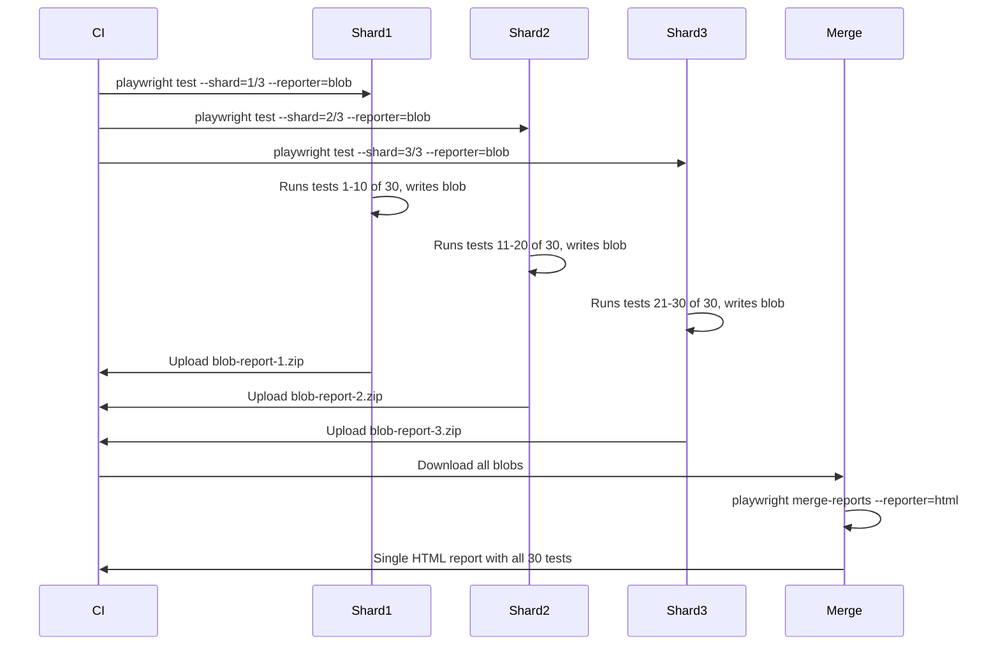

# Card 30: CI Sharding & Merge Reports

## What This Pattern Solves

The config pins CI to one worker (`workers: process.env.CI ? 1 : undefined`), which undercuts the parallelism story. Real suites with hundreds of tests need sharding: split tests across N CI machines, each running a subset, then merge the reports. Without sharding, a suite that takes 20 minutes locally can take hours in CI.

## How It Works

1. **Blob reporter** writes each shard's results to a portable `blob` file (not the default HTML reporter).
2. **`--shard=N/M`** splits tests: `1/3` runs the first third, `2/3` the second, `3/3` the third.
3. After all shards finish, **`merge-reports`** combines the blobs into a single HTML report.
4. The merged report has all tests, traces, and screenshots from every shard.

## Code Example

**playwright.config.ts** (blob reporter for CI):

```typescript
import { defineConfig } from '@playwright/test';

export default defineConfig({
  reporter: process.env.CI
    ? [['blob']]
    : [['html']],
  workers: process.env.CI ? 2 : undefined, // 2 workers per shard
});
```

**CI workflow** (GitHub Actions):

```yaml
jobs:
  test:
    strategy:
      matrix:
        shard: [1, 2, 3]
    runs-on: ubuntu-latest
    steps:
      - uses: actions/checkout@v4
      - run: pnpm install
      - run: pnpm exec playwright test --shard=${{ matrix.shard }}/${{ strategy.job-total }}
      - uses: actions/upload-artifact@v4
        with:
          name: playwright-blobs-${{ matrix.shard }}
          path: blob-report/
```

**Merge step** (separate job after all shards):

```yaml
merge-reports:
  needs: [test]
  runs-on: ubuntu-latest
  steps:
    - uses: actions/download-artifact@v4
      with: { pattern: playwright-blobs-* }
    - run: pnpm exec playwright merge-reports --reporter html ./playwright-blobs-*
    - uses: actions/upload-artifact@v4
      with:
        name: playwright-report
        path: playwright-report/
```

## Run This Example

```bash
# Run a single shard locally:
pnpm test src/30-ci-sharding-and-merge-reports

# Simulate CI sharding locally:
npx playwright test --shard=1/3 --reporter=blob
npx playwright test --shard=2/3 --reporter=blob
npx playwright test --shard=3/3 --reporter=blob
npx playwright merge-reports --reporter=html ./blob-report
npx playwright show-report
```

## Prerequisites

- **Card 01**: Basic test structure.
- Familiarity with CI configuration (GitHub Actions, GitLab CI, Jenkins).

## Key Concepts

- **`--shard=N/M`**: Split tests into M groups, run group N. Tests are split evenly by filename.
- **Blob reporter**: Writes binary `.zip` files with test results. Lighter than HTML, designed for merging.
- **`merge-reports`**: Combines multiple blob reports into one HTML report. Handles deduplication.
- **`workers` per shard**: Each CI machine can still run multiple workers within its shard. Set `workers: 2` per shard for 2× parallelism.

## When to Use This Pattern

- ✓ Suites with 50+ tests that need fast CI feedback.
- ✓ Monorepos where different teams own different test directories.
- ✓ Cross-browser testing where each browser is a separate shard.
- ✗ Suites with fewer than 30 tests (sharding overhead exceeds benefit).
- ✗ Tests that share process-level state across spec files (sharding assumes independence).

## Common Mistakes

1. **Using the HTML reporter per shard**: HTML reports don't merge. Use `blob` for shards, merge to HTML at the end.
2. **Forgetting the merge job**: each shard uploads blobs, but without a merge job there is no unified report.
3. **Pinning workers to 1 in CI**: the config currently does this. Remove it to let each shard use multiple workers. Set `workers: process.env.CI ? 2 : undefined`.
4. **Not uploading blob artifacts**: if the merge job can't find the blobs, there is nothing to merge. Use `actions/upload-artifact` with a pattern.

## Flow Diagram



## Related Patterns

- **Previous**: Card 29 (Trace Viewer), debugging failures across shards.
- **Next**: Card 31 (Network HAR), recording network traffic.
- **Complementary**: Card 19 (Auth Storage State), sharing state across shards.
