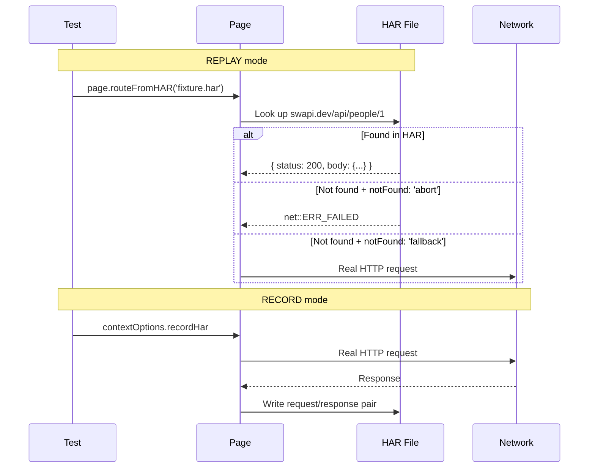

# Card 31: Network HAR Recording

## What This Pattern Solves

Card 06 records API responses as JSON fixtures and replays them with `page.route()`. Playwright also has a built-in HAR (HTTP Archive) path: record real network traffic at the browser level and save it as a `.har` file. This card focuses on the recording side. It opens a context with `recordHar` enabled, drives the page with standard `route.fulfill()` mocking, and writes a `.har` file you can replay later or open in Chrome DevTools.

`routeFromHAR()` is the matching replay step, documented in Code Example below. This card does not run a replay test, because replaying a freshly recorded HAR is timing-sensitive; record here, then replay in a dedicated test once the HAR is committed.

## How It Works

1. **Record**: Use `contextOptions.recordHar` to tell Playwright to capture all network traffic for a context into a `.har` file.
2. **Mock during recording**: Standard `route.fulfill()` mocking keeps the recorded data deterministic. The spec serves a known person via `makePerson` and asserts the page renders it.
3. The HAR contains full request/response pairs: URL, method, status, headers, body, and timing.
4. **Replay (later)**: Call `page.routeFromHAR('fixture.har')` to serve responses from the committed HAR. It matches requests by URL (with glob support) and falls back to `notFound` behaviour for unmatched URLs.

## Code Example

```typescript
// RECORD: context-level HAR recording
const context = await browser.newContext({
  recordHar: {
    path: './test/fixtures/app.har',
    mode: 'full',
    content: 'embed', // embed response bodies in the HAR file
  },
});

// REPLAY: play back the recorded traffic
await page.routeFromHAR('./test/fixtures/app.har', {
  url: '**/swapi.dev/api/people/1/**',
  notFound: 'abort', // abort any request not found in the HAR
});
```

## CLI Shortcut

```bash
# Pass --save-har to write all traffic:
npx playwright test --save-har=./test/fixtures/app.har

# Pass --save-har-glob to filter which requests are saved:
npx playwright test --save-har=./test/fixtures/api.har --save-har-glob='**/api/**'
```

## Run This Example

```bash
pnpm test src/31-network-har
```

## Prerequisites

- **Card 02**: Basic `page.route()` and `route.fulfill()`.
- **Card 06**: Record & Replay Fixtures (JSON-based alternative).

## Key Concepts

- **`recordHar`**: Context-level option. Captures every request during the context's lifetime. Modes: `'full'` (everything), `'minimal'` (URLs only).
- **`content: 'embed'`**: Embeds response bodies in the HAR. Default is `'omit'` (no body). Use `'attach'` for large bodies in separate files.
- **`routeFromHAR`**: Page-level replay. Matches requests against the HAR. The `url` option (glob) filters which requests are served from the HAR.
- **`notFound`**: What to do when a request is not in the HAR: `'abort'` (fail the request), `'fallback'` (let it go to the real network).
- **HAR vs JSON fixtures**: HAR records everything at the browser level (headers, timing, cookies). JSON fixtures are simpler, more explicit, and easier to version-control and patch.

## When to Use This Pattern

- ✓ Capturing real API responses for offline replay, including headers and timing.
- ✓ Debugging network issues: a HAR file can be opened in Chrome DevTools.
- ✓ Recording the entire network profile of a flow for later analysis.
- ✗ When you only need response bodies (use Card 06 JSON fixtures, simpler to read and patch).
- ✗ When you need to modify responses per test (use `page.route()` with `route.fulfill()`).

## Common Mistakes

1. **Forgetting `content: 'embed'`**: Default is `omit`, so recorded HARs have no response bodies.
2. **Committing large HAR files**: HAR files with embedded content can be huge. Use `--save-har-glob` to scope them.
3. **Using HAR for per-test overrides**: HAR replay is static. For per-test variations, use `page.route()` (Cards 07, 10).
4. **Not setting `notFound`**: Requests not in the HAR will hit the real network by default, making tests non-deterministic. Set `notFound: 'abort'`.

## Flow Diagram



## Related Patterns

- **Previous**: Card 30 (CI Sharding), scaling the suite.
- **Next**: Card 32 (Mobile & Emulation).
- **Complementary**: Card 06 (Record & Replay Fixtures), JSON-based alternative.
- **Complementary**: Card 10 (Per-Test Overrides), dynamic response patching.
