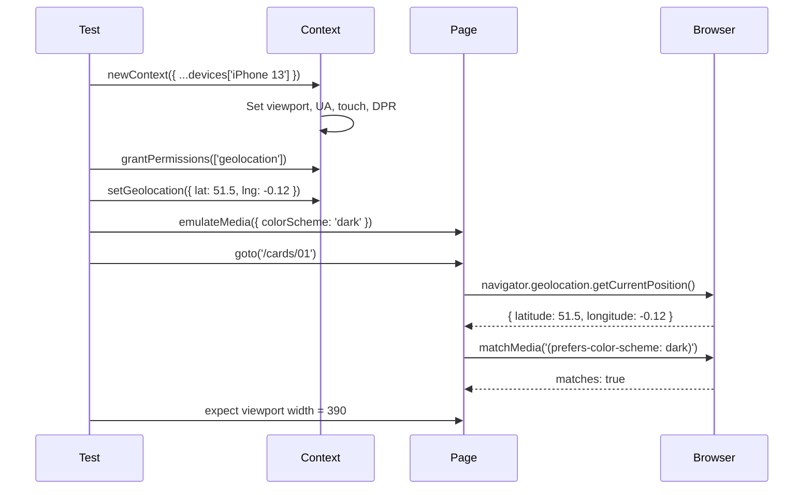

# Card 32: Mobile & Emulation

## What This Pattern Solves

You need to test your app across devices, viewports, color schemes, geolocation, and permissions, without owning a device lab. Playwright's built-in device descriptors and emulation APIs simulate mobile viewports, touch input, geolocation, `prefers-color-scheme`, and browser permissions.

## How It Works

1. **Device descriptors**: `devices['iPhone 13']` provides a complete preset (viewport, user agent, device scale factor, touch, `isMobile`, `hasTouch`).
2. **`test.use()`**: Apply device settings to a describe block or a single test.
3. **`context.setGeolocation()`**: Override the browser's geolocation.
4. **`context.grantPermissions()`**: Pre-grant permissions like geolocation or notifications.
5. **`page.emulateMedia()`**: Force `colorScheme`, `reducedMotion`, `forcedColors`.

## Code Example

```typescript
import { test, expect, devices } from '@playwright/test';

const iPhone = devices['iPhone 13'];

test.describe('Mobile tests', () => {
  test.use({ ...iPhone }); // Apply to all tests in this block

  test('renders on iPhone viewport', async ({ page }) => {
    await page.goto('/cards/01');
    const vp = page.viewportSize();
    expect(vp?.width).toBe(390); // iPhone 13 width
  });
});

test('geolocation test', async ({ page, context }) => {
  await context.grantPermissions(['geolocation']);
  await context.setGeolocation({ latitude: 51.5, longitude: -0.12 });
  await page.goto('/cards/01');
});

test('dark mode test', async ({ page }) => {
  await page.emulateMedia({ colorScheme: 'dark' });
  await page.goto('/cards/01');
  const isDark = await page.evaluate(() =>
    window.matchMedia('(prefers-color-scheme: dark)').matches,
  );
  expect(isDark).toBe(true);
});
```

## Config-Level Projects (multi-device CI)

```typescript
// playwright.config.ts
projects: [
  { name: 'chromium', use: { ...devices['Desktop Chrome'] } },
  { name: 'iphone', use: { ...devices['iPhone 13'] } },
  { name: 'pixel', use: { ...devices['Pixel 5'] } },
  { name: 'dark-chromium', use: { ...devices['Desktop Chrome'], colorScheme: 'dark' } },
],
```

## Run This Example

```bash
pnpm test src/32-mobile-and-emulation
```

## Prerequisites

- **Card 01**: Basic page navigation and assertions.
- **Card 05**: `route.fetch()` for geolocation-aware API testing.

## Key Concepts

- **`devices['...']`**: Pre-built device descriptors for iOS, Android, desktop browsers. Includes viewport, DPR, touch, UA string.
- **`test.use({ ...devices['iPhone 13'] })`**: Applies device settings to a describe block or test. Combines with existing config via spread.
- **`context.setGeolocation({ latitude, longitude })`**: Overrides navigator.geolocation. Accuracy defaults to 0.
- **`context.grantPermissions(['geolocation', ...])`**: Pre-grants permissions so the prompt is skipped. Must call before the permission is requested.
- **`page.emulateMedia({ colorScheme, reducedMotion, forcedColors })`**: Emulates CSS media features without changing viewport.
- **Config projects**: Define multiple `projects` in `playwright.config.ts` to run the same tests across different device/browser/colorScheme combinations.

## When to Use This Pattern

- ✓ Testing responsive layouts across real device viewports.
- ✓ Testing `prefers-color-scheme: dark` / reduced motion without toggling OS settings.
- ✓ Testing geolocation-dependent features.
- ✓ Running the same spec across multiple device profiles in CI.
- ✗ Testing actual touch gestures (device emulation uses click-based input).

## Common Mistakes

1. **Forgetting `context.grantPermissions()`**: `setGeolocation()` alone won't work if geolocation permission isn't granted. The browser will show a permission prompt and the test will hang.
2. **Using `page.emulateMedia()` for viewport**: `emulateMedia` only changes CSS media, not viewport size. Use `test.use({ viewport: { width, height } })` for viewport.
3. **Not spreading config**: `test.use({ ...devices['iPhone 13'] })` spreads the device preset onto existing config. Using `test.use(devices['iPhone 13'])` without spread may override base settings unexpectedly.

## Flow Diagram



## Related Patterns

- **Previous**: Card 31 (Network HAR), recording network across devices.
- **Next**: Card 33 (Worker-Scoped Fixtures), expensive setup per worker.
- **Complementary**: Card 18 (Stability Techniques), disabling animations for all devices.
- **Complementary**: Card 30 (CI Sharding), running device projects as separate shards.
