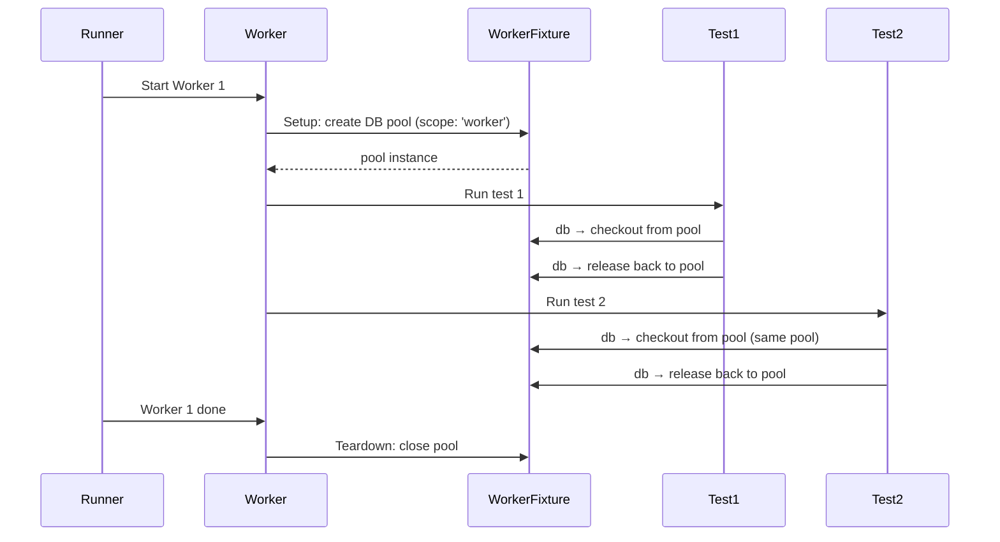

# Card 33: Worker-Scoped Fixtures

## What This Pattern Solves

All current fixtures are test-scoped (`scope: 'test'` is the default). For expensive setup (database connection, server start, auth token refresh), creating it per test wastes time. Worker-scoped fixtures run once per worker process and are shared across all tests in that worker. Each worker gets its own instance.

## How It Works

1. Define a fixture with `scope: 'worker'`. Playwright calls its setup once when the worker starts and its teardown once when the worker finishes.
2. Tests in the same worker process receive the same fixture value.
3. Test-scoped fixtures can depend on worker-scoped fixtures (the worker fixture is resolved first).
4. Worker-scoped fixtures cannot depend on test-scoped fixtures. The `{ page }` fixture is not available in worker scope.

## Code Example

```typescript
import { test as base, expect } from '@playwright/test';

const test = base.extend<
  // Test fixtures
  { db: Database },
  // Worker fixtures
  { dbPool: Pool }
>({
  dbPool: [async ({}, use) => {
    const pool = new Pool({ maxConnections: 5 });
    console.log(`Worker ${test.info().workerIndex}: pool created`);
    await use(pool);
    await pool.close();
    console.log(`Worker ${test.info().workerIndex}: pool closed`);
  }, { scope: 'worker' }],

  db: async ({ dbPool }, use) => {
    const conn = await dbPool.acquire(); // checkout per test
    await use(new Database(conn));
    await dbPool.release(conn); // return per test
  },
});

test('test 1 uses same pool as test 2', async ({ db, dbPool }) => {
  expect(dbPool.activeConnections).toBeLessThanOrEqual(5);
});

test('test 2 reuses the pool', async ({ db, dbPool }) => {
  // dbPool is the same instance as in test 1
  expect(dbPool.activeConnections).toBeLessThanOrEqual(5);
});
```

## Run This Example

```bash
pnpm test src/33-worker-scoped-fixtures
```

## Prerequisites

- **Card 21**: `test.extend` basics (test-scoped fixtures).
- **Card 26**: Fixture composition root pattern.

## Key Concepts

- **`scope: 'worker'`**: Setup runs once per worker process, teardown runs once when the worker exits. All tests in that worker share the fixture instance.
- **`scope: 'test'`** (default): Setup and teardown run for every test.
- **Fixture dependency rules**: Test fixtures can depend on worker fixtures. Worker fixtures can NOT depend on test fixtures (no `{ page }` in worker scope).
- **Worker count**: A worker runs multiple tests sequentially. If you set `workers: 4`, you get 4 workers, each with its own worker-scoped fixture instance.
- **Use cases**: Database connection pools, API servers, Docker containers, auth token caches.

## When to Use This Pattern

- ✓ Database connection pools (acquire per test, release per test, close once per worker).
- ✓ Starting a local server once per worker rather than per test.
- ✓ Refreshing a short-lived auth token once per worker.
- ✓ Docker containers that are heavy to start/stop.
- ✗ State that must be isolated per test (cookies, localStorage, DOM).
- ✗ When you need `page` or `context` in setup (worker fixtures don't have them).

## Common Mistakes

1. **Using `page` in a worker fixture**: Worker fixtures receive `{}` and browser-level fixtures (`browser`). `page` and `context` are test-scoped only.
2. **Sharing mutable state between tests via worker fixture**: Tests in the same worker can mutate the shared fixture value. If isolation matters, use test-scoped fixtures that checkout from the worker-scoped pool.
3. **Forgetting teardown**: Worker fixtures must clean up after `use()`. Skipping teardown leaks resources across the entire test run.

## Flow Diagram



## Related Patterns

- **Previous**: Card 32 (Mobile & Emulation).
- **Next**: Card 34 (Retries & Soft Assertions).
- **Complementary**: Card 26 (Full Architecture), fixture composition at scale.
- **Complementary**: Card 21 (App Driver Fixture), test-scoped fixture basics.
