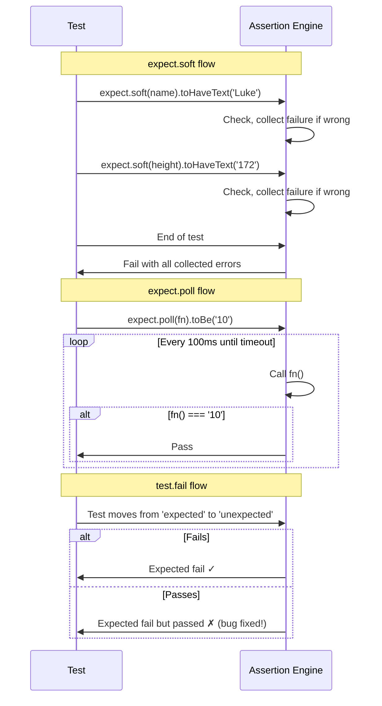

# Card 34: Retries & Soft Assertions

## What This Pattern Solves

Assertions fail one at a time: the first failure stops the test, so you never learn about other problems until the next CI run. `expect.soft` collects all failures before failing. `expect.poll` and `expect.toPass` retry until a condition is met (useful for async state transitions). `test.fail` and `test.fixme` communicate intent about known-broken tests.

## How It Works

1. **`expect.soft()`**: Runs every soft assertion, collects failures, and fails the test at the end. Great for form validation or data integrity checks where you want to see all errors at once.
2. **`expect.poll()`**: Re-checks a synchronous function at intervals until it returns the expected value or times out. Use for polling DOM state or external services.
3. **`expect.toPass()`**: Retries an async function until it passes. Similar to `expect.poll()` but for async callbacks.
4. **`test.fail()`**: Marks a test as expected to fail. If it passes, it's reported as a failure (bug fixed, remove the marker). If it fails, it's reported as expected.
5. **`test.fixme()`**: Marks a test as skipped (won't run). Use for tests that are known broken and not worth running.

## Code Example

```typescript
// Soft assertions: all three run, all failures collected
await expect.soft(page.getByTestId('name')).toHaveText('Luke');
await expect.soft(page.getByTestId('height')).toHaveText('172');
await expect.soft(page.getByTestId('mass')).toHaveText('77');
// Test fails at the end if any failed.

// Poll: wait for a counter to reach 10
await expect
  .poll(() => document.querySelector('#counter').textContent, { timeout: 5000 })
  .toBe('10');

// Retry an async callback until a condition holds
await expect(async () => {
  const res = await fetch('/api/status');
  expect(res.status).toBe(200);
}).toPass({ timeout: 10000, intervals: [500, 1000] });

// Known bug: mark the test expected-to-fail from inside the body
test('dashboard chart renders correctly', async ({ page }) => {
  test.fail(true, 'KNOWN BUG: dashboard chart renders off by 1px');
  await expect(page.locator('#chart')).toHaveScreenshot('chart.png');
});

// Broken: skip it with the annotation form inside the body
test('user deletion flow', async ({ page }) => {
  test.fixme(true, 'TODO: implement user deletion flow');
  // ...
});
```

## Run This Example

```bash
pnpm test src/34-retries-and-soft-assertions
```

## Prerequisites

- **Card 01**: Basic assertions with `expect`.
- **Card 15**: Done signals and waiting patterns.

## Key Concepts

- **`expect.soft()`**: Continues past failures, collects all errors, fails the test at the end. Dramatically reduces fix-one-at-a-time cycles for multi-field forms.
- **`expect.poll(fn, options)`**: Calls `fn` (synchronous) repeatedly until it returns the expected value. `timeout` and `intervals` control pacing.
- **`expect(func).toPass(options)`**: Retries an async callback. Use when polling a DOM value or waiting for an async side effect to settle.
- **`test.fail(condition?, description?)`**: Call it inside the test body. If the test fails, it's expected (reported as "expected to fail"). If it passes unexpectedly, it fails with "expected to fail but passed", signalling the bug is fixed.
- **`test.fixme(condition?, description?)`**: Skips the test entirely. Shows in report as "fixme".
- **`test.skip(condition?, description?)`**: Conditional skip. Use `test.skip(browserName === 'webkit')` to skip a test on WebKit.

## When to Use This Pattern

- ✓ Form validation: soft-assert every field error to see all at once.
- ✓ Waiting for async state (WebSocket updates, API polling): `expect.poll` or `expect.toPass`.
- ✓ Known CI-flaky tests while investigating: `test.fail`.
- ✓ Bug-not-yet-fixed: `test.fixme` with the issue number.
- ✓ Skipping browser-specific tests: `test.skip(browserName === 'webkit')`.
- ✗ Using `expect.soft` everywhere (reduces test clarity; use for multi-assertion scenarios only).

## Common Mistakes

1. **Assuming a soft-only test passes**: Playwright fails a test when soft-assertion errors accumulate, even with no hard assertion. The test reports failure at the end with every collected error. To fail early on the first soft failure, add `expect(test.info().errors).toHaveLength(0)` as a hard check partway through.
2. **Using `waitForTimeout` instead of `expect.poll`**: `expect.poll` retries with backoff; `waitForTimeout` is a fixed sleep. Always prefer polling.
3. **Forgetting to remove `test.fail` after fixing the bug**: A fixed test with `test.fail` reports as "expected to fail but passed", a clear signal to remove the marker.
4. **Overusing `test.fixme`**: Each fixme is dead code. If a fixme has been sitting for months, either fix it or delete it.

## Flow Diagram



## Related Patterns

- **Previous**: Card 33 (Worker-Scoped Fixtures).
- **Next**: Card 35 (Multi-Tab & Multi-Context).
- **Complementary**: Card 15 (Done Signals), waiting for network and async state.
- **Complementary**: Card 22 (Failure Artifacts), capturing context when tests fail.
