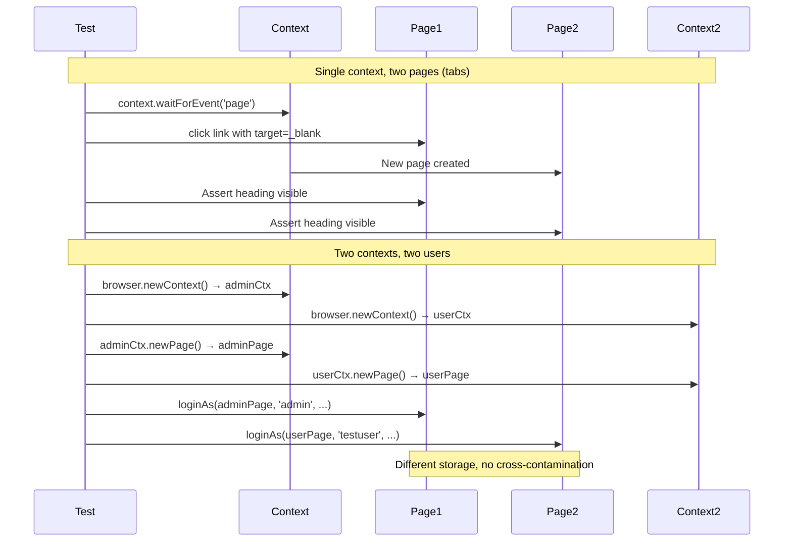

# Card 35: Multi-Tab & Multi-Context

## What This Pattern Solves

Real apps spawn popups, open new tabs, and support multiple simultaneous user sessions. Testing these flows requires managing multiple pages and browser contexts. `page` alone gives you one tab. `context` manages a set of pages (tabs, popups). `browser` manages multiple contexts (isolated sessions).

## How It Works

1. **`context.newPage()`**: Create a new tab in the same browser context. Pages in the same context share cookies, localStorage, and sessionStorage.
2. **`context.waitForEvent('page')`**: Capture a popup or new tab triggered by a user action (e.g. `window.open()`, `target="_blank"`).
3. **`browser.newContext()`**: Create an isolated browser context with its own storage, cookies, and permissions. Use for multi-user tests.
4. **`context.pages()`**: Get all open pages in a context. Use to verify counts and iterate.

## Code Example

```typescript
// Popup: capture window.open
const [popup] = await Promise.all([
  context.waitForEvent('page'),
  page.getByTestId('open-popup').click(),
]);
await expect(popup.getByRole('heading')).toBeVisible();
await expect(popup.locator('h1')).toHaveText('Popup Title');

// Multi-context: two users with separate auth
const adminCtx = await browser.newContext();
const userCtx = await browser.newContext();

const adminPage = await adminCtx.newPage();
await loginAs(adminPage, 'admin', 'adminpass');

const userPage = await userCtx.newPage();
await loginAs(userPage, 'testuser', 'password');

// adminPage and userPage have independent storage, cookies, permissions.
// They can be used simultaneously without cross-contamination.
```

## Run This Example

```bash
pnpm test src/35-multi-tab-and-multi-context
```

## Prerequisites

- **Card 01**: Basic page navigation.
- **Card 11**: Login flow.
- **Card 19**: Auth storage state (complementary for multi-user tests).

## Key Concepts

- **Page vs Context vs Browser**: A `browser` has one or more `contexts`. Each `context` has one or more `pages`. Pages in the same context share storage. Pages in different contexts are fully isolated.
- **`context.waitForEvent('page')`**: Returns a Promise that resolves when a new page is created. Use `Promise.all([waitForEvent, triggerAction])` to avoid missing the event.
- **`context.newPage()`**: Create a blank tab. Equivalent to `Ctrl+T` in a browser.
- **`context.pages()`**: Array of all open pages in the context. Helpful for verifying count and iterating.
- **`browser.newContext()`**: Create a fresh context. Useful for multi-user, cross-origin, or isolated test scenarios.

## When to Use This Pattern

- ✓ Testing popup windows and `window.open()` flows.
- ✓ Testing links with `target="_blank"`.
- ✓ Multi-user workflows (admin vs regular user in the same test).
- ✓ Cross-origin testing within a single test.
- ✓ Testing that localStorage/cookies are correctly scoped.
- ✗ When you can test each user flow separately (simpler).

## Common Mistakes

1. **Missing `waitForEvent` before the trigger**: Without `Promise.all`, the popup may open before the listener is registered, and the test hangs forever.
2. **Using multiple `context.newPage()` when you need `browser.newContext()`**: New pages share storage; new contexts don't. If you need separate auth, use separate contexts.
3. **Not closing extra pages/contexts**: Each open page/context consumes memory. Clean up with `.close()` in `afterEach`.
4. **Assuming `context.pages()[1]` is the popup**: The order is not guaranteed. Use `waitForEvent('page')` to get the specific popup reference.

## Flow Diagram



## Related Patterns

- **Previous**: Card 34 (Retries & Soft Assertions).
- **Next**: Card 36 (File Uploads & Downloads).
- **Complementary**: Card 19 (Auth Storage State), for sharing auth across tests.
- **Complementary**: Card 32 (Mobile & Emulation), for testing across device contexts.
