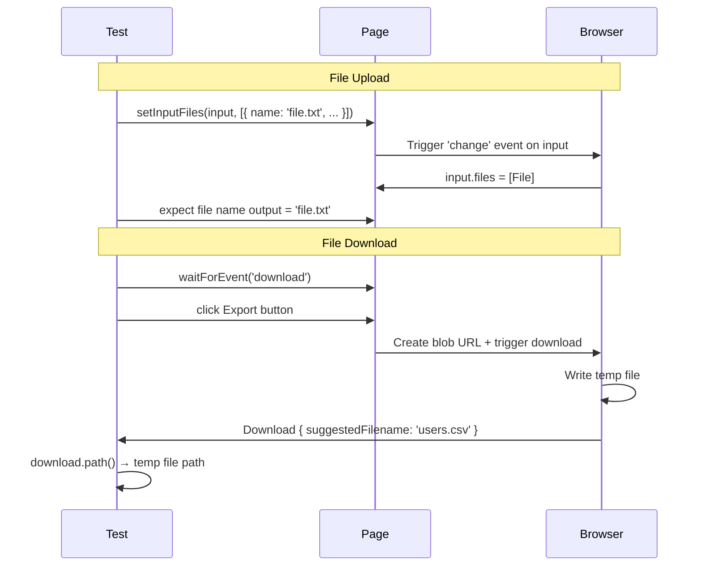

# Card 36: File Uploads & Downloads

## What This Pattern Solves

Forms upload files; pages generate downloads; users paste content. Testing these patterns requires simulating file selection, capturing download events, and reading clipboard. `page.route()` alone doesn't cover these. Playwright has dedicated APIs for file I/O in tests.

## How It Works

1. **`setInputFiles()`**: Set file(s) on `<input type="file">`. You can pass a file path, or create an in-memory file with `{ name, mimeType, buffer }`.
2. **`page.waitForEvent('download')`**: Capture a download triggered by a click. Returns a `Download` object with `suggestedFilename()`, `url()`, and `path()`.
3. **Clipboard**: Use `page.evaluate(() => navigator.clipboard.readText())` to read, `navigator.clipboard.writeText()` to write. Requires granting `clipboard-read` / `clipboard-write` permissions.

## Code Example

```typescript
// Upload a file
await page.getByTestId('file-input').setInputFiles({
  name: 'report.csv',
  mimeType: 'text/csv',
  buffer: Buffer.from('id,name\n1,Alice'),
});

// Upload multiple files
await page.getByTestId('file-input').setInputFiles([
  { name: 'file1.txt', mimeType: 'text/plain', buffer: Buffer.from('A') },
  { name: 'file2.csv', mimeType: 'text/csv', buffer: Buffer.from('x,y') },
]);

// Capture a download
const [download] = await Promise.all([
  page.waitForEvent('download'),
  page.getByTestId('export-btn').click(),
]);
console.log(download.suggestedFilename()); // 'users.csv'
const filePath = await download.path();      // temp file on disk
```

## Run This Example

```bash
pnpm test src/36-file-uploads-downloads
```

## Prerequisites

- **Card 01**: Basic page navigation and assertions.
- **Card 11**: Form interactions (fill, click, submit).

## Key Concepts

- **`locator.setInputFiles(files)`**: Sets the file(s) on a `<input type="file">`. Accepts file paths, or `{ name, mimeType, buffer }` objects. For `multiple`, pass an array.
- **`page.waitForEvent('download')`**: Returns a Promise that resolves when a download starts. Must register before the trigger action.
- **`Download.suggestedFilename()`**: The filename suggested by the server or blob URL.
- **`Download.url()`**: The download URL. For blob URLs, starts with `blob:`.
- **`Download.path()`**: The local temp path where Playwright saved the file. Returns `null` if the download was not saved (configurable via `acceptDownloads`).
- **`navigator.clipboard.readText()` / `writeText()`**: Read/write the system clipboard. Requires `clipboard-read` / `clipboard-write` permissions from the context.

## When to Use This Pattern

- ✓ Testing file upload forms (single and multi-file).
- ✓ Testing CSV/PDF export downloads.
- ✓ Verifying the content of a downloaded file.
- ✓ Testing clipboard copy/paste flows.
- ✗ Testing files larger than a few MB in CI (use smaller in-memory buffers).
- ✗ Testing drag-and-drop file uploads (use `page.dragAndDrop()`).

## Common Mistakes

1. **Forgetting `Promise.all` for downloads**: `waitForEvent('download')` must be registered before the click. The `Promise.all([download, click])` pattern ensures this.
2. **Using real files instead of in-memory buffers**: Real files require committing test fixtures and managing file paths. In-memory buffers are faster and self-contained.
3. **Not granting clipboard permissions**: `navigator.clipboard.readText()` requires the `clipboard-read` permission, which requires secure context (HTTPS or localhost).
4. **Checking the download path too early**: `download.path()` is only available after the download completes. Await the event first, then read the path.

## Flow Diagram



## Related Patterns

- **Previous**: Card 35 (Multi-Tab & Multi-Context).
- **Next**: Card 37 (Global Setup & Teardown).
- **Complementary**: Card 31 (Network HAR), recording downloads as network traffic.
