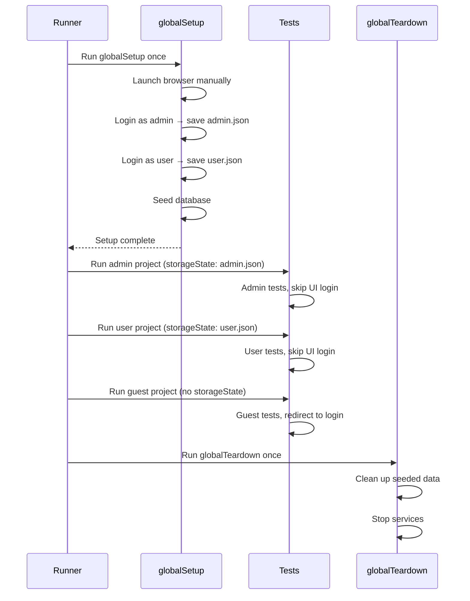

# Card 37: Global Setup & Teardown

## What This Pattern Solves

You need one-time, suite-wide setup — log in per role, save storage state, seed data — that runs before any spec, plus matching teardown. Playwright gives you two mechanisms: a **`setup` project** wired with `dependencies` (the modern recommendation, and what this repo uses), or the config-level **`globalSetup` / `globalTeardown`** hooks (shown below as the alternative).

This repo uses the `setup` project: `src/auth.setup.ts` logs in each role once, saves `playwright/.auth/{user,admin}.json`, and writes a marker. The `chromium` / `chromium-visual` projects declare `dependencies: ['setup']`, so setup always runs first. Specs then consume a role with `test.use({ storageState })` — no `beforeAll`, no manual browser launch.

## How It Works

1. **`globalSetup`** in config runs a single TypeScript file once before the test suite. It logs in, saves `storageState` to a file, and optionally seeds a database.
2. **`projects[].use.storageState`** points to the saved auth file. Each project (or describe block via `test.use()`) can load a different role's storage state.
3. **`globalTeardown`** runs after all tests. Use it to clean up seeded data, revoke auth tokens, or stop services.
4. **`.gitignore`** the `playwright/.auth/` directory to keep auth files out of version control.

> **The runnable spec** (`global-setup-teardown.spec.ts`) demonstrates the `setup`-project approach: it consumes the role files via `test.use({ storageState })`, shows the unauthenticated redirect when no state is loaded, and asserts the setup marker exists (proving setup ran first). The `globalSetup` / `globalTeardown` code below is the config-hook alternative for cases the setup project doesn't cover (e.g. starting external services).

## Alternative: config-level `globalSetup` / `globalTeardown`

**playwright.config.ts** (wired with global setup):

```typescript
import { defineConfig, devices } from '@playwright/test';

export default defineConfig({
  globalSetup: './src/37-global-setup-teardown/global-setup.ts',
  globalTeardown: './src/37-global-setup-teardown/global-teardown.ts',

  projects: [
    {
      name: 'admin',
      use: {
        ...devices['Desktop Chrome'],
        storageState: 'playwright/.auth/admin.json',
      },
    },
    {
      name: 'user',
      use: {
        ...devices['Desktop Chrome'],
        storageState: 'playwright/.auth/user.json',
      },
    },
    {
      name: 'guest',
      use: { ...devices['Desktop Chrome'] }, // no storageState
    },
  ],
});
```

**global-setup.ts** (runs once before all tests):

```typescript
import { chromium, FullConfig } from '@playwright/test';

async function globalSetup(config: FullConfig) {
  const { baseURL } = config.projects[0].use;

  // Per-role login + save storage state
  const adminBrowser = await chromium.launch();
  const adminCtx = await adminBrowser.newContext();
  const adminPage = await adminCtx.newPage();
  await loginAs(adminPage, 'admin', 'adminpass');
  await adminCtx.storageState({ path: 'playwright/.auth/admin.json' });
  await adminCtx.close();
  await adminBrowser.close();

  // Repeat for user role...
}

export default globalSetup;
```

**global-teardown.ts** (runs once after all tests):

```typescript
import { FullConfig } from '@playwright/test';

async function globalTeardown(config: FullConfig) {
  // Clean up seeded data, revoke tokens, stop services
  console.log('Global teardown: all tests completed');
}

export default globalTeardown;
```

## Run This Example

```bash
pnpm test src/37-global-setup-teardown
```

## Prerequisites

- **Card 19**: Auth Storage State (basic storage state pattern).
- **Card 11**: Login Flow.
- **Card 26**: Fixture composition (alternative to globalSetup).

## Key Concepts

- **`globalSetup`**: A function exported from a `.ts` file that receives `FullConfig`. Runs once before all tests. Use for expensive, once-per-suite setup.
- **`globalTeardown`**: Runs once after all tests. Use for cleanup.
- **`projects[].storageState`**: Per-project auth file. Each project (admin, user, guest) gets its own pre-authenticated session.
- **`test.use({ storageState })`**: Per-describe or per-test storage state override.
- **`config.projects[0].use.baseURL`**: Accessible inside `globalSetup` to build URLs.
- **Fixture-based alternative**: For simpler suites, worker-scoped fixtures (Card 33) can replace globalSetup.

## When to Use This Pattern

- ✓ Multiple auth roles tested across many spec files.
- ✓ Seeding test data once for the entire suite (e.g. database fixtures).
- ✓ Starting external services (Docker, test server) before the suite.
- ✓ Per-role test projects in CI.
- ✗ Single-role suites with < 10 specs (use `test.use({ storageState })` directly).
- ✗ Per-test auth variations (use test-scoped fixtures).

## Common Mistakes

1. **Forgetting `.gitignore`**: `playwright/.auth/` contains persistent auth state. If committed, auth tokens may expire or expose credentials. Add it to `.gitignore`.
2. **Running UI login in globalSetup without error handling**: If the login page changes, globalSetup fails before any test runs, blocking the entire suite with a cryptic error. Add try/catch and a helpful error message.
3. **Using `page` fixture in globalSetup**: `globalSetup` runs outside the test runner. You must launch a browser manually (`chromium.launch()`), create a context, and manage the page explicitly.
4. **Not cleaning up browsers in globalSetup**: Every `browser.launch()` needs a corresponding `browser.close()`. Use try/finally or scope the browser to the function.

## Flow Diagram



## Related Patterns

- **Previous**: Card 36 (File Uploads & Downloads).
- **Complementary**: Card 19 (Auth Storage State), the in-spec version without config wiring.
- **Complementary**: Card 33 (Worker-Scoped Fixtures), alternative to globalSetup for per-worker setup.
- **Complementary**: Card 20 (API Seeding & Cleanup), data factories used in globalSetup.
