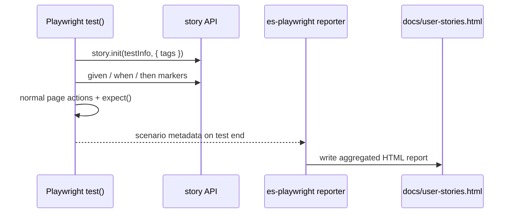

# Card 38: Executable Stories (Living Docs from Tests)

## What This Pattern Solves

Stakeholders want readable, behaviour-style documentation ("given a user… when they… then…"), but classic BDD tools (Cucumber, `.feature` files + step definitions) add a parallel test layer you have to maintain in lockstep with the real tests. [`executable-stories-playwright`](https://github.com/jagreehal/executable-stories) gives you the readable output **without** that second layer: you keep writing ordinary Playwright `test()` blocks, add `story.init(testInfo)` and `given`/`when`/`then` markers, and a reporter turns each run into living documentation.

This cookbook already ships the reporter in `playwright.config.ts` — it runs on every `pnpm test`. Until a spec calls `story.init`, the reporter has nothing to document. This card is where the cookbook actually uses it.

## How It Works

1. **Reporter** — `executable-stories-playwright/reporter` is registered in `playwright.config.ts` (kept in every run so the docs stay in sync). It collects scenario metadata and writes `docs/user-stories.html`.
2. **`story.init(testInfo)`** — called at the top of each documented test. `testInfo` is the **second** argument of Playwright's test callback; it links the scenario to the test. Pass options like `tags`.
3. **Step markers** — `story.given` / `story.when` / `story.then` / `story.and` (also importable as top-level `given`, `when`, `then`). In **marker-only** style you state the step, then write the normal Playwright code after it.
4. **Rich entries** — `story.note()`, `story.json()`, `story.code()`, `story.table()`, `story.mermaid()`, `story.screenshot()`, and `story.video()` attach extra context to a scenario in the report.
5. **Recorded walkthroughs** — record with `test.use({ video: 'on' })`; the reporter collects, dedupes, and inlines the `.webm` into the report on its own — no `story.video()` call needed.

## Code Example

```typescript
import { test, expect } from '@playwright/test';
import { story } from 'executable-stories-playwright';

test('a registered user logs in and reaches the dashboard', async ({ page }, testInfo) => {
  story.init(testInfo, { tags: ['e2e', 'auth'] });

  story.given('a registered user on the login page');
  await page.goto('/login');

  story.when('they submit valid credentials');
  await page.getByLabel('Username').fill('testuser');
  await page.getByLabel('Password').fill('password');
  await Promise.all([
    page.waitForURL(/protected/),
    page.getByRole('button', { name: 'Log in' }).click(),
  ]);

  story.then('the dashboard greets them by name');
  await expect(page.getByTestId('dashboard-message')).toContainText('testuser');

  story.note('Same assertions as Card 11 — only story.init and the markers are new.');
});
```

The reporter config that produces the HTML report:

```typescript
// playwright.config.ts
reporter: [
  ['html'],
  ['executable-stories-playwright/reporter', {
    formats: ['html'],            // default is cucumber-json — set this explicitly
    outputDir: 'docs',
    outputName: 'user-stories',   // writes docs/user-stories.html
    output: { mode: 'aggregated' },
    html: {
      title: 'Playwright Testing Cookbook - User Stories',
      darkMode: true,
      searchable: true,
      embedScreenshots: true,     // inline screenshots as base64
    },
  }],
],
```

## Recording Video and Screenshots

The reporter already collects Playwright's native attachments. At `onTestEnd` it persists each video and screenshot — small files are base64-inlined into the HTML, larger ones are copied into the report output — and it dedupes the extra `.webm` files Playwright sometimes emits. So you get a self-contained, portable report with no manual file handling.

Record video by opting in (the cookbook config keeps video only on failure):

```typescript
test.use({ video: 'on' });
```

Capture a screenshot with Playwright's attachment API:

```typescript
await testInfo.attach('dashboard', {
  body: await page.screenshot(),   // body keeps it off disk; the reporter inlines it
  contentType: 'image/png',
});
```

That is the whole story: one video and one screenshot per scenario, inlined into `docs/user-stories.html`.

> **Do not also call `story.screenshot()` or `story.video()` for the same artifact.** The reporter renders the auto-collected attachment *and* the explicit story entry, so the media appears twice. Reserve `story.screenshot()` / `story.video()` for media the reporter cannot see on its own — an image you generated yourself, or a video at an external URL.

## Converting an Existing Test

Three mechanical edits — no behaviour changes:

1. Add `testInfo` as the second callback parameter: `async ({ page }, testInfo) => {`.
2. Call `story.init(testInfo)` first.
3. Add `given`/`when`/`then` markers in front of the code they describe.

The assertions stay identical; the test still passes or fails on exactly the same conditions. The only new output is the generated documentation.

## Run This Example

```bash
pnpm test src/38-executable-stories
```

After a full `pnpm test`, open `docs/user-stories.html` to see the generated stories.

## Prerequisites

- **Card 11**: Login Flow — this card documents the same journey.
- **Card 30**: CI Sharding & Merge Reports — how the cookbook's reporters compose in CI.

## Key Concepts

- **Same `test()`** — executable stories are not a separate runner; they decorate Playwright's native tests, so traces, retries, fixtures, and the HTML report all keep working.
- **`story.init(testInfo)`** — required to document a test; `testInfo` is the callback's second argument.
- **Marker-only vs. callback** — marker-only keeps the test flat (state the step, then the code). A callback form (`await story.when('…', async ({ page }) => { … })`) also exists; pass fixtures into `story.init({ page }, testInfo)` to use it.
- **`tags` / `ticket`** — categorise scenarios and link them to issues in the report.
- **Living docs** — the documentation is regenerated from the actual run, so it can never drift from the tests.

## When to Use This Pattern

- ✓ Non-engineers need to read what the suite verifies.
- ✓ You want BDD-readable docs without maintaining `.feature` files and step definitions.
- ✓ Acceptance criteria should be traceable to passing tests (via `ticket`).
- ✗ A small internal suite where no one reads generated docs (the markers are then just noise).

## Common Mistakes

1. **Forgetting `testInfo`** — `story.init()` with no argument can't link metadata to the test. The signature must be `async ({ page }, testInfo) => { … }`.
2. **Relying on the default format** — the reporter's default `formats` is `['cucumber-json']`. Set `formats: ['html']` explicitly for the readable report.
3. **Passing a reporter instance** — Playwright wants the module path + options tuple (`['executable-stories-playwright/reporter', { … }]`), not `new Reporter(...)`.
4. **`.story.test.ts` naming** — Playwright's convention is `.spec.ts`; keep specs as `*.spec.ts` so the runner and reporter pick them up.

## Flow Diagram



## Related Patterns

- **Previous**: Card 37 (Global Setup & Teardown)
- **Documents**: Card 11 (Login Flow), the same journey without the markers
- **Complementary**: Card 30 (CI Sharding & Merge Reports), how reporters compose in CI
