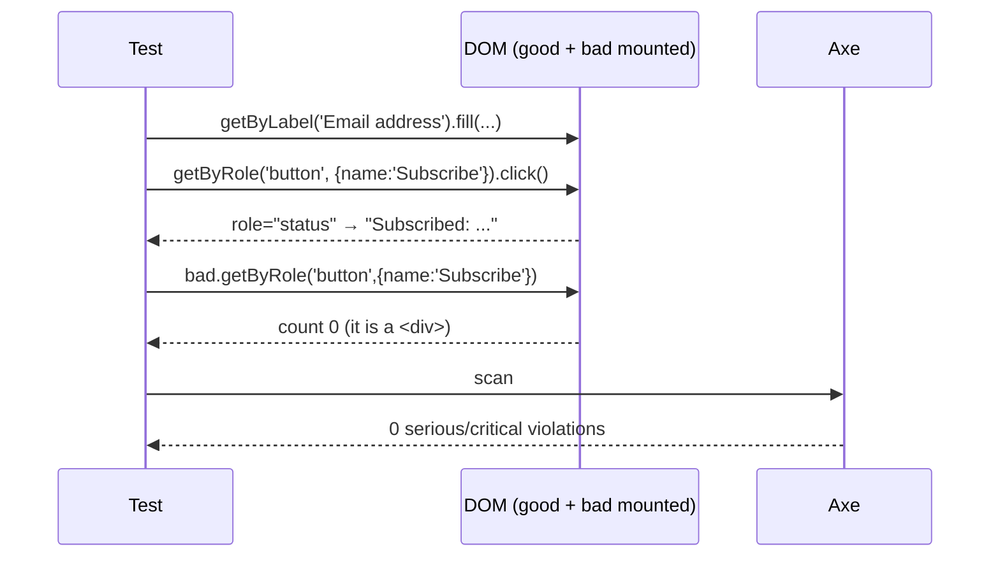

# Card 39: Accessible Components, Tested by Role

## What This Pattern Solves

Most teams write the markup first and bolt tests on after. To find the `<div>`
that should have been a `<button>`, they reach for `data-testid` — and the test
passes while the component is unreachable by keyboard or screen reader. The test
id certifies that a string exists in the DOM and nothing else.

This card co-designs the component and its tests as one problem. Build the markup
so a **role-first query** (`getByRole`, `getByLabel`) reaches every element, and
the same query that drives the test proves a real user could do the same thing. A
passing role query is a free accessibility assertion. The card mounts a good
semantic component and a bad test-id-only one side by side and runs the same
queries against both, so you watch the difference resolve in the terminal.

This is the runnable companion to the `build-tested-components` skill.

## How It Works

1. Navigate to any served page to get a live DOM root (Card 28's technique).
2. `page.evaluate()` mounts two versions of a newsletter signup: a semantic
   `<form>` with a real `<label>`, `<button>`, and a `role="status"` live region;
   and a div-and-test-id imitation.
3. Drive the **good** version entirely by role and label. Success and error
   states are read back through the live region the way a screen reader announces
   them.
4. Against the **bad** version, prove the contrast: the test id works (`green, and
   blind`) while `getByRole('button', …)` and `getByLabel(…)` resolve to zero
   matches. That failing count is the accessibility regression a test id hides.
5. Run an `axe` pass scoped to the good component, and show the label query
   catching a gap (`placeholder` as accessible name) that axe is lenient about.

## Code Example

```typescript
// GOOD: the query that finds it proves a user could.
const root = page.locator('#good');
await root.getByLabel('Email address').fill('jag@example.com');
await root.getByRole('button', { name: 'Subscribe' }).click();
await expect(root.getByRole('status')).toHaveText('Subscribed: jag@example.com');

// BAD: the test id passes while the a11y proof fails.
const bad = page.locator('#bad');
await bad.getByTestId('subscribe-btn').click();                          // green, and blind
await expect(bad.getByRole('button', { name: 'Subscribe' })).toHaveCount(0); // it is a <div>
await expect(bad.getByLabel('Email address')).toHaveCount(0);                // placeholder, not a label
```

## Run This Example

```bash
pnpm test src/39-accessible-components
```

## Prerequisites

- **Card 01**: `page.goto`, `expect().toBeVisible`, basic assertions.
- **Card 17**: Accessibility scanning with `@axe-core/playwright`.
- **Card 28**: Mounting a component in isolation via `page.evaluate()`.

## Key Concepts

- **Co-design markup and selector**: choose the accessible element so the
  highest-priority query (`getByRole` > `getByLabel` > `getByText` > `getByTestId`)
  reaches it. Falling down that list is a markup bug to fix, not a reason for a
  test id.
- **The negative / a11y proof**: assert the role query is *present* on good
  markup and *absent* (`toHaveCount(0)`) on bad markup. This is the test base
  models skip, and the one that catches the bug that matters.
- **States are announced, not just shown**: success in a `role="status"` live
  region, errors in `role="alert"`. The test reads them the way a user is told.
- **axe and role queries catch different bugs**: a placeholder satisfies axe's
  name computation, but `getByLabel` still finds nothing. Keep both nets.

## When to Use This Pattern

- ✓ Building a new component or feature and its tests together.
- ✓ Hardening an existing component that is only reachable by test id.
- ✓ Proving an accessibility regression with an executable test, not a lint note.
- ✗ Pure layout/visual checks with no interaction. Use Card 27 (visual regression).
- ✗ Page-level orchestration (routing, auth). Use page-level flow tests.

## Common Mistakes

1. **Testing only the happy path.** Cover each state — loading, empty, success,
   and error — and assert each is announced via a live region.
2. **`data-testid` on a semantic element.** If you add one to a button instead of
   an accessible name, accessibility rots while the test stays green. Name the
   button; let `getByRole` find it.
3. **Index selectors for repeated rows** (`add-2`, `nth(3)`). They break on
   reorder. Use a per-item accessible name, or a test id keyed on a stable
   business id (`product-card-wool-socks`), never position.
4. **Trusting axe alone.** axe is a lint, not a behaviour check. Pair it with
   role/label queries that prove the element is actually reachable.

## Flow Diagram



## Related Patterns

- **Previous**: Card 38 (Executable Stories), turning these tests into living docs.
- **Complementary**: Card 17 (Accessibility / axe) and Card 28 (Component Testing).
- **Skill**: `build-tested-components` — the full coverage matrix and the
  two-tier (jsdom + Playwright) strategy this card distils.
```
